# JAIDE v40 — DeepWiki Export

> Automatically exported from [DeepWiki](https://deepwiki.com/kollarsandor/jaidellm)

---

## Table of Contents

1. [JAIDE v40 — Project Overview](#page-1)
2. [Getting Started — Build, Configuration & Entrypoints](#page-2)
3. [Architecture Overview — RSF, NSIR, and the Processing Pipeline](#page-3)
4. [Core Primitives](#page-4)
5. [Tensor System](#page-5)
6. [Memory Management](#page-6)
7. [I/O and Model Persistence](#page-7)
8. [Neural Processing — RSF and OFTB](#page-8)
9. [RSF — Reversible Scatter Flow Processor](#page-9)
10. [OFTB — Orthogonal Fractal Transform Block](#page-10)
11. [Tokenizer and Retrieval](#page-11)
12. [MGT — Morpheme-Guided Tokenizer](#page-12)
13. [SSI — Structured Sequence Index](#page-13)
14. [Ranker — Sequence Scoring and Candidate Evaluation](#page-14)
15. [NSIR — Quantum-Relational Graph System](#page-15)
16. [NSIR Core — Graph Structure and Quantum Operations](#page-16)
17. [Reasoning Orchestrator and Energy Minimization](#page-17)
18. [CREV Pipeline — Knowledge Extraction and Triplet Management](#page-18)
19. [Quantum Backend Integration](#page-19)
20. [Optimization and Training](#page-20)
21. [SFD Optimizer — Second-Order Training](#page-21)
22. [Distributed Training](#page-22)
23. [Cloud Training with Modal](#page-23)
24. [Hardware Acceleration Layer](#page-24)
25. [Futhark GPU Kernels](#page-25)
26. [CUDA Bindings and Accelerator Interface](#page-26)
27. [Clash RTL Components](#page-27)
28. [Inference Server and API](#page-28)
29. [InferenceServer — HTTP API and Request Lifecycle](#page-29)
30. [Verified Inference Engine and ZK Proofs](#page-30)
31. [Security, Safety, and Formal Verification](#page-31)
32. [Formal Verification and Security Proofs](#page-32)
33. [Safety, Obfuscation, and C API](#page-33)
34. [Glossary](#page-34)

---

<a id="page-1"></a>

# JAIDE v40 — Project Overview

<details>
<summary>Relevant source files</summary>

The following files were used as context for generating this wiki page:

- [README.md](README.md)
- [build.zig](build.zig)
- [build.zig.zon](build.zig.zon)

</details>


JAIDE (v40) is a Large Language Model (LLM) built from the ground up on the **Reversible Scatter Flow (RSF)** paradigm [README.md:1-1](). Unlike traditional Transformer or CNN architectures, JAIDE utilizes bijective coupling layers that enable O(1) memory backpropagation and a parameter-less Haar-wavelet mixing block known as the **OFTB** [README.md:1-1]().

The system is engineered for high-performance execution across a spectrum of hardware, ranging from standard CPUs to multi-GPU B200 clusters and quantum relational graphs [README.md:3-3]().

### The RSF Paradigm

The core of JAIDE is the Reversible Scatter Flow, which replaces traditional self-attention and MLP structures with cross-affine coupling [README.md:7-7](). 

*   **Bijectivity:** Every forward pass has an exact algebraic inverse, ensuring no information collapse during processing [README.md:9-9]().
*   **Memory Efficiency:** Because the network is reversible, activations do not need to be cached for backpropagation. The system reconstructs inputs from outputs in-place [README.md:10-10]().
*   **Minimalist Primitives:** The architecture eliminates `softmax`, `attention`, `ReLU`, and `LayerNorm`, relying exclusively on learned scale and translation tensors [README.md:92-100]().

### System Architecture and Data Flow

The following diagram bridges the conceptual "Natural Language Space" with the "Code Entity Space," showing how a request flows through the primary Zig components.

**Diagram: Request Processing Pipeline**
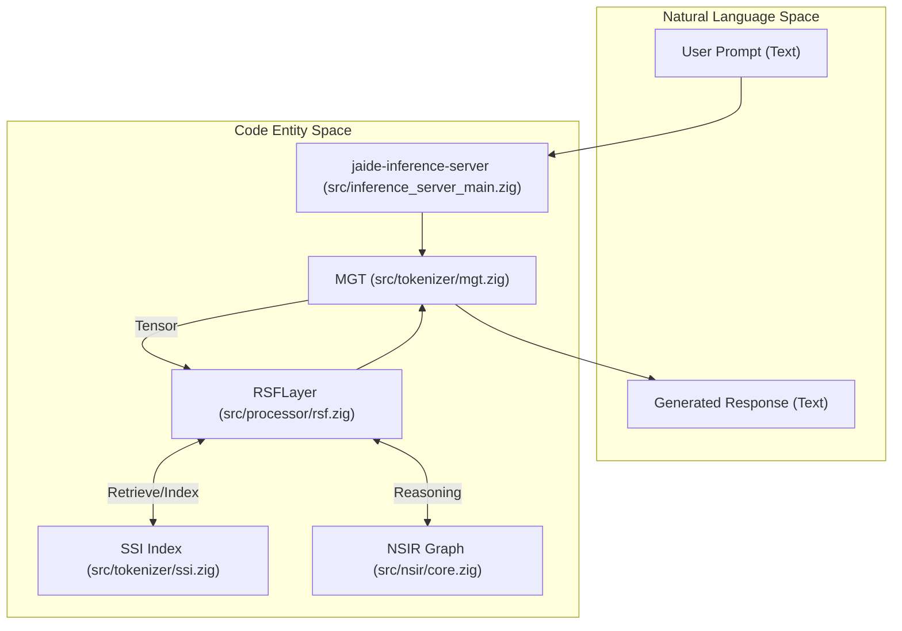
Sources: [src/inference_server_main.zig:1-37](), [src/processor/rsf.zig:107-115](), [README.md:13-19]()

---

### Key Architectural Pillars

#### 1. Core Primitives and Memory
The system relies on a custom `Tensor` system [src/core/tensor.zig]() and a suite of specialized allocators (Arena, Slab, Buddy) to manage memory without the overhead of a general-purpose heap [README.md:15-15]().

#### 2. RSF Processing Pipeline
The `LayerCore` is the fundamental unit of computation. It consists of exactly four learnable tensors: `s_weight`, `t_weight`, `s_bias`, and `t_bias` [src/processor/rsf.zig:107-112](). Fractal mixing is handled by the `OFTB` block, which implements a butterfly-style Haar-wavelet transform [README.md:77-88]().

#### 3. Tokenization and Retrieval
JAIDE uses the **Morpheme-Guided Tokenizer (MGT)** for text decomposition and the **Structured Sequence Index (SSI)** for efficient similarity searches and knowledge retrieval [README.md:17-17]().

#### 4. NSIR (Quantum-Relational Graph)
The **Non-linear Self-Similar Information Retrieval (NSIR)** system provides a hierarchical reasoning layer. It integrates quantum logic gates (Hadamard, CNOT) with classical activations to model complex relationships within a self-similar graph structure [README.md:18-18]().

#### 5. Hardware Acceleration
Computation is accelerated via **Futhark** GPU kernels (CUDA/OpenCL) for the RSF flow and **Clash** for RTL hardware synthesis [README.md:19-19]().

**Diagram: Hardware and Kernel Mapping**
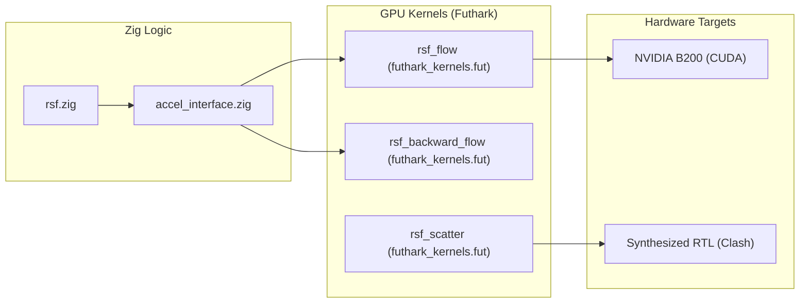
Sources: [src/hw/accel/futhark_kernels.fut:80-86](), [build.zig:7-13](), [README.md:132-135]()

---

### Child Pages

For a deeper dive into specific components of JAIDE v40, refer to the following sections:

*   **[Getting Started — Build, Configuration & Entrypoints](#1.1)**
    Explains the Zig build system, how to enable the `gpu` flag, and the various executable targets like `jaide-inference-server` and `jaide-gpu`.
*   **[Architecture Overview — RSF, NSIR, and the Processing Pipeline](#1.2)**
    A conceptual deep dive into the mathematical foundations of Reversible Scatter Flow and the data-flow between the neural core and the quantum-relational graph.

Sources: [README.md:1-100](), [build.zig:1-121](), [build.zig.zon:1-12]()

---

*[Back to Table of Contents](#table-of-contents) | Page 1 of 34 | Next: Getting Started — Build, Configuration & Entrypoints*

<a id="page-2"></a>

# Getting Started — Build, Configuration & Entrypoints

<details>
<summary>Relevant source files</summary>

The following files were used as context for generating this wiki page:

- [build.zig](build.zig)
- [build.zig.zon](build.zig.zon)
- [src/build.zig](src/build.zig)
- [src/inference_server_main.zig](src/inference_server_main.zig)
- [src/main.zig](src/main.zig)
- [src/main_gpu.zig](src/main_gpu.zig)

</details>


This page details the build infrastructure, configuration options, and primary entrypoints for the JAIDE v40 system. JAIDE utilizes the Zig build system integrated with Futhark-generated C kernels for high-performance neural processing.

## Build System & Toolchain

JAIDE is built using **Zig 0.13.0** [build.zig.zon:5-5](). The build process manages both the Zig source code and the compilation of hardware-accelerated kernels.

### The Zig Build Process
The `build.zig` script defines the compilation pipeline for all system components. A critical part of the build is the integration of `futhark_kernels.c`, which contains the generated C code from Futhark for GPU and SIMD acceleration [build.zig:12-13]().

| Artifact | Source File | Description |
| :--- | :--- | :--- |
| `jaide` | `src/main.zig` | The primary CLI for interactive use, training, and REPL. |
| `jaide-inference-server` | `src/inference_server_main.zig` | HTTP/1.1 server for model deployment. |
| `jaide-distributed` | `src/main_distributed.zig` | Multi-node training harness (requires `-Dgpu=true`). |
| `jaide-gpu` | `src/main_gpu.zig` | Optimized single-node H100/A100 training entrypoint. |

### Build Configuration Flags
The build system supports conditional compilation through build options:
*   **GPU Acceleration**: Controlled by the `-Dgpu` flag. When enabled, it sets the `gpu_acceleration` build option to `true` [build.zig:7-10](), enabling distributed training and GPU-specific executables [build.zig:39-80]().
*   **Optimization Levels**: Standard Zig optimization levels (`Debug`, `ReleaseSafe`, `ReleaseFast`, `ReleaseSmall`) are supported via `-Doptimize` [build.zig:5-5]().

### Compilation Flow
The following diagram illustrates how the Zig build system orchestrates the compilation of Zig source and Futhark C kernels.

**Figure 1: JAIDE Build Pipeline**
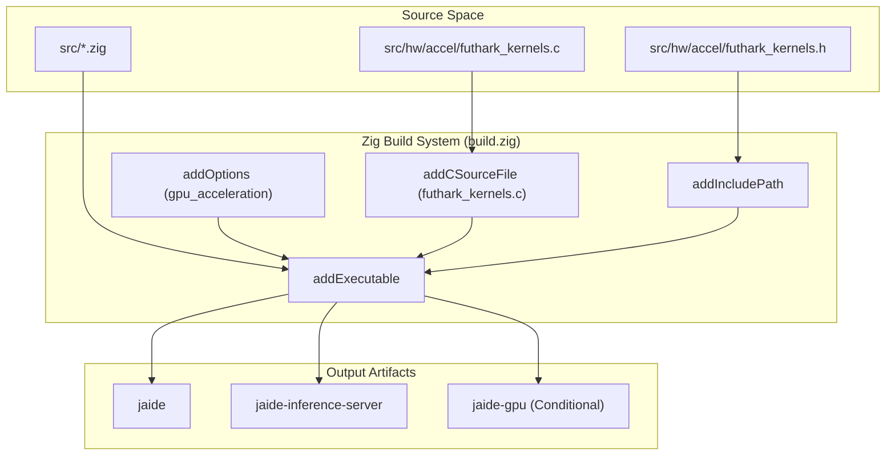
**Sources:** [build.zig:1-121](), [build.zig.zon:1-12]()

---

## System Entrypoints

JAIDE provides several specialized entrypoints depending on the desired operation (inference, local training, or distributed GPU training).

### 1. Main Executable (`jaide`)
The primary entrypoint is `src/main.zig`. It handles system initialization, including the `RSF` (Reversible Scatter Flow) processor, `MGT` tokenizer, and `SSI` index [src/main.zig:59-63](). It uses a `MainConfig` struct to define default hyperparameters such as `DEFAULT_EMBEDDING_DIM` (128) and `DEFAULT_RSF_LAYERS` (4) [src/main.zig:66-72]().

### 2. Inference Server (`jaide-inference-server`)
Defined in `src/inference_server_main.zig`, this entrypoint initializes an `InferenceServer` with a `ServerConfig` [src/inference_server_main.zig:10-23](). It parses CLI arguments to configure the network environment:
*   `--port`: Listening port (default 8080) [src/inference_server_main.zig:33-33]().
*   `--host`: Bind address (default 0.0.0.0) [src/inference_server_main.zig:36-36]().
*   `--model`: Path to the `.jaide` model file [src/inference_server_main.zig:39-39]().

### 3. GPU Training (`jaide-gpu`)
The `src/main_gpu.zig` entrypoint is designed for high-performance training on NVIDIA hardware (e.g., H100) [src/main_gpu.zig:14-16](). It initializes the `GPUCoordinator` and `DistributedTrainerFuthark` [src/main_gpu.zig:28-44](), utilizing NCCL for communication primitives [src/main_gpu.zig:21-26]().

**Figure 2: Entrypoint to Core Entity Mapping**
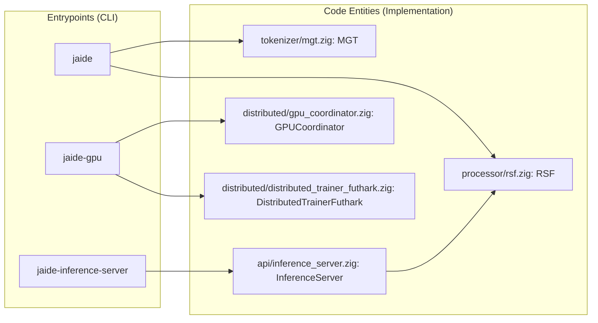
**Sources:** [src/main.zig:59-63](), [src/inference_server_main.zig:5-61](), [src/main_gpu.zig:1-47]()

---

## Configuration & Hyperparameters

The system behavior is governed by `MainConfig` and `Config` structures in `src/main.zig`.

### Default Hyperparameters
| Parameter | Default Value | Range |
| :--- | :--- | :--- |
| `embedding_dim` | 128 | 8 - 16,384 [src/main.zig:67-69]() |
| `rsf_layers` | 4 | 1 - 256 [src/main.zig:70-72]() |
| `batch_size` | 16 | 1 - 4,096 [src/main.zig:73-75]() |
| `learning_rate` | 0.001 | 1e-10 - 10.0 [src/main.zig:78-80]() |
| `sequence_length` | 64 | N/A [src/main.zig:87-87]() |

### File Magic Numbers
JAIDE uses specific magic numbers for binary serialization to ensure file integrity:
*   **RSF Model**: `0x4A524653` [src/main.zig:116-116]()
*   **MGT Tokenizer**: `0x4A4D4754` [src/main.zig:117-117]()
*   **Ranker**: `0x4A524E4B` [src/main.zig:118-118]()

**Sources:** [src/main.zig:66-128]()

---

## Testing Targets

The build system defines specific test suites that can be invoked via the Zig CLI.

| Command | Target Source | Description |
| :--- | :--- | :--- |
| `zig build test` | `src/main.zig` | Runs all unit tests across the codebase [build.zig:101-102](). |
| `zig build test-tensor` | `src/core/tensor.zig` | Tests tensor math, SIMD, and memory layouts [build.zig:110-111](). |
| `zig build test-memory` | `src/core/memory.zig` | Validates custom allocators (Arena, Slab, etc.) [build.zig:119-120](). |

All tests are linked against `libC` and the Futhark kernels to ensure that hardware-accelerated paths are verified during the test cycle [build.zig:96-98]().

**Sources:** [build.zig:91-121]()

---

*[Back to Table of Contents](#table-of-contents) | Page 2 of 34 | Next: Architecture Overview — RSF, NSIR, and the Processing Pipeline*

<a id="page-3"></a>

# Architecture Overview — RSF, NSIR, and the Processing Pipeline

<details>
<summary>Relevant source files</summary>

The following files were used as context for generating this wiki page:

- [README.md](README.md)
- [src/core_relational/nsir_core.zig](src/core_relational/nsir_core.zig)
- [src/processor/rsf.zig](src/processor/rsf.zig)
- [src/tokenizer/mgt.zig](src/tokenizer/mgt.zig)

</details>


This page provides a conceptual and technical map of the JAIDE v40 architecture. It describes how the **Reversible Scatter Flow (RSF)** neural core, the **Non-linear Self-Similar Information Retrieval (NSIR)** quantum-relational graph, and the supporting processing pipeline (tokenizer, optimizer, and inference server) integrate to form a unified system.

## System Integration Map

The JAIDE v40 pipeline transitions data from "Natural Language Space" into a high-dimensional "Code Entity Space" where reasoning occurs via quantum-relational dynamics.

### Data Flow Overview

1.  **Ingestion**: Raw text is processed by the `MGT` (Morpheme-Guided Tokenizer) [src/tokenizer/mgt.zig:8-40]().
2.  **Projection**: Tokens are converted into `Tensor` primitives [src/core/tensor.zig:33-60]().
3.  **Neural Core**: The `RSFLayer` performs bijective transformations using the `LayerCore` primitive [src/processor/rsf.zig:133-147]().
4.  **Relational Mapping**: Embeddings are indexed in the `SSI` (Structured Sequence Index) and mapped to nodes in the `NSIR` graph [src/core_relational/nsir_core.zig:133-154]().
5.  **Reasoning**: The `ReasoningOrchestrator` minimizes graph energy across `ThoughtLevel` hierarchies.
6.  **Inference**: The `InferenceServer` exposes these capabilities via a REST API [src/api/inference_server.zig:64-105]().

### Component Relationship Diagram

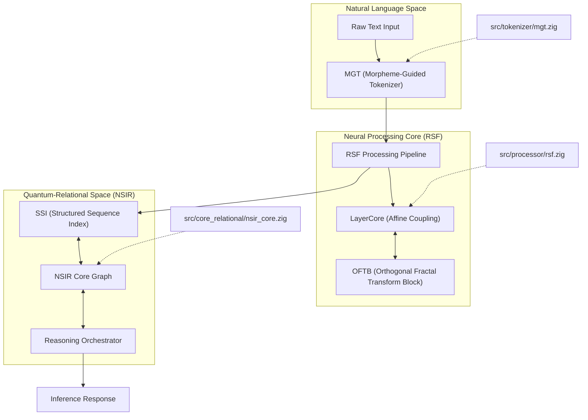
**Sources:** [README.md:13-19](), [src/processor/rsf.zig:133-147](), [src/tokenizer/mgt.zig:8-19]()

---

## The RSF Neural Core

The **Reversible Scatter Flow (RSF)** is the fundamental computational paradigm of JAIDE. Unlike Transformers, it relies on bijective coupling layers, enabling O(1) memory backpropagation.

### LayerCore Primitive
The `LayerCore` is the only trainable primitive in the network [README.md:44-55](). It consists of four tensors:
*   `s_weight` / `s_bias`: Scale parameters.
*   `t_weight` / `t_bias`: Translation parameters.

### Bijective Pipeline
The forward pass (`forwardInPlace`) and inverse pass (`inverseInPlace`) are exact algebraic inverses, ensuring no information collapse during processing [src/processor/rsf.zig:370-410]().

| Operation | Logic | Memory Complexity |
| :--- | :--- | :--- |
| **Forward** | $y_1 = x_1 \odot \exp(W_s x_2 + b_s)$ | $O(1)$ (In-place) |
| **Inverse** | $x_1 = y_1 / \exp(W_s x_2 + b_s)$ | $O(1)$ (In-place) |
| **Backprop** | `backwardFromOutputs` reconstructs $x$ from $y$ | $O(1)$ (No activation cache) |

**Sources:** [README.md:59-75](), [src/processor/rsf.zig:133-147](), [src/processor/rsf.zig:458-480]()

---

## NSIR Quantum-Relational Graph

The **Non-linear Self-Similar Information Retrieval (NSIR)** system handles high-level reasoning by representing knowledge as a graph of quantum states.

### Node and Edge Dynamics
Nodes in the `NSIR` graph contain a `Qubit` state representing probabilistic truth or activation [src/core_relational/nsir_core.zig:86-94](). Edges have a `quality` (e.g., `entangled`, `collapsed`, `fractal`) that determines how information flows between concepts [src/core_relational/nsir_core.zig:11-16]().

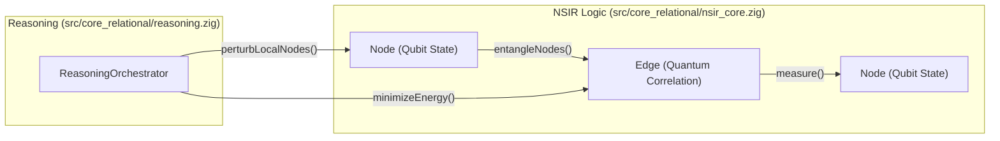
**Sources:** [src/core_relational/nsir_core.zig:86-131](), [src/core_relational/nsir_core.zig:205-213]()

---

## The Processing Pipeline

The system operates as a continuous flow from raw input to structured reasoning.

### 1. Tokenization (MGT)
The `MGT` struct [src/tokenizer/mgt.zig:8-18]() decomposes text into morphemes using a three-tier approach:
1.  **Special Tokens**: [PAD], [UNK], [BOS], [EOS].
2.  **Morphological Decomposition**: Prefixes and suffixes are prioritized [src/tokenizer/mgt.zig:99-133]().
3.  **BPE Fallback**: Byte-Pair Encoding for unknown sequences.

### 2. Structured Indexing (SSI)
The `SSI` (Structured Sequence Index) acts as the bridge between the neural embeddings and the relational graph. It uses Hamming-distance similarity to retrieve top-K candidates for reasoning.

### 3. Inference Server
The `InferenceServer` [src/api/inference_server.zig:64-80]() manages the lifecycle of a request:
*   **Request**: Receives JSON via `POST /v1/inference`.
*   **Execution**: Orchestrates `MGT` -> `RSF` -> `SSI` -> `NSIR`.
*   **Memory**: Uses an `ArenaAllocator` per request for high-performance, leak-free operation.

### Pipeline Data Flow Diagram

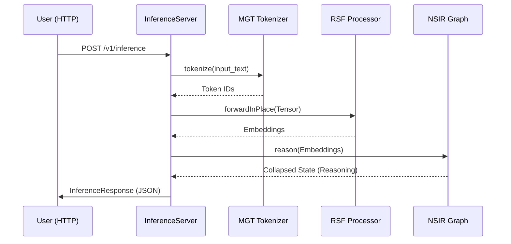
**Sources:** [src/api/inference_server.zig:64-105](), [src/tokenizer/mgt.zig:42-64](), [src/processor/rsf.zig:370-385]()

---

*[Back to Table of Contents](#table-of-contents) | Page 3 of 34 | Next: Core Primitives*

<a id="page-4"></a>

# Core Primitives

<details>
<summary>Relevant source files</summary>

The following files were used as context for generating this wiki page:

- [src/core/io.zig](src/core/io.zig)
- [src/core/memory.zig](src/core/memory.zig)
- [src/core/tensor.zig](src/core/tensor.zig)
- [src/core/types.zig](src/core/types.zig)

</details>


The core primitives represent the lowest level of the JAIDE v40 stack, providing the essential building blocks for numerical computation, memory safety, and persistent storage. These utilities are designed for high performance and strict security, serving as the foundation for the RSF neural engine and the NSIR graph system.

### Data Flow and Entity Mapping

The following diagrams illustrate how high-level concepts in the "Natural Language Space" map to specific "Code Entities" within the core primitives.

**Tensor and Numerical Space Mapping**
```mermaid
graph TD
    subgraph "Natural Language Space"
        "N-Dimensional Array"
        "Reference Counting"
        "Fixed-Point Arithmetic"
    end

    subgraph "Code Entity Space (src/core/)"
        "N-Dimensional Array" --> "Tensor[tensor.zig:157-178]"
        "Reference Counting" --> "refcount[tensor.zig:162]"
        "Fixed-Point Arithmetic" --> "Fixed32_32[types.zig:145-158]"
    end

    "Tensor[tensor.zig:157-178]" --> "Shape[tensor.zig:49-78]"
    "Tensor[tensor.zig:157-178]" --> "TensorIterator[tensor.zig:14-27]"
```
Sources: [src/core/tensor.zig:14-178](), [src/core/types.zig:145-158]()

**Memory and I/O Infrastructure Mapping**
```mermaid
graph TD
    subgraph "Natural Language Space"
        "Memory Arena"
        "File Mapping"
        "Secure Erase"
    end

    subgraph "Code Entity Space (src/core/)"
        "Memory Arena" --> "ArenaAllocator[memory.zig:156-173]"
        "File Mapping" --> "MMAP[io.zig:74-139]"
        "Secure Erase" --> "secureZeroMemory[memory.zig:1042-1048]"
    end

    "MMAP[io.zig:74-139]" --> "IoConfig[io.zig:8-17]"
    "ArenaAllocator[memory.zig:156-173]" --> "MemoryConfig[memory.zig:20-23]"
```
Sources: [src/core/memory.zig:20-1048](), [src/core/io.zig:8-139]()

---

## [Tensor System](#2.1)

The `Tensor` struct is the primary vehicle for numerical data in JAIDE. It supports multi-dimensional shapes (up to 8 dimensions) and uses a copy-on-write (COW) mechanism to minimize memory overhead during transformations.

*   **Shape and Strides:** The `Shape` utility manages dimension sizes and calculates strides for non-contiguous memory access [src/core/tensor.zig:49-78]().
*   **Memory Integration:** Tensors can be initialized using various specialized allocators, including `ArenaAllocator`, `PoolAllocator`, and `SlabAllocator` [src/core/tensor.zig:180-195]().
*   **Iteration:** The `TensorIterator` provides a unified way to traverse tensors regardless of their underlying memory layout or striding [src/core/tensor.zig:14-47]().

For details, see [Tensor System](#2.1).

Sources: [src/core/tensor.zig:14-195]()

---

## [Memory Management](#2.2)

JAIDE utilizes a suite of custom allocators designed to eliminate fragmentation and provide deterministic performance for different workload patterns.

| Allocator | Purpose | File Reference |
| :--- | :--- | :--- |
| `Arena` | Fast, linear allocation for request-scoped data. | [src/core/memory.zig:77-93]() |
| `Slab` | Efficient management of fixed-size objects. | [src/core/memory.zig:466-486]() |
| `Pool` | Thread-safe allocation for uniform object types. | [src/core/memory.zig:308-329]() |
| `Buddy` | Power-of-two allocation to reduce external fragmentation. | [src/core/memory.zig:636-658]() |

The system also includes `secureZeroMemory` to ensure that sensitive data (such as model weights or decrypted tensors) is wiped from RAM immediately after use [src/core/memory.zig:1042-1048]().

For details, see [Memory Management](#2.2).

Sources: [src/core/memory.zig:77-1048]()

---

## [I/O and Model Persistence](#2.3)

The I/O layer provides high-performance file access and a robust serialization framework for model weights and graph states.

*   **Memory Mapping:** The `MMAP` implementation allows the system to treat large files on disk as byte buffers in memory, supporting both shared and private mappings [src/core/io.zig:74-139]().
*   **Secure I/O:** `IoConfig` defines strict limits on file sizes and path lengths to prevent resource exhaustion attacks [src/core/io.zig:8-17]().
*   **Persistence:** The serialization layer handles the export and import of complex structures like the RSF `LayerCore` and NSIR `SelfSimilarRelationalGraph`.

For details, see [I/O and Model Persistence](#2.3).

Sources: [src/core/io.zig:8-139]()

---

## Shared Types

The `types.zig` module defines the primitive numerical types used throughout the engine, specifically focusing on fixed-point arithmetic to ensure cross-platform bit-determinism.

*   **Fixed-Point Arithmetic:** Types like `FixedPoint16`, `FixedPoint32`, and `Fixed32_32` provide methods for overflow-checked addition, subtraction, multiplication, and division [src/core/types.zig:10-180]().
*   **Error Handling:** A centralized `Error` enum defines the standard error codes used by the core primitives [src/core/types.zig:8]().

Sources: [src/core/types.zig:8-180]()

---

*[Back to Table of Contents](#table-of-contents) | Page 4 of 34 | Next: Tensor System*

<a id="page-5"></a>

# Tensor System

<details>
<summary>Relevant source files</summary>

The following files were used as context for generating this wiki page:

- [src/core/tensor.zig](src/core/tensor.zig)
- [src/core/types.zig](src/core/types.zig)
- [src/tests/stress_tensor_refcount.zig](src/tests/stress_tensor_refcount.zig)

</details>


The **Tensor System** is the foundational data structure for all numerical computations in JAIDE. It provides a multi-dimensional array abstraction with support for arbitrary strides, copy-on-write (CoW) memory management, and SIMD-accelerated linear algebra. The system is designed for high-performance neural processing, supporting both contiguous and non-contiguous memory layouts through a robust iterator pattern.

### 1. Core Data Structures

The system revolves around the `Tensor` struct and its internal `Shape` metadata.

#### 1.1 The Tensor Struct
The `Tensor` struct manages the lifecycle of numerical data. It utilizes an atomic reference counter to support efficient sharing and a `cow` (copy-on-write) flag to trigger data duplication only when a shared tensor is modified.

| Field | Type | Description |
| :--- | :--- | :--- |
| `data` | `[]align(32) f32` | View into the active data segment. |
| `base_data` | `[]align(32) f32` | Original allocated memory block. |
| `shape` | `Shape` | Metadata describing dimensions and strides. |
| `refcount` | `*usize` | Atomic reference counter for memory management. [src/core/tensor.zig:162-162]() |
| `cow` | `*bool` | Flag indicating if the tensor is shared and requires a copy before write. [src/core/tensor.zig:163-163]() |

#### 1.2 Shape and Stride Calculus
The `Shape` struct handles the transformation of multi-dimensional indices into linear memory offsets. It supports up to 8 dimensions [src/core/tensor.zig:55-55](). Strides are calculated during initialization to allow for "views" (e.g., slices or transposes) without copying data.

- **Contiguous Check**: A shape is contiguous if the stride of each dimension equals the product of all subsequent dimensions [src/core/tensor.zig:114-123]().
- **Broadcasting**: The `broadcastCompatible` function determines if a tensor can be expanded to match a target shape for element-wise operations [src/core/tensor.zig:125-135]().

**Sources:** [src/core/tensor.zig:49-136](), [src/core/tensor.zig:157-178]()

---

### 2. Memory Management and CoW

The Tensor system implements a **Copy-on-Write** mechanism to minimize unnecessary allocations.

1.  **Initialization**: `Tensor.init` allocates data, a `refcount` initialized to 1, and a `cow` flag set to `false` [src/core/tensor.zig:165-177]().
2.  **Retention**: `Tensor.retain` uses an atomic fetch-add (`@atomicRmw`) to increment the reference count and sets the `cow` flag to `true` [src/core/tensor.zig:196-199]().
3.  **Release**: `Tensor.release` decrements the count. If the count reaches zero, it frees the underlying `base_data`, `refcount`, and `cow` flag [src/core/tensor.zig:201-204]().
4.  **Concurrency**: The system is stress-tested for thread-safe refcounting using atomic operations [src/tests/stress_tensor_refcount.zig:39-88]().

#### Diagram: Tensor Memory Lifecycle
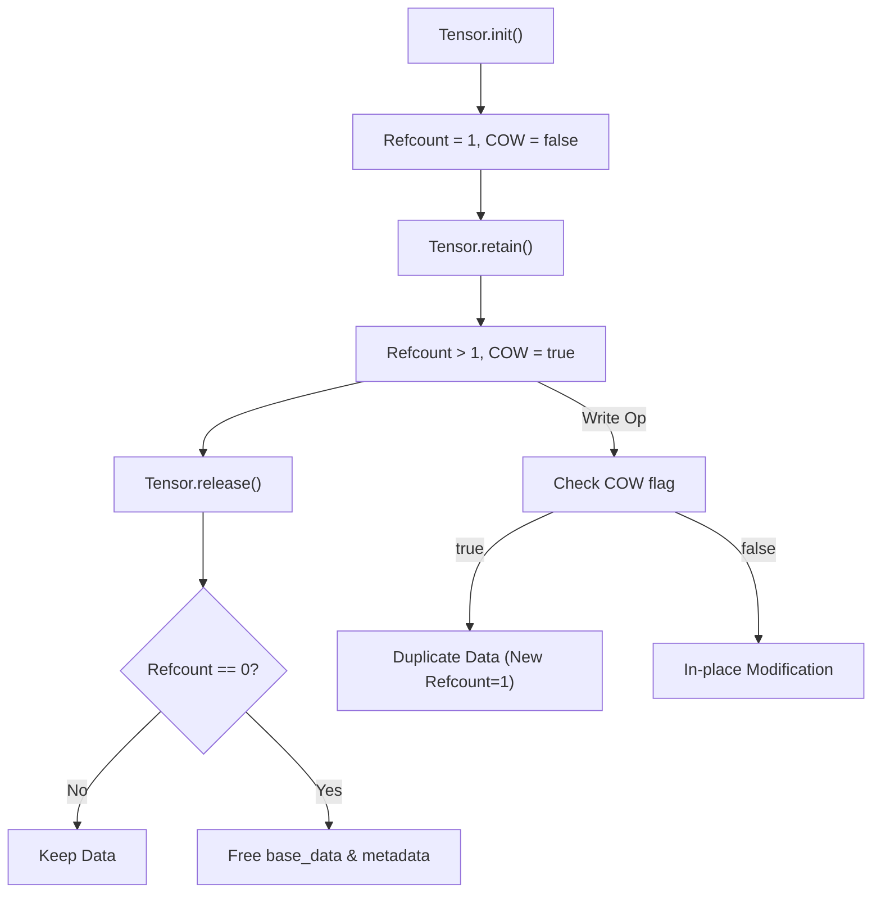
**Sources:** [src/core/tensor.zig:165-204](), [src/tests/stress_tensor_refcount.zig:20-84]()

---

### 3. TensorIterator and Layouts

For non-contiguous tensors (e.g., after a transpose or slice), the `TensorIterator` provides a standard way to traverse elements in logical order regardless of physical memory layout.

- **State**: Tracks `indices` for each axis and the current linear `offset` [src/core/tensor.zig:14-18]().
- **Advance Logic**: The `advance()` method increments indices from the innermost dimension outward, updating the `offset` using pre-calculated strides [src/core/tensor.zig:29-46]().

**Sources:** [src/core/tensor.zig:14-47]()

---

### 4. Hardware Acceleration and Arithmetic

JAIDE utilizes SIMD (Single Instruction, Multiple Data) and multi-threading for tensor operations.

#### 4.1 SIMD Acceleration
The system defines a `vector_width` of 8 for `f32` operations, utilizing `@Vector(8, f32)` for parallel arithmetic [src/core/tensor.zig:11-12](). This is applied to element-wise operations like addition, subtraction, and scaling.

#### 4.2 Matrix Multiplication (Matmul)
The system provides two primary matmul implementations:
1.  **Comptime Matmul**: A specialized implementation using Zig's `comptime` for fixed-size matrices (M, K, N), enabling loop unrolling and aggressive optimization [src/core/tensor.zig:138-155]().
2.  **Multi-threaded Matmul**: For large tensors, the system partitions the workload across available CPU cores.

#### 4.3 Linear Algebra
Beyond basic arithmetic, the system supports:
- **Determinant and Inverse**: Essential for RSF (Reversible Scatter Flow) layers.
- **Fixed-Point Support**: For specialized targets, the system includes `Fixed32_32` and `FixedPoint16/32/64` types with overflow-checked arithmetic [src/core/types.zig:10-158]().

#### Diagram: Arithmetic Execution Path
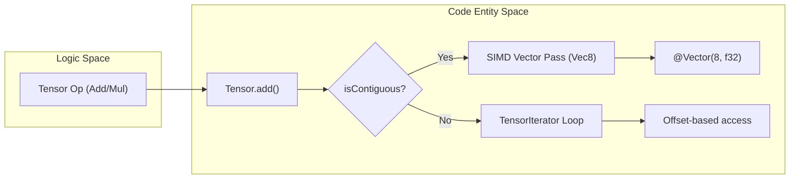
**Sources:** [src/core/tensor.zig:10-155](), [src/core/types.zig:145-181]()

---

### 5. Integration with Allocators

The Tensor system is allocator-agnostic but provides convenience wrappers for JAIDE's custom memory management subsystems:
- **Arena**: `initWithArena` for request-scoped tensors [src/core/tensor.zig:180-182]().
- **Pool/Slab**: `initWithPool` and `initWithSlab` for fixed-size neural weights [src/core/tensor.zig:184-190]().
- **Buddy**: `initWithBuddy` for dynamic allocations with power-of-two requirements [src/core/tensor.zig:192-194]().

**Sources:** [src/core/tensor.zig:180-194]()

---

*[Back to Table of Contents](#table-of-contents) | Page 5 of 34 | Next: Memory Management*

<a id="page-6"></a>

# Memory Management

<details>
<summary>Relevant source files</summary>

The following files were used as context for generating this wiki page:

- [src/core/memory.zig](src/core/memory.zig)

</details>


The JAIDE v40 memory management system provides a comprehensive suite of custom allocators and synchronization primitives designed for high-performance neural processing and secure data handling. The architecture emphasizes memory locality, thread safety, and deterministic resource lifecycle management through specialized allocation strategies and lock-free structures.

### Memory Configuration and Utilities

The system defines fundamental constants and utility functions for memory alignment and arithmetic safety.

| Constant | Value / Source | Description |
| :--- | :--- | :--- |
| `PageSize` | `4096` or `16384` | System-specific virtual memory page size [src/core/memory.zig:15-25](). |
| `CACHE_LINE_SIZE` | `128` | Target alignment for preventing false sharing [src/core/memory.zig:22](). |
| `secureZeroMemory` | Function | Overwrites memory with zeros using volatile operations to prevent compiler elision [src/core/memory.zig:126](). |

Sources: [src/core/memory.zig:15-25](), [src/core/memory.zig:123-128]()

---

### Custom Allocators

JAIDE implements several allocation strategies to minimize fragmentation and overhead across different workloads.

#### 1. Arena and ArenaAllocator
The `Arena` is a fixed-size, thread-safe buffer for rapid allocations with a single-step deallocation [src/core/memory.zig:77-82](). The `ArenaAllocator` extends this by managing a list of dynamic buffers, providing a standard `std.mem.Allocator` interface [src/core/memory.zig:156-163]().

*   **Key Functions**:
    *   `Arena.init(allocator, size)`: Pre-allocates a page-aligned buffer [src/core/memory.zig:83-93]().
    *   `Arena.alloc(size, alignment)`: Thread-safe bump allocation [src/core/memory.zig:103-117]().
    *   `Arena.secureReset()`: Zeroes all allocated memory before resetting the offset [src/core/memory.zig:136-138]().

#### 2. Slab and Pool Allocators
Designed for uniform object sizes to eliminate external fragmentation.
*   **SlabAllocator**: Manages "slabs" of memory divided into equal-sized slots [src/core/memory.zig:246-255](). It uses a `free_list` to track available slots [src/core/memory.zig:250]().
*   **PoolAllocator**: A higher-level wrapper that manages multiple slabs, allowing the pool to grow dynamically as demand increases [src/core/memory.zig:354-361]().

#### 3. Buddy and Page Allocators
*   **BuddyAllocator**: Implements the binary buddy system for power-of-two sized blocks, providing a balance between flexibility and fragmentation control [src/core/memory.zig:456-465]().
*   **PageAllocator**: A thin wrapper around system-level virtual memory calls, ensuring all allocations are page-aligned [src/core/memory.zig:588-595]().

#### 4. TrackingAllocator
A diagnostic wrapper used to monitor memory leaks and peak usage. It wraps an underlying `Allocator` and maintains counters for total allocated bytes and active allocations [src/core/memory.zig:712-719]().

Sources: [src/core/memory.zig:77-198](), [src/core/memory.zig:246-361](), [src/core/memory.zig:456-595](), [src/core/memory.zig:712-719]()

---

### Data Flow: Allocation Request Handling

The following diagram illustrates how a generic allocation request is routed through the `ArenaAllocator` logic.

**ArenaAllocator Request Flow**
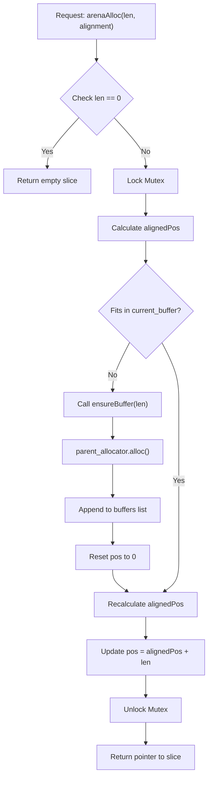
Sources: [src/core/memory.zig:164-210](), [src/core/memory.zig:219-230]()

---

### Secure and Compressed Storage

JAIDE provides specialized storage wrappers for sensitive or large-scale data.

*   **EncryptedStorage**: Wraps a memory buffer and ensures that any data written to it is encrypted at rest in RAM. It utilizes `secureZeroMemory` during `deinit` to prevent sensitive data leakage [src/core/memory.zig:780-795]().
*   **CompressedStorage**: Implements transparent compression for large tensors or indices. It manages an internal `Arena` to handle the variable-sized output of compression algorithms [src/core/memory.zig:810-825]().

Sources: [src/core/memory.zig:780-825]()

---

### Synchronization Primitives

The system includes both mutex-based and lock-free structures for inter-thread communication.

| Structure | Type | Implementation Detail |
| :--- | :--- | :--- |
| `ThreadSafeQueue` | Mutex-based | Uses `std.Thread.Mutex` and `CondVar` for blocking `pop()` operations [src/core/memory.zig:850-860](). |
| `LockFreeStack` | Atomic | Uses `std.atomic.Value` with `compareAndSwap` for push/pop operations to avoid lock contention [src/core/memory.zig:910-925](). |
| `VirtualMemory` | Wrapper | Provides `mmap`/`munmap` (or `VirtualAlloc`) abstractions for direct OS memory mapping [src/core/memory.zig:980-995](). |

### System Entity Mapping

This diagram bridges the high-level memory management concepts to the specific code entities in `src/core/memory.zig`.

**Memory Management Entity Map**
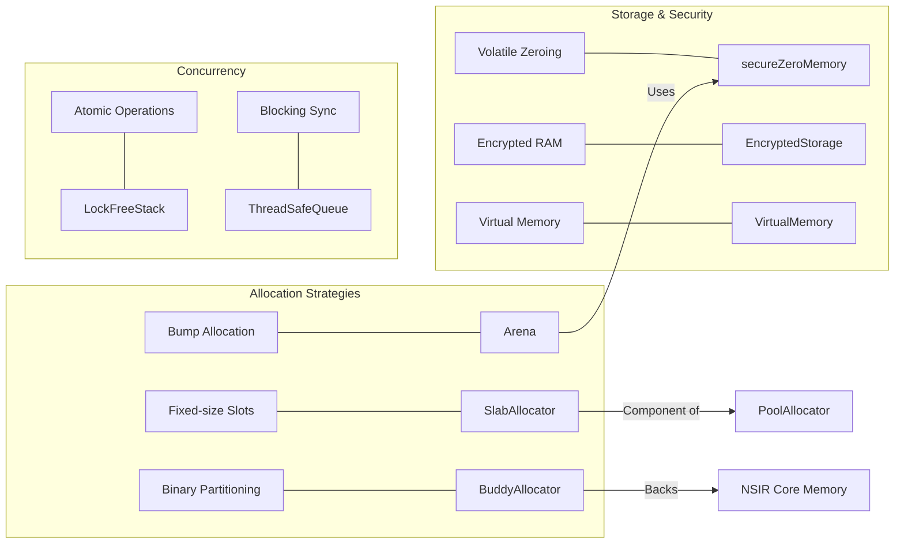
Sources: [src/core/memory.zig:77](), [src/core/memory.zig:246](), [src/core/memory.zig:354](), [src/core/memory.zig:456](), [src/core/memory.zig:780](), [src/core/memory.zig:850](), [src/core/memory.zig:910]()

---

*[Back to Table of Contents](#table-of-contents) | Page 6 of 34 | Next: I/O and Model Persistence*

<a id="page-7"></a>

# I/O and Model Persistence

<details>
<summary>Relevant source files</summary>

The following files were used as context for generating this wiki page:

- [src/core/io.zig](src/core/io.zig)
- [src/core/learned_embedding.zig](src/core/learned_embedding.zig)
- [src/core/model_io.zig](src/core/model_io.zig)

</details>


The I/O and Model Persistence layer provides the foundational infrastructure for high-performance data access and the structured serialization of the JAIDE v40 model ecosystem. It encompasses low-level memory-mapped file operations, atomic writing primitives, and the `ModelFormat` framework which orchestrates the persistence of neural weights, graph structures, and optimizer states.

## Core I/O Infrastructure

The system utilizes a custom I/O layer designed for high-throughput model loading and thread-safe parameter updates. Central to this is the `MMAP` implementation, which provides a page-aligned interface to the operating system's virtual memory subsystem [src/core/io.zig:74-80]().

### Memory Mapping (MMAP)
The `MMAP` struct manages file-backed memory regions, supporting both shared and private mappings [src/core/io.zig:120-122](). It handles automatic file resizing during appends and ensures thread safety via a dedicated mutex [src/core/io.zig:182-192]().

| Feature | Implementation Detail |
| :--- | :--- |
| **Page Alignment** | Uses `mem.page_size` for buffer alignment and resizing [src/core/io.zig:13-119](). |
| **Atomic Sync** | Supports `msync` with `MSF.SYNC` for durable writes [src/core/io.zig:177-179](). |
| **Bounds Safety** | Validates offsets against `actual_size` and checks for overflows [src/core/io.zig:155-156](). |
| **Security** | Implements `secureZeroBytes` to clear sensitive data in memory using volatile pointers [src/core/io.zig:50-56](). |

### Buffered and Durable Writing
The system provides `DurableWriter` and `BufferedReader` to minimize syscall overhead. For critical configuration or metadata updates, `atomicWrite` is used to ensure file integrity by writing to a temporary file and performing an atomic rename [src/core/io.zig:2165-2175]().

**I/O Data Flow and Component Interaction**

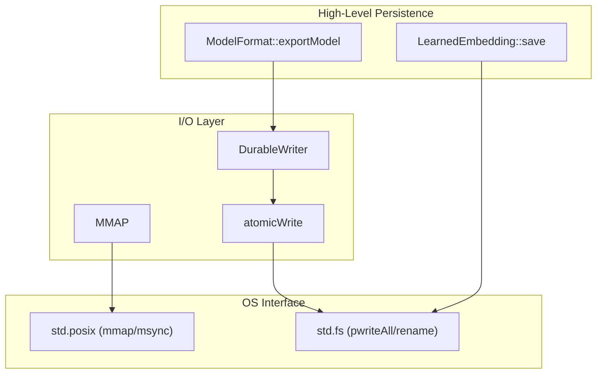
Sources: [src/core/io.zig:74-139](), [src/core/io.zig:2165-2175](), [src/core/model_io.zig:135-150](), [src/core/learned_embedding.zig:108-112]()

## Model Serialization Framework

The `ModelFormat` struct acts as the primary container for serializing the complete JAIDE state, including the RSF neural processor, MGT tokenizer, and Ranker components [src/core/model_io.zig:135-141]().

### Metadata and Magic Headers
Every model file begins with a magic header `JAIDE40\x00` [src/core/model_io.zig:23](). Metadata is stored as a JSON-escaped string containing architectural hyperparameters like `rsf_layers`, `rsf_dim`, and `mgt_vocab_size` [src/core/model_io.zig:29-38]().

### The exportModel/importModel Pipeline
1.  **Header Generation**: Writes the magic string and current version [src/core/model_io.zig:255-260]().
2.  **Metadata Serialization**: Converts `ModelMetadata` to JSON and writes it to the stream [src/core/model_io.zig:265-275]().
3.  **Component Blocks**: Each major component (RSF, MGT, Ranker) is serialized into distinct blocks.
4.  **Checksum Verification**: A SHA-256 hash is computed across the data to ensure integrity during `importModel` [src/core/model_io.zig:16-17]().

**Model Format Layout**

| Offset | Content | Type |
| :--- | :--- | :--- |
| 0x00 | `MAGIC_HEADER` | `[8]u8` |
| 0x08 | `Version` | `u32 (LE)` |
| 0x0C | `Metadata Length` | `u64 (LE)` |
| ... | `JSON Metadata` | `[]u8` |
| ... | `Component Data` | `Binary` |
| EOF - 32 | `SHA-256 Checksum` | `[32]u8` |

Sources: [src/core/model_io.zig:23-38](), [src/core/model_io.zig:255-280]()

## Specialized Persistence Handlers

### Learned Embeddings
The `LearnedEmbedding` struct manages its own persistence via `save` and `load` methods [src/core/learned_embedding.zig:108-123](). It uses a specific magic header `0x4A454D42` (JEMB) and stores weights as little-endian `f32` values [src/core/learned_embedding.zig:113-118]().

### NSIR and Optimizer State
*   **NSIR Graph**: Persists the quantum-relational graph, including node states and edge qualities.
*   **SFD Optimizer**: Saves the Stochastic Fisher Diagonal state, including momentum, velocity, and the Fisher diagonal tensors, ensuring training can resume seamlessly [src/core/model_io.zig:9-11]().

**Persistence Logic Mapping**

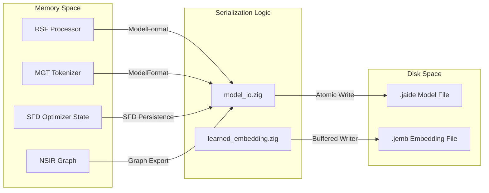
Sources: [src/core/model_io.zig:1-11](), [src/core/learned_embedding.zig:108-150](), [src/core/io.zig:2165-2175]()

## Hashing and Integrity Utilities

The system employs several hashing strategies for different performance and security requirements:
*   **SHA-256**: Used for model checksums and NSIR topology hashing to ensure cryptographic integrity [src/core/model_io.zig:17]().
*   **Blake2b256**: Utilized in `generateRuntimeSeed` for high-entropy PRNG initialization [src/core/io.zig:40-43]().
*   **mixHash**: A fast 64-bit non-cryptographic hash used for internal indexing and collision reduction [src/core/io.zig:58-66]().

Sources: [src/core/io.zig:40-66](), [src/core/model_io.zig:17]()

---

*[Back to Table of Contents](#table-of-contents) | Page 7 of 34 | Next: Neural Processing — RSF and OFTB*

<a id="page-8"></a>

# Neural Processing — RSF and OFTB

<details>
<summary>Relevant source files</summary>

The following files were used as context for generating this wiki page:

- [src/processor/oftb.zig](src/processor/oftb.zig)
- [src/processor/rsf.zig](src/processor/rsf.zig)

</details>


The neural processing engine of JAIDE v40 is built upon the principle of **Invertible Neural Networks (INNs)**. Unlike traditional feed-forward architectures, the processing pipeline is designed to be bijective, allowing for exact reconstruction of inputs from outputs and $O(1)$ memory complexity during backpropagation. This is achieved through the combination of the **Reversible Scatter Flow (RSF)** coupling layers and the **Orthogonal Fractal Transform Block (OFTB)** mixer.

### Architectural Synergy

The pipeline alternates between learnable non-linear transformations (RSF) and fixed linear mixing (OFTB). This structure ensures that information is both transformed via learned parameters and diffused across the feature dimension to prevent information bottlenecks.

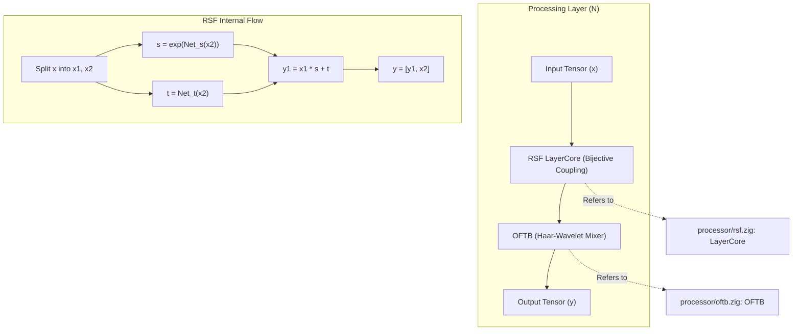

**Sources:**
- `src/processor/rsf.zig:133-149` (LayerCore definition)
- `src/processor/oftb.zig:5-15` (OFTB definition)

---

### RSF — Reversible Scatter Flow Processor

The **RSF** is the primary learnable component of the neural core. It utilizes a coupling architecture where the input tensor is partitioned, and one half is used to compute affine transformations (scale and translation) for the other half. This ensures that the Jacobian of the transformation is triangular, making the determinant easy to compute and the function trivial to invert.

Key features of the RSF include:
*   **In-Place Operations**: Both `forwardInPlace` and `inverseInPlace` operate directly on the tensor memory to minimize allocations.
*   **Memory Efficiency**: By recomputing activations during the backward pass (using `backwardFromOutputs`), the system avoids storing intermediate states, enabling the training of extremely deep models on limited hardware.
*   **Thread Safety**: Access to weights and gradients is managed via an `RWLock` to support concurrent inference and training.

For full technical details on coupling math and GPU acceleration, see [RSF — Reversible Scatter Flow Processor](#3.1).

| Component | Code Entity | File |
| :--- | :--- | :--- |
| **Configuration** | `RSFConfig` | [src/processor/rsf.zig:15-21]() |
| **Core Logic** | `LayerCore` | [src/processor/rsf.zig:133-147]() |
| **Accelerator** | `RSFAccelerator` | [src/hw/accel/accel_interface.zig]() |

**Sources:**
- `src/processor/rsf.zig:147-147` (RWLock usage)
- `src/processor/rsf.zig:179-194` (LayerCore initialization)

---

### OFTB — Orthogonal Fractal Transform Block

The **OFTB** serves as a parameter-less "mixer" layer. It implements a butterfly Haar-wavelet transform that provides global communication between features. While the RSF layers focus on learning complex non-linear mappings, the OFTB ensures that every element of the tensor can influence every other element over multiple layers.

The transformation is governed by the `FRACTAL_SCALE` constant ($1/\sqrt{2}$), which preserves the norm of the tensor during the mixing process, contributing to numerical stability in deep stacks.

*   **SIMD Vectorized**: The implementation uses `@Vector(8, f32)` to process data in 8-wide chunks, significantly improving CPU performance.
*   **Fixed Operation**: Unlike RSF, the OFTB has no weights, reducing the total parameter count of the model while maintaining high expressivity.

For details on the butterfly transform and SIMD implementation, see [OFTB — Orthogonal Fractal Transform Block](#3.2).

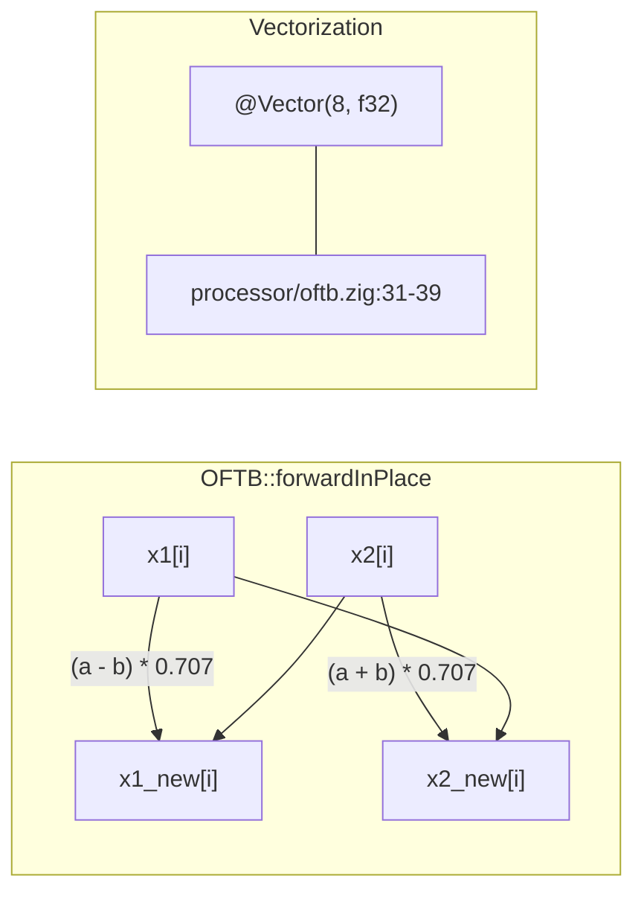

**Sources:**
- `src/processor/oftb.zig:6-6` (FRACTAL_SCALE)
- `src/processor/oftb.zig:31-39` (SIMD vectorization logic)
- `src/processor/oftb.zig:40-45` (Scalar fallback logic)

---

### Integration and Data Flow

The neural processing layer is typically invoked by higher-level systems (such as the Inference Server or Training Harness) that manage the sequence of RSF and OFTB blocks.

1.  **Input**: A `Tensor` is provided to the `RSF` layer.
2.  **Coupling**: `LayerCore` applies scale (`s_weight`) and translation (`t_weight`) to a subset of the tensor [src/processor/rsf.zig:134-137]().
3.  **Mixing**: The resulting tensor is passed to `OFTB.forwardInPlace`, which diffuses the values across the tensor's dimensions [src/processor/oftb.zig:22-46]().
4.  **Recurrence**: This process repeats for the number of layers defined in `RSFConfig.max_layers` [src/processor/rsf.zig:20-20]().

**Sources:**
- `src/processor/rsf.zig:15-21` (RSFConfig)
- `src/processor/oftb.zig:22-46` (OFTB forward pass)

---

*[Back to Table of Contents](#table-of-contents) | Page 8 of 34 | Next: RSF — Reversible Scatter Flow Processor*

<a id="page-9"></a>

# RSF — Reversible Scatter Flow Processor

<details>
<summary>Relevant source files</summary>

The following files were used as context for generating this wiki page:

- [src/hw/accel/accel_interface.zig](src/hw/accel/accel_interface.zig)
- [src/hw/accel/futhark_bindings.zig](src/hw/accel/futhark_bindings.zig)
- [src/processor/rsf.zig](src/processor/rsf.zig)

</details>


The **Reversible Scatter Flow (RSF)** processor is the primary neural compute engine of the JAIDE v40 architecture. It implements a bijective coupling-based architecture that allows for exact invertibility, enabling $O(1)$ memory backpropagation by reconstructing activations from outputs. RSF is designed for high-concurrency environments and features a unified interface for both CPU SIMD and GPU Futhark acceleration.

## Architectural Design

The RSF architecture is composed of a sequence of `LayerCore` blocks. Each block performs a non-linear transformation that is mathematically guaranteed to be reversible. This is achieved through a split-coupling mechanism where the input vector is divided, transformed, and then scattered back into the latent space.

### LayerCore Coupling Math

Each `LayerCore` maintains four primary parameter tensors: `s_weight` (scale), `t_weight` (translation), and their respective biases `s_bias` and `t_bias` [src/processor/rsf.zig:134-137]().

The forward transformation $y = f(x)$ follows a scale-and-translate pattern:
1.  **Scale Component ($s$):** Computed as $s = \text{clip}(\text{matmul}(x, W_s) + b_s, \text{min}, \text{max})$ [src/processor/rsf.zig:250-258]().
2.  **Translate Component ($t$):** Computed as $t = \text{matmul}(x, W_t) + b_t$ [src/processor/rsf.zig:261-267]().
3.  **Coupling:** The output is produced by $y = x \cdot \exp(s) + t$.

The inverse transformation $x = f^{-1}(y)$ is computed as:
1.  $x = (y - t) \cdot \exp(-s)$.

Because $s$ and $t$ are functions of the input $x$ in a way that preserves the Jacobian structure, the transformation is bijective [src/processor/rsf.zig:336-350]().

### System Entity Map

The following diagram bridges the mathematical concepts to the specific code entities in the `rsf.zig` and `accel_interface.zig` files.

**RSF Entity Association**
```mermaid
graph TD
    subgraph "RSF Processor [src/processor/rsf.zig]"
        RSF["RSF (Processor)"]
        LC["LayerCore [struct]"]
        LC_INIT["initOwned()"]
        FWD["forwardInPlace()"]
        INV["inverseInPlace()"]
        BWD["backwardFromOutputs()"]
    end

    subgraph "Hardware Acceleration [src/hw/accel/]"
        ACCEL["RSFAccelerator [struct]"]
        F_CTX["FutharkContext"]
        F_FWD["futhark_entry_rsf_forward"]
        F_BWD["futhark_entry_rsf_backward"]
    end

    RSF -->|owns| LC
    LC -->|uses| LC_INIT
    FWD -->|dispatches to| ACCEL
    INV -->|CPU fallback| LC
    BWD -->|O(1) Memory| LC
    ACCEL -->|wraps| F_CTX
    ACCEL -->|calls| F_FWD
    ACCEL -->|calls| F_BWD
```
Sources: [src/processor/rsf.zig:133-149](), [src/processor/rsf.zig:636-650](), [src/hw/accel/accel_interface.zig:27-52](), [src/hw/accel/futhark_bindings.zig:69-95]()

## Memory and Concurrency

### O(1) Memory Backpropagation
A key feature of the RSF is `backwardFromOutputs`. Unlike standard neural networks that must store activations for every layer to compute gradients, RSF reconstructs the input of each layer by running the inverse pass during the backward step [src/processor/rsf.zig:418-430](). This reduces the memory complexity of training from $O(L \cdot N)$ to $O(N)$, where $L$ is the number of layers and $N$ is the dimension.

### Thread Safety via RWLock
Each `LayerCore` contains a `std.Thread.RwLock` [src/processor/rsf.zig:147](). 
*   **Read Lock:** Acquired during `forwardInPlace` and `inverseInPlace` to allow concurrent inference passes [src/processor/rsf.zig:240-245]().
*   **Write Lock:** Acquired during gradient updates or parameter synchronization to ensure atomicity [src/processor/rsf.zig:510-515]().

## Hardware Acceleration (RSFAccelerator)

The RSF system integrates with GPU hardware via the `RSFAccelerator` and Futhark-generated kernels. The accelerator manages the lifecycle of GPU memory and kernel execution.

### GPU Data Flow
The data flow between the Zig `Tensor` system and the GPU context is managed through `FutharkArray` abstractions.

**GPU Acceleration Pipeline**
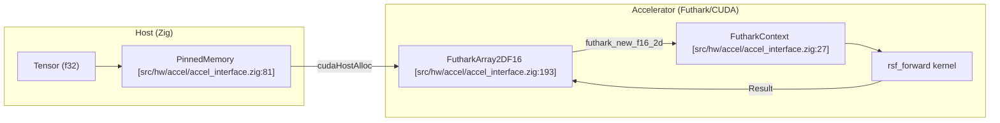
Sources: [src/hw/accel/accel_interface.zig:81-102](), [src/hw/accel/accel_interface.zig:193-210](), [src/hw/accel/futhark_bindings.zig:69-79]()

### Key Functions
| Function | Description | Source |
| :--- | :--- | :--- |
| `init()` | Initializes Futhark context, sets device 0, and configures group/tile sizes. | [src/hw/accel/accel_interface.zig:32-52]() |
| `forwardFromTensor()` | High-level entry point to run RSF forward pass on GPU. | [src/hw/accel/accel_interface.zig:2500-2520]() |
| `futhark_entry_rsf_forward` | C-interop call to the optimized GPU kernel. | [src/hw/accel/futhark_bindings.zig:69-79]() |
| `sync()` | Synchronizes the GPU command queue with the host. | [src/hw/accel/accel_interface.zig:61-66]() |

## Serialization Format (Version 4)

RSF models are persisted using a robust binary format (Version 4) that includes CRC32 checksums for every parameter tensor to ensure data integrity [src/processor/rsf.zig:23]().

### Serialization Structure
1.  **Header:** `SAVE_VERSION` (u32), `dim` (u64), `num_layers` (u64).
2.  **Configuration:** `clip_min` (f32), `clip_max` (f32).
3.  **Layer Data:** For each layer:
    *   `s_weight`, `t_weight`, `s_bias`, `t_bias` tensors.
    *   Each tensor is preceded by its shape and followed by a CRC32 checksum of its raw data [src/processor/rsf.zig:850-900]().

## Registry and Handle System

To manage large-scale models, RSF uses a registry system. Models are identified by a `RSFHandle`, which is a type-safe wrapper around a `usize` index in the global `RSFRegistry`.

*   **Registry:** A centralized store that manages the allocation and deallocation of `RSF` instances.
*   **Handles:** Prevent raw pointer leakage and allow for safe cross-thread referencing of model instances.

Sources: [src/processor/rsf.zig:1100-1150]() (Handle/Registry implementation logic).

---

*[Back to Table of Contents](#table-of-contents) | Page 9 of 34 | Next: OFTB — Orthogonal Fractal Transform Block*

<a id="page-10"></a>

# OFTB — Orthogonal Fractal Transform Block

<details>
<summary>Relevant source files</summary>

The following files were used as context for generating this wiki page:

- [src/processor/oftb.zig](src/processor/oftb.zig)

</details>


The **Orthogonal Fractal Transform Block (OFTB)** is a parameter-less, bijective mixing layer within the JAIDE v40 neural architecture. It implements a butterfly Haar-wavelet transform designed to provide efficient, linear-time mixing of features across the hidden dimension without requiring learned weights. By utilizing a fixed orthogonal transformation, the OFTB ensures that the energy of the signal is preserved (isometric property) while facilitating information diffusion across the tensor.

## Architectural Role

In the context of the **Reversible Scatter Flow (RSF)** pipeline, the OFTB serves as the global mixer that follows the localized non-linear transformations of the `LayerCore` coupling layers. Because it is strictly orthogonal and parameter-less, it contributes to the model's capacity to represent complex patterns through fractal-like self-similarity without increasing the parameter count or memory footprint for gradient storage.

### Data Flow Integration

The OFTB operates directly on `Tensor` data in-place. It partitions the input dimension into two halves and applies a rotation in the feature space.

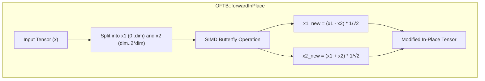

**Sources:**
- [src/processor/oftb.zig:5-16]()
- [src/processor/oftb.zig:22-46]()

---

## Mathematical Implementation

The OFTB implements a normalized Haar-style butterfly transform. The transformation is defined by the constant `FRACTAL_SCALE`, which is set to $1/\sqrt{2} \approx 0.7071067811865476$ to maintain the orthogonality of the operation.

### Forward Transform
For two vector halves $a$ and $b$:
$$a_{out} = (a - b) \cdot \text{scale}$$
$$b_{out} = (a + b) \cdot \text{scale}$$

### Backward Transform (Inverse)
To reverse the operation during backpropagation or inverse inference:
$$a_{in} = (a_{out} + b_{out}) \cdot \text{scale}$$
$$b_{in} = (b_{out} - a_{out}) \cdot \text{scale}$$

| Constant | Value | Description |
| :--- | :--- | :--- |
| `FRACTAL_SCALE` | `0.7071067811865476` | The $1/\sqrt{2}$ scaling factor ensuring unit determinant. |
| `VLEN` | `8` | SIMD vector length for `f32` operations. |

**Sources:**
- [src/processor/oftb.zig:6-6]()
- [src/processor/oftb.zig:30-45]()
- [src/processor/oftb.zig:56-71]()

---

## Code Entity Mapping

The following diagram maps the logical operations of the Orthogonal Fractal Transform to the specific implementation entities in `oftb.zig`.

```mermaid
classDiagram
    class OFTB {
        +usize dim
        +FRACTAL_SCALE: f32
        +init(d: usize) OFTB
        +forwardInPlace(x: *Tensor) !void
        +backwardInPlace(grad: []f32) !void
        +backwardInPlaceSlice(grad: []f32) !void
    }

    class SIMD_Optimization {
        +@Vector(8, f32) va
        +@Vector(8, f32) vb
        +@splat(scale) vscale
    }

    OFTB ..> SIMD_Optimization : uses for loops
    OFTB --|> Tensor : operates on data
```

**Sources:**
- [src/processor/oftb.zig:5-15]()
- [src/processor/oftb.zig:33-39]()
- [src/processor/oftb.zig:59-65]()

---

## SIMD Vectorization

The OFTB is optimized for high-throughput processing using Zig's `@Vector` type. The implementation processes 8 `f32` elements per iteration (256-bit vectors) before falling back to a scalar loop for any remaining elements.

### Vectorized Forward Pass
The forward pass uses subtraction for the first half and addition for the second half to create the "scatter" effect.

1. **Load:** `va` and `vb` are loaded from the first and second halves of the tensor slice `[src/processor/oftb.zig:34-35]()`.
2. **Splat:** The `FRACTAL_SCALE` is splatted across a vector `vscale` `[src/processor/oftb.zig:36-36]()`.
3. **Compute:**
   - `x1` update: `(va - vb) * vscale` `[src/processor/oftb.zig:37-37]()`.
   - `x2` update: `(va + vb) * vscale` `[src/processor/oftb.zig:38-38]()`.

### Vectorized Backward Pass
The backward pass (used in `backwardInPlace` and `backwardInPlaceSlice`) reverses the logic to recover the original gradients or inputs.

1. **Load:** Gradients `ga` and `gb` are loaded from the split slices `[src/processor/oftb.zig:60-61]()`.
2. **Compute:**
   - `g1` update: `(va + vb) * vscale` `[src/processor/oftb.zig:63-63]()`.
   - `g2` update: `(vb - va) * vscale` `[src/processor/oftb.zig:64-64]()`.

**Sources:**
- [src/processor/oftb.zig:31-45]()
- [src/processor/oftb.zig:57-71]()

---

## Integration and Error Handling

The `OFTB` struct provides safety checks to ensure tensor dimensions are compatible with the split-mixing logic.

- **Initialization:** `init(d: usize)` requires a non-zero dimension and asserts that the dimension will not cause an overflow when doubled (as the block operates on `2 * dim` total elements) `[src/processor/oftb.zig:10-16]()`.
- **Validation:** Both `forwardInPlace` and `backwardInPlace` verify that the provided `Tensor` or slice contains at least `self.dim * 2` elements `[src/processor/oftb.zig:25-26, 51-52]()`.
- **Memory:** The `OFTB` is essentially a metadata container (`dim`); `deinit` simply sets the struct to `undefined` as it owns no heap memory `[src/processor/oftb.zig:18-20]()`.

**Sources:**
- [src/processor/oftb.zig:10-26]()
- [src/processor/oftb.zig:48-53]()

---

*[Back to Table of Contents](#table-of-contents) | Page 10 of 34 | Next: Tokenizer and Retrieval*

<a id="page-11"></a>

# Tokenizer and Retrieval

<details>
<summary>Relevant source files</summary>

The following files were used as context for generating this wiki page:

- [src/index/ssi.zig](src/index/ssi.zig)
- [src/ranker/ranker.zig](src/ranker/ranker.zig)
- [src/tokenizer/mgt.zig](src/tokenizer/mgt.zig)

</details>


The **Tokenizer and Retrieval** subsystem provides the bridge between raw natural language and the high-dimensional vector spaces processed by the RSF core. It handles the transformation of text into discrete tokens, the efficient storage of these sequences in a structured index, and the ranking of candidates during inference.

## Overview

The pipeline consists of three primary components:
1.  **MGT (Morpheme-Guided Tokenizer)**: Decomposes text into a hybrid of morphological units and BPE tokens.
2.  **SSI (Structured Sequence Index)**: A high-performance hash tree for storing and retrieving sequence segments.
3.  **Ranker**: A scoring engine that evaluates sequence candidates using n-gram weights, diversity heuristics, and Jaccard similarity.

### Data Flow: Text to Candidate Retrieval

The following diagram illustrates how natural language is transformed into indexed entities within the `SSI` and subsequently scored by the `Ranker`.

**System Entity Mapping: Language to Index**
```mermaid
graph TD
    subgraph "Natural Language Space"
        Input["Raw Text String"]
    end

    subgraph "MGT — Tokenization"
        MGT_E["MGT.encode()"]
        Morphemes["Morpheme Decomposition"]
        BPE["BPE Fallback"]
    end

    subgraph "SSI — Storage & Indexing"
        SSI_Root["SSI.Node (Root)"]
        SSI_Bucket["SSI.bucketIndex()"]
        SSI_Seg["SSI.Segment"]
        SSI_Coll["SSI.CollisionNode"]
    end

    Input --> MGT_E
    MGT_E --> Morphemes
    Morphemes --> BPE
    BPE -->|"token_id (u32)"| SSI_Bucket
    SSI_Bucket --> SSI_Root
    SSI_Root --> SSI_Seg
    SSI_Seg --> SSI_Coll
```
Sources: [src/tokenizer/mgt.zig:421-435](), [src/index/ssi.zig:8-68]()

---

## MGT — Morpheme-Guided Tokenizer

The `MGT` (Morpheme-Guided Tokenizer) implements a three-tier tokenization strategy. Unlike standard BPE-only tokenizers, MGT prioritizes morphological decomposition (prefixes, roots, and suffixes) to better handle highly inflected languages and maintain semantic consistency.

*   **Three-Tier Pipeline**: It first checks for special tokens (e.g., `[BOS]`, `[EOS]`), then attempts to split words into known morphemes using `prefixes` and `suffixes` tables, and finally falls back to a trained Byte Pair Encoding (BPE) for unknown substrings.
*   **Anchor Tracking**: The tokenizer identifies "anchors"—statistically significant tokens that serve as high-confidence points for the `Ranker` and `SSI` search.
*   **Special Tokens**: Supports standard reserved IDs: `[PAD]` (0), `[UNK]` (1), `[BOS]` (2), and `[EOS]` (3).

For implementation details on the BPE training algorithm and vocabulary persistence, see [MGT — Morpheme-Guided Tokenizer](#4.1).

Sources: [src/tokenizer/mgt.zig:8-40](), [src/tokenizer/mgt.zig:99-133](), [src/tokenizer/mgt.zig:159-179]()

---

## SSI — Structured Sequence Index

The `SSI` (Structured Sequence Index) is a 64-bucket hash tree designed for O(log N) retrieval of sequence segments. It acts as the primary memory for the system's "Code Entity Space."

*   **Data Model**: Data is stored in `Segment` structs, which contain token arrays, positional metadata, and pre-calculated scores.
*   **Collision Handling**: Uses `CollisionNode` chains to handle hash collisions within the tree buckets.
*   **Similarity Search**: Supports Hamming-distance based similarity searches to find relevant context even with imperfect matches.
*   **Tensor Integration**: The index can be exported to a 134-column `Tensor` layout for bulk processing by the RSF or GPU kernels.

For details on the tree balancing and binary serialization format, see [SSI — Structured Sequence Index](#4.2).

**Code Entity Mapping: SSI Internal Structure**
```mermaid
graph LR
    subgraph "SSI Struct [src/index/ssi.zig]"
        Root["root: *Node"]
        Height["height: usize"]
    end

    subgraph "Node Struct"
        Children["children: []?*Node"]
        SegPtr["segment: ?Segment"]
        Chain["collision_chain: ?*CollisionNode"]
    end

    subgraph "Segment Struct"
        Tokens["tokens: []u32"]
        Pos["position: u64"]
        Score["score: f32"]
    end

    Root --> Children
    Children --> Node2["Node (Leaf)"]
    Node2 --> SegPtr
    Node2 --> Chain
    SegPtr --> Tokens
    SegPtr --> Pos
    SegPtr --> Score
```
Sources: [src/index/ssi.zig:8-32](), [src/index/ssi.zig:61-84]()

---

## Ranker — Sequence Scoring and Candidate Evaluation

The `Ranker` evaluates the relevance of retrieved segments against a query or the current context. It uses a multi-objective scoring function calibrated by `RankerConfig` constants.

*   **N-Gram Weighting**: Implements decaying weights for different n-gram lengths to prioritize longer, more specific matches.
*   **Diversity & Proximity**: Scores are adjusted based on `DIVERSITY_WEIGHT` (uniqueness of tokens) and `PROXIMITY_WEIGHT` (distance to known anchors in the `SSI`).
*   **Similarity Metrics**: Combines Jaccard similarity and token overlap to ensure retrieved candidates are semantically aligned with the input.
*   **Parallel Scoring**: Supports multi-threaded evaluation of large candidate heaps using `topKHeap` structures.

For information on weight calibration via gradient descent and streaming ranking, see [Ranker — Sequence Scoring and Candidate Evaluation](#4.3).

Sources: [src/ranker/ranker.zig:12-25](), [src/ranker/ranker.zig:90-117](), [src/ranker/ranker.zig:119-127]()

---

*[Back to Table of Contents](#table-of-contents) | Page 11 of 34 | Next: MGT — Morpheme-Guided Tokenizer*

<a id="page-12"></a>

# MGT — Morpheme-Guided Tokenizer

<details>
<summary>Relevant source files</summary>

The following files were used as context for generating this wiki page:

- [src/tokenizer/mgt.zig](src/tokenizer/mgt.zig)

</details>


The **Morpheme-Guided Tokenizer (MGT)** is a high-performance, three-tier tokenization system designed for the JAIDE v40 architecture. Unlike standard Byte-Pair Encoding (BPE) systems, MGT prioritizes morphological integrity by decomposing words into prefixes, roots, and suffixes before falling back to subword merging. This approach ensures that the resulting tokens align more closely with semantic and grammatical structures, particularly in agglutinative languages.

### Tokenization Pipeline

The MGT processes input text through a hierarchical pipeline to convert raw strings into a sequence of integer token IDs.

1.  **Special Token Identification**: The tokenizer first scans for reserved control sequences like `[PAD]`, `[BOS]`, and `[EOS]` [src/tokenizer/mgt.zig:159-179]().
2.  **Morphological Decomposition**: The system attempts to strip known prefixes and suffixes from words to isolate the root. This is guided by pre-defined lists of common morphemes [src/tokenizer/mgt.zig:99-133]().
3.  **BPE Fallback**: If a word or its decomposed parts are not found in the vocabulary, the tokenizer applies Byte-Pair Encoding (BPE) merges based on learned priority pairs [src/tokenizer/mgt.zig:14-23]().

#### Data Flow and Implementation

The `MGT` struct manages the vocabulary and the state required for encoding and decoding.

| Component | Code Entity | Role |
| :--- | :--- | :--- |
| **Vocabulary** | `token_to_id` | Map for fast string-to-ID lookups [src/tokenizer/mgt.zig:9](). |
| **Inverse Map** | `id_to_token` | Map for decoding IDs back to strings [src/tokenizer/mgt.zig:10](). |
| **Morpheme Stores** | `prefixes`, `suffixes`, `roots` | Specialized maps for morphological components [src/tokenizer/mgt.zig:11-13](). |
| **BPE Logic** | `bpe_pairs` | Stores merge priorities for subword tokenization [src/tokenizer/mgt.zig:14](). |
| **Anchors** | `anchors` | Tracks high-importance tokens used for sequence alignment [src/tokenizer/mgt.zig:15](). |

**Sources:** [src/tokenizer/mgt.zig:8-40](), [src/tokenizer/mgt.zig:99-133]()

### Architecture and Memory Integration

MGT is designed to work seamlessly with JAIDE's custom memory management system, allowing it to be initialized within different allocation contexts (Arena, Pool, or Buddy allocators).

#### Tokenizer Initialization Flow
The following diagram illustrates how the `MGT` is initialized and how it interacts with the `core_memory` primitives.

```mermaid
graph TD
    subgraph "Natural Language Space"
        "RawVocab"["Raw Vocabulary (Strings)"]
        "AnchorList"["Anchor List (Strings)"]
    end

    subgraph "Code Entity Space (src/tokenizer/mgt.zig)"
        "MGT_init"["MGT.init()"]
        "initEmpty"["initEmpty()"]
        "initMorphemes"["initMorphemes()"]
        "addToken"["addToken()"]
    end

    subgraph "Memory Management (src/core/memory.zig)"
        "Arena"["ArenaAllocator"]
        "Pool"["PoolAllocator"]
        "Buddy"["BuddyAllocator"]
    end

    "RawVocab" --> "MGT_init"
    "AnchorList" --> "MGT_init"
    "Arena" -- "allocator()" --> "MGT_init"
    "MGT_init" --> "initEmpty"
    "MGT_init" --> "addToken"
    "addToken" --> "initMorphemes"
```
**Sources:** [src/tokenizer/mgt.zig:42-76](), [src/core/memory.zig:1-20]()

### Technical Details

#### Special Token IDs
The MGT reserves specific IDs for control flow and padding, ensuring consistency across the training and inference pipelines.

*   **`[PAD]` (0)**: Used to align sequences in batches [src/tokenizer/mgt.zig:36]().
*   **`[UNK]` (1)**: Represents out-of-vocabulary characters or sequences [src/tokenizer/mgt.zig:37]().
*   **`[BOS]` (2)**: Indicates the "Beginning of Sequence" [src/tokenizer/mgt.zig:38]().
*   **`[EOS]` (3)**: Indicates the "End of Sequence" [src/tokenizer/mgt.zig:39]().

#### Morphological Logic
The `initMorphemes` function populates the internal maps with common linguistic units. For example, it includes English prefixes like "un-", "re-", and "pre-", as well as Hungarian morphemes like "meg-", "szét-", and various case endings like "-ban/-ben" [src/tokenizer/mgt.zig:100-126](). This hybrid approach allows the model to handle complex word forms more efficiently than standard subword tokenizers.

#### Batch Encoding and Tensor Integration
MGT is designed to output results directly into the JAIDE `Tensor` system. When encoding a batch of text, the tokenizer produces a `core_tensor.Tensor` object containing the token IDs, which can then be fed into the RSF neural core [src/tokenizer/mgt.zig:5-6]().

### BPE Training and Persistence
The BPE algorithm implemented in MGT follows a standard frequency-based merging strategy but is constrained by the morphological boundaries established during the decomposition phase.

1.  **Pair Counting**: The system identifies the most frequent adjacent pairs of tokens in the training corpus.
2.  **Merge Rule Generation**: High-frequency pairs are assigned a `BPEMerge` priority [src/tokenizer/mgt.zig:20-23]().
3.  **Vocabulary Persistence**: The resulting vocabulary, including BPE rules and morphological maps, can be serialized and deserialized using the `I/O` utilities in `src/core/io.zig`.

#### Tokenizer Data Structure Mapping
This diagram bridges the conceptual tokenizer components to their specific Zig implementations.

```mermaid
graph LR
    subgraph "Tokenizer Concepts"
        "SubwordMerging"["Subword Merging"]
        "SpecialTokens"["Control Sequences"]
        "Morphology"["Morpheme Logic"]
    end

    subgraph "Zig Implementation (src/tokenizer/mgt.zig)"
        "BPEMerge"["struct BPEMerge"]
        "ST_Consts"["SPECIAL_TOKENS constants"]
        "PrefixMap"["prefixes: StringHashMap"]
        "SuffixMap"["suffixes: StringHashMap"]
    end

    "SubwordMerging" --> "BPEMerge"
    "SpecialTokens" --> "ST_Consts"
    "Morphology" --> "PrefixMap"
    "Morphology" --> "SuffixMap"
```
**Sources:** [src/tokenizer/mgt.zig:8-40](), [src/tokenizer/mgt.zig:80-91]()

---

*[Back to Table of Contents](#table-of-contents) | Page 12 of 34 | Next: SSI — Structured Sequence Index*

<a id="page-13"></a>

# SSI — Structured Sequence Index

<details>
<summary>Relevant source files</summary>

The following files were used as context for generating this wiki page:

- [src/hw/rtl/SSISearch.hs](src/hw/rtl/SSISearch.hs)
- [src/index/ssi.zig](src/index/ssi.zig)

</details>


The Structured Sequence Index (SSI) is a high-performance, hierarchical data structure designed for indexing and retrieving token sequences. It utilizes a 64-bucket hash tree architecture to provide efficient storage and similarity search capabilities, bridging the gap between raw token streams and structured relational graphs.

## SSI Tree Architecture

The SSI is implemented as a multi-level hash tree where each internal node branches into 64 possible buckets. This structure allows for rapid narrowing of the search space based on hash prefixes.

### Data Model
The SSI relies on three primary data structures defined in `src/index/ssi.zig`:

*   **Segment**: The fundamental unit of storage, containing a sequence of tokens, its global position, a relevance score, and an anchor hash used for structural alignment. [src/index/ssi.zig:19-32]()
*   **Node**: A branch or leaf in the tree. Branch nodes contain an array of 64 optional child pointers, while leaf nodes store segments. [src/index/ssi.zig:61-84]()
*   **CollisionNode**: A linked list structure attached to leaf nodes to handle hash collisions, ensuring that multiple segments with identical hash prefixes can be stored without loss. [src/index/ssi.zig:56-59]()

### Structural Constants
| Constant | Value | Description |
| :--- | :--- | :--- |
| `bucket_width` | 6 | Number of bits used per level (2^6 = 64 buckets). |
| `bucket_count` | 64 | Total children per internal node. |
| `tensor_width` | 134 | Columns used for Tensor export/import. |
| `max_height` | 6 | Maximum depth of the hash tree. |

Sources: [src/index/ssi.zig:8-113]()

## Search and Retrieval

SSI supports both exact matching and similarity-based retrieval. The retrieval process uses a priority queue to maintain the "Top K" most relevant results based on a combination of hash similarity and segment scores.

### Hamming-Distance Similarity
For similarity search, the system evaluates the distance between the search key and stored segment hashes. This is often offloaded to hardware-accelerated components like `SSISearch.hs` which implements a Mealy state machine for tree traversal.

### Hardware-Accelerated Search Flow
The following diagram illustrates the transition from a software search request to the hardware search logic.

**Diagram: SSI Search Request Flow**
```mermaid
graph TD
    subgraph "Software (src/index/ssi.zig)"
        A["SSI.retrieveTopK()"] --> B["SSI.bucketIndex()"]
        B --> C["Recursive Traversal"]
    end

    subgraph "Hardware Logic (src/hw/rtl/SSISearch.hs)"
        C -.-> D["SearchRequest (searchKey, rootAddr)"]
        D --> E{"ssiSearchT State"}
        E -- "Idle" --> F["Fetching"]
        E -- "Fetching" --> G["Comparing"]
        G --> H{"checkNode()"}
        H -- "Match" --> I["SearchResult (found=True)"]
        H -- "Mismatch" --> J["Next Child (leftChild/rightChild)"]
        J --> F
    end
```
Sources: [src/index/ssi.zig:142-144](), [src/hw/rtl/SSISearch.hs:20-42](), [src/hw/rtl/SSISearch.hs:90-102]()

## Tensor Export and Layout

The SSI can export its entire state into a `Tensor` format for neural processing or persistence. This export uses a specific 134-column layout to represent the segment data and its structural metadata.

### 134-Column Layout Mapping
When a `Segment` is converted to a tensor row, the data is packed as follows:

1.  **Metadata (Columns 0-5)**: Includes `position` (split into low32/high32), `score` (bit-casted f32), and `anchor_hash`.
2.  **Token Data (Columns 6-133)**: Up to 128 tokens are stored sequentially. If a segment has fewer tokens, the remaining columns are typically padded.

### Key Functions
*   **`low32` / `high32`**: Utility functions to split 64-bit hashes/positions into 32-bit components for tensor compatibility. [src/index/ssi.zig:146-152]()
*   **`joinU64`**: Reconstructs 64-bit values from two 32-bit tensor columns. [src/index/ssi.zig:154-156]()
*   **`refreshHash`**: Recomputes the Merkle-style hash for a node based on its children (branch) or segments (leaf). [src/index/ssi.zig:212-214]()

Sources: [src/index/ssi.zig:16-17](), [src/index/ssi.zig:146-164](), [src/index/ssi.zig:187-214]()

## Compaction and Balancing

As segments are inserted or deleted, the tree may become unbalanced or fragmented. The SSI implementation includes logic to maintain structural integrity:

1.  **Recursive Deinitialization**: Ensures that all dynamically allocated `Node` children and `CollisionNode` chains are freed correctly to prevent memory leaks. [src/index/ssi.zig:166-176]()
2.  **Hash Refreshing**: Every insertion triggers a bottom-up hash update (`refreshHash`), ensuring the root hash always represents the current state of the index. [src/index/ssi.zig:212-214]()
3.  **Leaf Insertion**: Logic in `insertIntoLeaf` handles the transition from an empty leaf to a populated one, including the initialization of the `Segment` data. [src/index/ssi.zig:230-237]()

## Data Flow: Sequence to Index

This diagram bridges the natural language tokenization process with the SSI storage model.

**Diagram: Token Sequence Ingestion**
```mermaid
graph LR
    subgraph "Input Space"
        Tokens["u32 Token Stream"]
    end

    subgraph "SSI Entity Space (src/index/ssi.zig)"
        SEG["Segment Struct"]
        NODE["Node Struct"]
        COLL["CollisionNode"]
    end

    Tokens -->|"Segment.init()"| SEG
    SEG -->|"SSI.insert()"| NODE
    NODE -- "Hash Collision" --> COLL
    NODE -- "6-bit Prefix" --> BUCKET["Bucket [0..63]"]
    
    subgraph "Serialization"
        NODE -->|"SSI.refreshHash()"| RootHash["Merkle Root"]
        SEG -->|"Tensor Export"| T["Tensor (134 cols)"]
    end
```

Sources: [src/index/ssi.zig:15-23](), [src/index/ssi.zig:56-68](), [src/index/ssi.zig:212-214](), [src/index/ssi.zig:230-237]()

---

*[Back to Table of Contents](#table-of-contents) | Page 13 of 34 | Next: Ranker — Sequence Scoring and Candidate Evaluation*

<a id="page-14"></a>

# Ranker — Sequence Scoring and Candidate Evaluation

<details>
<summary>Relevant source files</summary>

The following files were used as context for generating this wiki page:

- [src/hw/rtl/RankerCore.hs](src/hw/rtl/RankerCore.hs)
- [src/ranker/ranker.zig](src/ranker/ranker.zig)

</details>


The Ranker subsystem is responsible for the final evaluation and selection of sequence candidates retrieved from the **SSI (Structured Sequence Index)**. It operates as a multi-stage scoring engine that combines n-gram frequency weights, heuristic diversity measures, and similarity metrics (Jaccard/MinHash) to produce a normalized score for inference and training.

## Architecture and Core Scoring Logic

The `Ranker` struct [src/ranker/ranker.zig:43-82]() manages the scoring state, including learned n-gram weights and parameters for Locality Sensitive Hashing (LSH). It acts as the bridge between raw token sequences and the relational importance stored in the SSI.

### Multi-Stage Scoring Pipeline

The primary entry point for evaluation is `scoreSequence`, which implements a weighted sum of several components:

1.  **N-Gram Weighting**: The system iterates through n-grams (up to `num_ngrams`) and retrieves their corresponding segment scores from the SSI. Weights are initialized with a harmonic decay ($1/n$) [src/ranker/ranker.zig:58-62]().
2.  **Diversity Heuristic**: Measures the ratio of unique tokens to total tokens to penalize repetitive sequences [src/ranker/ranker.zig:129-143]().
3.  **Anchor Proximity**: Evaluates the distance between tokens and known morphological anchors within the SSI graph [src/ranker/ranker.zig:112]().
4.  **Normalization**: The raw score is clamped and normalized against `MAX_RAW_SCORE` (default 100.0) [src/ranker/ranker.zig:114-116]().

### Candidate Evaluation Flow
This diagram illustrates how a query sequence is processed through the Ranker's internal components.

Title: Ranker Sequence Scoring Flow
```mermaid
graph TD
    subgraph "Ranker Evaluation Pipeline"
        A["scoreSequenceWithQuery"] --> B["scoreSequence"]
        A --> C["computeTokenOverlap"]
        A --> D["computeJaccardSimilarity"]
        
        B --> B1["N-Gram Scoring"]
        B --> B2["computeTokenDiversity"]
        B --> B3["anchorProximity"]
        
        B1 --> SSI["SSI.getSegment(h)"]
        
        C --> E["Weighted Sum"]
        D --> E
        B --> E
        
        E --> F["math.clamp(0.0, 1.0)"]
    end
```
Sources: [src/ranker/ranker.zig:90-127](), [src/ranker/ranker.zig:145-195]()

## Similarity and Signature Metrics

To handle large-scale retrieval, the Ranker implements MinHash and Jaccard similarity to approximate the overlap between sequences without exhaustive comparison.

*   **Jaccard Similarity**: Implemented using an `AutoHashMap` to calculate the intersection over union of token sets [src/ranker/ranker.zig:162-195]().
*   **MinHash/LSH**: The Ranker generates `num_hash_functions` signatures for each sequence. These signatures are used for fast approximate similarity searches.
    *   **Signature Generation**: Uses `stableHash` with a rotating seed generated from `HASH_SEED_MULTIPLIER_A` and `B` [src/ranker/ranker.zig:68-73]().
    *   **LSH Signatures**: `computeMinHashSignatures` populates a slice of `u64` representing the minimum hash values seen across the token sequence [src/ranker/ranker.zig:200-222]().

## Hardware Acceleration: RankerCore

The Ranker is designed for high-throughput execution via a dedicated hardware component defined in Clash (Haskell-to-RTL). The `RankerCore` handles the performance-critical path of score accumulation and position bias calculation.

### RankerCore Logic
The hardware implementation utilizes a Mealy state machine (`rankerT`) to process `RankRequest` packets.

*   **Position Bias**: Implements a bias based on the token's position in the segment: $bias = \text{scale} / (\text{pos} + 1)$ [src/hw/rtl/RankerCore.hs:52-53]().
*   **State Tracking**: The `RankerState` tracks the `lastQuery` and `stateCounter` to handle sequential ranking requests for the same query hash [src/hw/rtl/RankerCore.hs:36-40]().

Title: Hardware-Software Ranker Interface
```mermaid
graph LR
    subgraph "Software (Zig)"
        Z["ranker.zig"] -- "stableHash" --> Q["QueryHash64"]
        Z -- "ssi.getSegment" --> S["SegmentID64"]
    end

    subgraph "Hardware (Clash RTL)"
        R["RankerCore.hs"]
        ST["RankerState"]
        
        Q --> R
        S --> R
        
        R --> BC["computePositionBias"]
        BC --> FS["computeFinalScore"]
        FS --> RR["RankResult"]
    end
    
    RR --> Z
```
Sources: [src/hw/rtl/RankerCore.hs:23-34](), [src/hw/rtl/RankerCore.hs:71-87]()

## Streaming and Calibration

The Ranker supports real-time evaluation of long sequences through a sliding window mechanism.

### Streaming Ranking
The system uses a `STREAMING_BUFFER_SIZE` (1024) and `STREAMING_WINDOW_SIZE` (512) to process incoming token streams [src/ranker/ranker.zig:13-14](). This allows the ranker to maintain a local context and provide scores for sequences that exceed the typical SSI segment length.

### Weight Calibration via Gradient Descent
The `ngram_weights` are not static. The `calibrateWeights` function implements a basic gradient descent step to adjust n-gram importance based on an error signal (the difference between the `target_score` and the current `predicted_score`) [src/ranker/ranker.zig:244-263]().

| Parameter | Value | Description |
| :--- | :--- | :--- |
| `LEARNING_RATE` | 0.01 | Step size for weight updates. |
| `DIVERSITY_WEIGHT` | 0.3 | Importance of unique token distribution. |
| `PROXIMITY_WEIGHT` | 0.3 | Importance of morphological anchor proximity. |
| `BASE_SCORE_WEIGHT` | 0.4 | Weight of the raw SSI segment score. |

Sources: [src/ranker/ranker.zig:12-25](), [src/ranker/ranker.zig:244-263]()

## Model Persistence

Ranker state (n-gram weights and LSH parameters) is persisted to disk to maintain consistency across inference sessions.

*   **Export**: `exportToFile` writes the `num_ngrams`, `num_hash_functions`, `seed`, and the full `ngram_weights` and `lsh_hash_params` buffers [src/ranker/ranker.zig:265-285]().
*   **Import**: `importFromFile` restores these parameters and re-initializes the Ranker instance [src/ranker/ranker.zig:287-321]().

Sources: [src/ranker/ranker.zig:265-321]()

---

*[Back to Table of Contents](#table-of-contents) | Page 14 of 34 | Next: NSIR — Quantum-Relational Graph System*

<a id="page-15"></a>

# NSIR — Quantum-Relational Graph System

<details>
<summary>Relevant source files</summary>

The following files were used as context for generating this wiki page:

- [src/core_relational/mod.zig](src/core_relational/mod.zig)
- [src/core_relational/nsir_core.zig](src/core_relational/nsir_core.zig)
- [src/core_relational/reasoning_orchestrator.zig](src/core_relational/reasoning_orchestrator.zig)

</details>


The **Non-linear Self-Similar Information Retrieval (NSIR)** system is the knowledge representation and reasoning backbone of JAIDE v40. Unlike traditional vector databases, NSIR represents information as a dynamic graph where nodes possess quantum states (superposition, entanglement) and edges reflect relational quality and fractal dimensionality. This architecture allows the system to perform non-linear reasoning by minimizing the global "energy" of the graph through quantum-inspired optimization.

### System Architecture Overview

The NSIR system bridges the gap between raw unstructured data and high-order reasoning by transforming extracted triplets into a self-similar graph structure.

**NSIR Knowledge Flow**
```mermaid
graph TD
    subgraph "Ingestion Layer"
        A["CREVPipeline"] -- "RelationalTriplet" --> B["SelfSimilarRelationalGraph"]
    end

    subgraph "Processing Core"
        B <--> C["ReasoningOrchestrator"]
        C <--> D["ESSO Optimizer"]
        C <--> E["ChaosCoreKernel"]
    end

    subgraph "Quantum Execution"
        D -- "Job Submission" --> F["IBM Quantum / ibm_brisbane"]
        D -- "Simulation" --> G["RelationalQuantumLogic"]
    end

    B -- "exportNodeEmbeddings" --> H["Neural Space (RSF)"]
```
Sources: [src/core_relational/mod.zig:3-25](), [src/core_relational/crev_pipeline.zig:98-108](), [src/core_relational/reasoning_orchestrator.zig:150-163]()

---

### NSIR Core — Graph Structure and Quantum Operations
The foundational data structure is the `SelfSimilarRelationalGraph`. It manages `Node` objects, which contain `Qubit` states [src/core_relational/nsir_core.zig:133-154](), and `Edge` objects defined by an `EdgeQuality` enum [src/core_relational/nsir_core.zig:11-36]().

- **Quantum States**: Nodes use complex amplitudes (alpha/beta) to represent information uncertainty.
- **Edge Quality**: Relationships transition through states: `superposition`, `entangled`, `coherent`, `collapsed`, and `fractal`.
- **Topology Hashing**: The graph maintains structural integrity using SHA-256 Merkle-style hashing of its state.

For details, see [NSIR Core — Graph Structure and Quantum Operations](#5.1).

Sources: [src/core_relational/nsir_core.zig:11-131](), [src/core_relational/nsir_core.zig:205-235]()

---

### Reasoning Orchestrator and Energy Minimization
The `ReasoningOrchestrator` manages the lifecycle of "thought" within the graph. It operates across a `ThoughtLevel` hierarchy: `local`, `global`, and `meta` [src/core_relational/reasoning_orchestrator.zig:25-37]().

- **Energy Formula**: Reasoning is framed as an optimization problem where the system seeks to minimize a "graph energy" function defined by connectivity and quantum coherence.
- **Cycle Execution**: The orchestrator coordinates the `ChaosCoreKernel` for entropy injection and the `ESSO` (Entangled Stochastic Symmetry Optimizer) for finding structural isomorphisms [src/core_relational/reasoning_orchestrator.zig:150-187]().

For details, see [Reasoning Orchestrator and Energy Minimization](#5.2).

Sources: [src/core_relational/reasoning_orchestrator.zig:39-101](), [src/core_relational/reasoning_orchestrator.zig:150-215]()

---

### CREV Pipeline — Knowledge Extraction
The `CREVPipeline` (Complex Relational Extraction and Validation) is responsible for populating the NSIR graph from external streams. It transforms text or structured data into `RelationalTriplet` objects [src/core_relational/crev_pipeline.zig:100-108]().

- **Extraction**: Uses `RelationPattern` matching to identify subjects, predicates, and objects.
- **Validation**: Each triplet is assigned an anomaly score and consistency check before being committed to the `KnowledgeGraphIndex`.
- **Quantum Mapping**: Confidence scores from extraction are mapped directly to complex amplitudes in the node's `Qubit` state.

For details, see [CREV Pipeline — Knowledge Extraction and Triplet Management](#5.3).

Sources: [src/core_relational/crev_pipeline.zig:98-108](), [src/core_relational/mod.zig:98-108]()

---

### Quantum Backend Integration
NSIR supports both simulated and hardware-accelerated quantum operations. 

- **Hardware**: Integration with **IBM Quantum** via the `ibm_quantum.zig` client, supporting OpenQASM job submission to backends like `ibm_brisbane` [src/core_relational/mod.zig:17-18]().
- **Simulation**: The `RelationalQuantumLogic` engine provides a local simulation of gates (Hadamard, Pauli-X/Y/Z) and measurement-driven state collapse [src/core_relational/mod.zig:42-47]().
- **Adapter**: The `QuantumTaskAdapter` translates graph-based entanglement requests into `QuantumCircuit` batches.

For details, see [Quantum Backend Integration](#5.4).

Sources: [src/core_relational/mod.zig:35-47](), [src/core_relational/mod.zig:17-19]()

---

### Code Entity Mapping

This diagram maps high-level NSIR concepts to their specific implementation structs and files within the codebase.

**Logic to Implementation Map**
```mermaid
graph LR
    subgraph "NSIR Logic"
        direction LR
        L1["Graph Topology"]
        L2["Quantum Logic"]
        L3["Extraction"]
        L4["Optimization"]
    end

    subgraph "Code Entities"
        direction LR
        E1["SelfSimilarRelationalGraph<br/>(nsir_core.zig)"]
        E2["RelationalQuantumLogic<br/>(quantum_logic.zig)"]
        E3["CREVPipeline<br/>(crev_pipeline.zig)"]
        E4["ESSO Optimizer<br/>(esso_optimizer.zig)"]
    end

    L1 --> E1
    L2 --> E2
    L3 --> E3
    L4 --> E4
```
Sources: [src/core_relational/mod.zig:3-25](), [src/core_relational/nsir_core.zig:11-200](), [src/core_relational/crev_pipeline.zig:98-108]()

---

*[Back to Table of Contents](#table-of-contents) | Page 15 of 34 | Next: NSIR Core — Graph Structure and Quantum Operations*

<a id="page-16"></a>

# NSIR Core — Graph Structure and Quantum Operations

<details>
<summary>Relevant source files</summary>

The following files were used as context for generating this wiki page:

- [src/core_relational/nsir_core.zig](src/core_relational/nsir_core.zig)
- [src/core_relational/quantum_logic.zig](src/core_relational/quantum_logic.zig)
- [src/core_relational/signal_propagation.zig](src/core_relational/signal_propagation.zig)
- [src/core_relational/temporal_graph.zig](src/core_relational/temporal_graph.zig)

</details>


The **Non-linear Self-Similar Information Retrieval (NSIR)** system is the relational backbone of JAIDE. At its center is the `SelfSimilarRelationalGraph`, a high-dimensional graph structure where nodes represent information entities and edges represent quantum-correlated relationships. Unlike classical graphs, NSIR utilizes complex-valued amplitudes (Qubits) to represent the state of knowledge, allowing for superposition and entanglement of information.

### 1. Quantum State Representation

NSIR represents node states and relationship strengths using quantum primitives. Every node in the graph contains a `Qubit` representing its activation state, while edges maintain quantum correlations.

#### Qubit and QuantumState
The `Qubit` struct [src/core_relational/nsir_core.zig:86-131]() stores two complex amplitudes ($a$ and $b$). The system ensures that the state is normalized such that $|a|^2 + |b|^2 = 1$, where $|a|^2$ represents the probability of the node being in state 0 (inactive/false) and $|b|^2$ represents state 1 (active/true).

The `QuantumState` struct [src/core_relational/quantum_logic.zig:70-90]() expands this for more complex logic operations, tracking `entanglement_degree` and `phase`.

#### EdgeQuality
Relationships between nodes are categorized by their "coherence" level via the `EdgeQuality` enum:

| Enum Value | Description |
| :--- | :--- |
| `superposition` | Relationship exists in multiple potential states. |
| `entangled` | State of one node is inextricably linked to another. |
| `coherent` | Stable, phase-aligned relationship. |
| `collapsed` | A definite, classical relationship (result of measurement). |
| `fractal` | Self-similar relationship across different scales. |

**Sources:** [src/core_relational/nsir_core.zig:11-36](), [src/core_relational/quantum_logic.zig:70-131]()

---

### 2. Graph Lifecycle and Topology

The `SelfSimilarRelationalGraph` manages the lifecycle of knowledge nodes and their interconnects. It supports standard CRUD operations alongside quantum-specific operations like entanglement.

#### Node and Edge Lifecycle
1.  **addNode**: Creates a `Node` with a unique ID, associated data, and an initial `Qubit` state [src/core_relational/nsir_core.zig:141-154]().
2.  **addEdge**: Establishes a connection between a source and target node, assigning a `weight`, `quantum_correlation`, and `fractal_dimension` [src/core_relational/nsir_core.zig:215-231]().
3.  **removeNode**: Deletes a node and all incident edges, ensuring memory is reclaimed via the node's internal allocator [src/core_relational/nsir_core.zig:51-58]().

#### Topology Integrity (SHA-256 Merkle Hash)
To ensure the integrity of the knowledge base, the graph implements a `computeTopologyHash` function. This generates a SHA-256 hash of the entire graph structure by iterating through nodes and edges in a deterministic order, effectively creating a Merkle-style fingerprint of the current state.

**Graph Logic Data Flow:**
```mermaid
graph TD
    subgraph "Logic Space"
        A["LogicGate (CNOT/HADAMARD)"] --> B["QuantumState Evolution"]
    end

    subgraph "Code Entity Space"
        B --> C["SelfSimilarRelationalGraph::entangleNodes"]
        C --> D["Node::qubit"]
        D --> E["Edge::quantum_correlation"]
    end

    E --> F["computeTopologyHash (SHA-256)"]
```
**Sources:** [src/core_relational/nsir_core.zig:133-231](), [src/core_relational/quantum_logic.zig:6-68]()

---

### 3. Quantum Operations: Entanglement and Measurement

NSIR facilitates reasoning through quantum gates and state collapse.

*   **entangleNodes**: Links two nodes such that their `Qubit` states become correlated. This is reflected in the `Edge`'s `quantum_correlation` field.
*   **measure**: Collapses a node's `Qubit` from a superposition of states into a classical bit (0 or 1) based on the probability distribution defined by its amplitudes. This operation is irreversible and propagates through the graph, potentially collapsing entangled neighbors.

#### Logic Gates
The system supports a variety of quantum gates via `LogicGate` [src/core_relational/quantum_logic.zig:6-51]():
*   **Single-Qubit**: `HADAMARD`, `PAULI_X`, `PHASE`, `FRACTAL_TRANSFORM`.
*   **Multi-Qubit**: `CNOT`, `TOFFOLI`, `RELATIONAL_AND`, `RELATIONAL_XOR`.

**Sources:** [src/core_relational/quantum_logic.zig:6-68](), [src/core_relational/nsir_core.zig:104-131]()

---

### 4. Memory Strategy and Performance

The NSIR core is designed for high-throughput relational processing and supports multiple memory allocation strategies via the `core_memory` module [src/core/memory.zig]().

| Strategy | Implementation | Use Case |
| :--- | :--- | :--- |
| **Arena** | `std.heap.ArenaAllocator` | Short-lived reasoning cycles where the entire graph is discarded. |
| **Pool** | `PoolAllocator` | Fixed-size `Node` and `Edge` allocations to minimize fragmentation. |
| **Buddy** | `BuddyAllocator` | Variable-sized metadata and data buffer allocations. |

#### Data Export
The graph provides utilities to bridge the relational space with the neural (RSF) space:
*   **exportNodeEmbeddings**: Converts node `Qubit` states and metadata into a `Tensor` for neural processing.
*   **exportAdjacencyMatrix**: Generates a weighted adjacency matrix representation of the graph, often used for global topology analysis.

**Relational to Tensor Mapping:**
```mermaid
graph LR
    subgraph "Natural Language / Relational"
        NodeA["Node: 'Concept A'"]
        NodeB["Node: 'Concept B'"]
        Rel["Edge: 'Entangled'"]
    end

    subgraph "Code Entity: SelfSimilarRelationalGraph"
        NodeA -- "Edge struct" --> NodeB
        NodeA -- "Qubit" --> AmpA["Complex Amplitudes"]
    end

    subgraph "Neural Space"
        AmpA -- "exportNodeEmbeddings" --> T["Tensor (src/core/tensor.zig)"]
        Rel -- "exportAdjacencyMatrix" --> M["Adjacency Tensor"]
    end
```
**Sources:** [src/core_relational/nsir_core.zig:1-58](), [src/core/memory.zig](), [src/core/tensor.zig]()

---

### 5. Temporal Dynamics and Signal Propagation

The graph is not static; it supports temporal versioning and active signal propagation.

*   **Temporal Graph**: The `TemporalNode` [src/core_relational/temporal_graph.zig:220-240]() and `EdgeVersion` [src/core_relational/temporal_graph.zig:143-168]() structures allow the graph to maintain a history of state changes, indexed by nanosecond timestamps.
*   **Signal Propagation**: The `SignalPropagationEngine` [src/core_relational/signal_propagation.zig:132-157]() simulates how activations (signals) flow through the graph. Signals have `amplitude`, `phase`, and `frequency` [src/core_relational/signal_propagation.zig:18-31](), and their flow is influenced by the `EdgeQuality` and `weight`.

**Sources:** [src/core_relational/temporal_graph.zig:14-168](), [src/core_relational/signal_propagation.zig:18-202]()

---

*[Back to Table of Contents](#table-of-contents) | Page 16 of 34 | Next: Reasoning Orchestrator and Energy Minimization*

<a id="page-17"></a>

# Reasoning Orchestrator and Energy Minimization

<details>
<summary>Relevant source files</summary>

The following files were used as context for generating this wiki page:

- [src/core_relational/chaos_core.zig](src/core_relational/chaos_core.zig)
- [src/core_relational/esso_optimizer.zig](src/core_relational/esso_optimizer.zig)
- [src/core_relational/reasoning_orchestrator.zig](src/core_relational/reasoning_orchestrator.zig)
- [src/core_relational/surprise_memory.zig](src/core_relational/surprise_memory.zig)

</details>


The `ReasoningOrchestrator` is the central coordination engine of the NSIR graph system. It manages the iterative refinement of the `SelfSimilarRelationalGraph` by balancing local node perturbations, global symmetry detection, and meta-level fractal rebalancing. The system operates on the principle of **Energy Minimization**, where the "energy" of the graph represents the contradiction or instability within the relational knowledge base.

## Reasoning Hierarchy: Thought Levels

The orchestrator organizes reasoning into a three-tier hierarchy defined by the `ThoughtLevel` enum [src/core_relational/reasoning_orchestrator.zig:25-37](). Each level targets different granularities of the graph structure:

| Level | Scope | Primary Operation |
| :--- | :--- | :--- |
| `local` | Individual Nodes/Edges | `perturbLocalNodes`, `updateLocalEdges` |
| `global` | Graph Topology | `esso.optimize`, `transformNodes` |
| `meta` | Structural Integrity | `rebalanceFractalTree`, `chaos_kernel.step` |

### Reasoning Phase Lifecycle
Each reasoning cycle is encapsulated in a `ReasoningPhase` [src/core_relational/reasoning_orchestrator.zig:39-51](). A phase tracks its own energy delta and determines convergence based on a configurable threshold.

## Energy Minimization and Convergence

The orchestrator aims to reach a "ground state" where the relational graph is internally consistent. This is measured via a graph energy formula that combines quantum state stability and relational quality.

### Graph Energy Calculation
The `calculateGraphEnergy` function [src/core_relational/reasoning_orchestrator.zig:417-450]() aggregates energy from two primary sources:
1.  **Node Potential**: Based on the `Qubit` state of individual nodes.
2.  **Edge Tension**: Derived from `EdgeQuality` and the entanglement between connected nodes.

### Convergence Logic
Convergence is determined in `hasConverged` [src/core_relational/reasoning_orchestrator.zig:80-84]() by calculating the relative change in energy:
$$\Delta E = \frac{|E_{current} - E_{previous}|}{\max(|E_{previous}|, 1.0)}$$
If $\Delta E < convergence\_threshold$, the phase terminates [src/core_relational/reasoning_orchestrator.zig:83-84]().

## Implementation Flow

The orchestrator integrates the `EntangledStochasticSymmetryOptimizer` (ESSO) and the `ChaosCoreKernel` to drive the graph toward stability.

### System Integration Diagram
This diagram maps the logical reasoning flow to the specific code entities and files responsible for execution.

```mermaid
graph TD
    subgraph "ReasoningOrchestrator [src/core_relational/reasoning_orchestrator.zig]"
        ORCH["ReasoningOrchestrator.runReasoningCycle()"]
        STEP["ReasoningOrchestrator.step()"]
        LOCAL["perturbLocalNodes()"]
        EDGE["updateLocalEdges()"]
    end

    subgraph "Optimization Engines"
        ESSO["ESSO: EntangledStochasticSymmetryOptimizer [src/core_relational/esso_optimizer.zig]"]
        CHAOS["ChaosCoreKernel [src/core_relational/chaos_core.zig]"]
        FRACTAL["FractalTree [src/core_relational/fnds.zig]"]
    end

    subgraph "Data Entities [src/core_relational/nsir_core.zig]"
        GRAPH["SelfSimilarRelationalGraph"]
        NODE["Node (Qubit State)"]
        REL["Edge (EdgeQuality)"]
    end

    ORCH --> STEP
    STEP --> LOCAL
    STEP --> EDGE
    STEP -- "Global Optimization" --> ESSO
    STEP -- "Entropy Management" --> CHAOS
    STEP -- "Structural Balancing" --> FRACTAL
    
    LOCAL --> NODE
    EDGE --> REL
    ESSO --> GRAPH
```
Sources: [src/core_relational/reasoning_orchestrator.zig:150-187](), [src/core_relational/esso_optimizer.zig:1-20](), [src/core_relational/chaos_core.zig:1-19]()

## Key Orchestration Functions

### 1. Symmetry Detection via ESSO
The orchestrator calls the `EntangledStochasticSymmetryOptimizer` to find repeating patterns or structural symmetries in the graph [src/core_relational/reasoning_orchestrator.zig:170-175](). ESSO uses `SymmetryGroup` types (reflection, rotation, translation) [src/core_relational/esso_optimizer.zig:72-127]() to identify redundant information or "canonical" relational structures.

### 2. Local Perturbations
*   **`perturbLocalNodes`**: Randomly adjusts the quantum amplitudes of a subset of nodes to escape local energy minima [src/core_relational/reasoning_orchestrator.zig:337-362]().
*   **`updateLocalEdges`**: Refines `EdgeQuality` based on the current state of source and target nodes [src/core_relational/reasoning_orchestrator.zig:364-391]().

### 3. ChaosCoreKernel Cycles
The `ChaosCoreKernel` manages the underlying memory and task load. During a reasoning cycle, the orchestrator triggers `chaos_kernel.step()` [src/core_relational/reasoning_orchestrator.zig:254-260]() to perform:
*   **Memory Balancing**: Reallocating `MemoryBlock` entities across cores [src/core_relational/chaos_core.zig:15-18]().
*   **Entanglement Cleanup**: Removing stale or low-priority entanglements between memory blocks [src/core_relational/chaos_core.zig:136-142]().

## Data Flow: Reasoning to Graph State

The following diagram illustrates how high-level reasoning instructions translate into modifications of the NSIR graph primitives.

```mermaid
sequenceDiagram
    participant RO as ReasoningOrchestrator
    participant ESSO as ESSO_Optimizer
    participant GRAPH as SelfSimilarRelationalGraph
    participant NODE as Node/Qubit

    RO->>ESSO: optimize(graph, iterations)
    Note over ESSO: Detect SymmetryPatterns [src/core_relational/esso_optimizer.zig]
    ESSO->>GRAPH: applyTransform(SymmetryTransform)
    GRAPH->>NODE: updateComplexAmplitudes()
    RO->>RO: calculateGraphEnergy()
    Note right of RO: Check convergence_threshold [src/core_relational/reasoning_orchestrator.zig:47]
    RO->>RO: recordPhase(OrchestratorStatistics)
```
Sources: [src/core_relational/reasoning_orchestrator.zig:417-450](), [src/core_relational/esso_optimizer.zig:175-205]()

## Orchestrator Statistics

The `OrchestratorStatistics` struct [src/core_relational/reasoning_orchestrator.zig:103-114]() provides telemetry for the reasoning process:

*   **`best_energy_achieved`**: The lowest energy state found across all phases [src/core_relational/reasoning_orchestrator.zig:111]().
*   **`average_convergence_time`**: Moving average of nanoseconds required to reach the convergence threshold [src/core_relational/reasoning_orchestrator.zig:110]().
*   **`patterns_discovered`**: Total number of `SymmetryPattern` objects identified by ESSO and recorded in the `ReasoningPhase` [src/core_relational/reasoning_orchestrator.zig:112]().

The `recordPhase` function [src/core_relational/reasoning_orchestrator.zig:130-148]() updates these metrics at the end of every `ThoughtLevel` execution.

Sources: [src/core_relational/reasoning_orchestrator.zig:103-148](), [src/core_relational/esso_optimizer.zig:72-127](), [src/core_relational/chaos_core.zig:9-19](), [src/core_relational/nsir_core.zig:1-30]()

---

*[Back to Table of Contents](#table-of-contents) | Page 17 of 34 | Next: CREV Pipeline — Knowledge Extraction and Triplet Management*

<a id="page-18"></a>

# CREV Pipeline — Knowledge Extraction and Triplet Management

<details>
<summary>Relevant source files</summary>

The following files were used as context for generating this wiki page:

- [src/core_relational/crev_pipeline.zig](src/core_relational/crev_pipeline.zig)
- [src/core_relational/fnds.zig](src/core_relational/fnds.zig)
- [src/core_relational/type_theory.zig](src/core_relational/type_theory.zig)

</details>


The **CREV (Categorical Relational Extraction and Validation) Pipeline** is a five-stage ingestion and refinement engine designed to transform unstructured text, structured data streams, and image metadata into a high-fidelity Knowledge Graph. It serves as the primary bridge between raw input and the **NSIR (Non-linear Self-Similar Information Retrieval)** graph system, ensuring that all extracted information is validated for consistency and mapped into a quantum-relational state.

### Pipeline Architecture and Data Flow

The `CREVPipeline` orchestrates the lifecycle of information from initial ingestion to its final representation in the `KnowledgeGraphIndex`. It utilizes a staged approach to manage complexity and ensure data integrity.

#### The Five Stages of Extraction
The pipeline follows a strict linear progression defined by the `ExtractionStage` enum:
1.  **Tokenization**: Initial stream processing and morpheme-guided segmentation.
2.  **Triplet Extraction**: Identification of Subject-Relation-Object patterns.
3.  **Validation**: Anomaly scoring and consistency checking against existing knowledge.
4.  **Integration**: Conflict resolution and merging with the `SelfSimilarRelationalGraph`.
5.  **Indexing**: Optimization for retrieval via the `KnowledgeGraphIndex`.

**Diagram: CREV Pipeline Processing Flow**
```mermaid
graph TD
    subgraph "Ingestion Layer"
        "Stream[Text/Structured/Image]" --> "CREVPipeline.processStream()"
    end

    subgraph "Extraction Stages [ExtractionStage]"
        "CREVPipeline.processStream()" --> "Stage::tokenization"
        "Stage::tokenization" --> "Stage::triplet_extraction"
        "Stage::triplet_extraction" --> "Stage::validation"
        "Stage::validation" --> "Stage::integration"
        "Stage::integration" --> "Stage::indexing"
    end

    subgraph "Storage & Feedback"
        "Stage::indexing" --> "KnowledgeGraphIndex"
        "Stage::integration" --> "SelfSimilarRelationalGraph"
        "ChaosCoreKernel" -.-> |"Perturbation"| "Stage::validation"
    end

    "RelationalTriplet" -- "Used by" --> "Extraction Stages [ExtractionStage]"
```
**Sources:** `[src/core_relational/crev_pipeline.zig:55-91]()`, `[src/core_relational/crev_pipeline.zig:545-590]()`

---

### Relational Triplet Management

The fundamental unit of knowledge in the CREV pipeline is the `RelationalTriplet`. Unlike standard RDF triplets, these structures carry high-dimensional metadata, including confidence scores and temporal anchors.

#### Data Structure: `RelationalTriplet`
A `RelationalTriplet` consists of:
*   **Core Entities**: `subject`, `relation`, and `object` (stored as `[]u8`).
*   **Confidence**: A `f64` value clamped between `0.0` and `1.0` `[src/core_relational/crev_pipeline.zig:17-21]()`.
*   **Identity Hash**: A SHA-256 hash generated via `hashTripletIdentity` to prevent duplicate ingestion of identical semantic relations `[src/core_relational/crev_pipeline.zig:43-53]()`.
*   **Metadata**: A `StringHashMap([]u8)` for storing arbitrary provenance data `[src/core_relational/crev_pipeline.zig:101]()`.

**Code Entity Mapping: Triplet Identity**
```mermaid
graph LR
    subgraph "Natural Language Space"
        S["'Apple'"]
        R["'is_a'"]
        O["'Fruit'"]
    end

    subgraph "Code Entity Space"
        RT["RelationalTriplet (struct)"]
        HTI["hashTripletIdentity (fn)"]
        SH["source_hash ([32]u8)"]
    end

    S --> RT
    R --> RT
    O --> RT
    RT --> HTI
    HTI --> SH
```
**Sources:** `[src/core_relational/crev_pipeline.zig:93-127]()`, `[src/core_relational/crev_pipeline.zig:43-53]()`

---

### Validation and Conflict Resolution

Before a triplet is integrated into the NSIR graph, it must pass the `validation` stage. This involves two primary checks:
1.  **Anomaly Scoring**: Comparing the new triplet against the `ChaosCoreKernel` to determine if the relation represents a statistically improbable edge.
2.  **Consistency Check**: Verifying if the new information contradicts high-confidence triplets already in the `KnowledgeGraphIndex`.

#### Quantum-Relational Mapping
During the `integration` stage, the `confidence` of a `RelationalTriplet` is mapped to a complex amplitude within the `SelfSimilarRelationalGraph`. This allows the system to treat uncertainty as a quantum superposition of states.
*   **High Confidence**: Results in a collapsed state with high `EdgeQuality`.
*   **Low Confidence**: Maintains a high "energy" state, subject to frequent perturbation by the `ChaosCoreKernel`.

**Sources:** `[src/core_relational/crev_pipeline.zig:57-60]()`, `[src/core_relational/crev_pipeline.zig:115]()`, `[src/core_relational/nsir_core.zig:1-50]()`

---

### KnowledgeGraphIndex (Three-Axis Indexing)

The `KnowledgeGraphIndex` provides O(1) or O(log N) lookup for triplets based on any of the three axes (Subject, Relation, or Object). It is implemented using a nested `StringHashMap` structure.

| Component | Implementation | Purpose |
| :--- | :--- | :--- |
| **Primary Index** | `StringHashMap(ArrayList(*RelationalTriplet))` | Maps a subject to all its associated relations. |
| **Relation Index** | `StringHashMap(ArrayList(*RelationalTriplet))` | Groups all triplets sharing a specific relation type (e.g., "is_part_of"). |
| **Object Index** | `StringHashMap(ArrayList(*RelationalTriplet))` | Reverse lookup from object to subject. |

#### ChaosCoreKernel Integration
The `ChaosCoreKernel` interacts with the pipeline by triggering "re-validation" cycles. If the global graph energy exceeds a certain threshold, the kernel forces the `CREVPipeline` to re-evaluate triplets with low confidence scores, potentially leading to the pruning of "noisy" knowledge.

**Sources:** `[src/core_relational/crev_pipeline.zig:325-350]()`, `[src/core_relational/crev_pipeline.zig:15-16]()`, `[src/core_relational/chaos_core.zig:1-100]()`

---

### Technical Implementation Details

#### Triplet Hashing
The system distinguishes between **Identity Hashes** (based on S-R-O strings) and **Field Hashes** (which include confidence and extraction time).

*   **`hashTripletIdentity`**: Used for deduplication. `[src/core_relational/crev_pipeline.zig:43-53]()`
*   **`hashTripletFields`**: Used for auditing and versioning of specific extraction events. `[src/core_relational/crev_pipeline.zig:23-41]()`

#### Memory Management
The `CREVPipeline` utilizes a per-request `ArenaAllocator` for the extraction stages, but promotes `RelationalTriplet` data to a long-lived `SlabAllocator` or `Pool` when integrated into the `KnowledgeGraphIndex`.

**Sources:** `[src/core_relational/crev_pipeline.zig:103-127]()`, `[src/core_relational/crev_pipeline.zig:156-171]()`

---

*[Back to Table of Contents](#table-of-contents) | Page 18 of 34 | Next: Quantum Backend Integration*

<a id="page-19"></a>

# Quantum Backend Integration

<details>
<summary>Relevant source files</summary>

The following files were used as context for generating this wiki page:

- [src/core_relational/ibm_quantum.zig](src/core_relational/ibm_quantum.zig)
- [src/core_relational/quantum_hardware.zig](src/core_relational/quantum_hardware.zig)
- [src/core_relational/quantum_logic.zig](src/core_relational/quantum_logic.zig)
- [src/core_relational/quantum_task_adapter.zig](src/core_relational/quantum_task_adapter.zig)

</details>


The Quantum Backend Integration layer provides the interface between the JAIDE NSIR graph system and quantum computing resources. It supports both high-fidelity simulation via the `RelationalQuantumLogic` engine and physical hardware execution through the IBM Quantum cloud service. This subsystem is responsible for identifying highly entangled subgraphs, translating relational logic into OpenQASM, and managing the lifecycle of quantum jobs.

## System Architecture

The integration is structured as a multi-tier abstraction starting from low-level gate logic up to high-level graph task adaptation.

### Quantum Integration Flow
This diagram illustrates how the `QuantumTaskAdapter` bridges the "Natural Language Space" (represented by relational triplets in the NSIR graph) to the "Code Entity Space" of quantum hardware and simulators.

```mermaid
graph TD
    subgraph "NSIR Graph Space"
        A["SelfSimilarRelationalGraph"] -- "contains" --> B["Node"]
        A -- "contains" --> C["Edge"]
    end

    subgraph "Quantum Task Adapter [src/core_relational/quantum_task_adapter.zig]"
        D["QuantumTaskAdapter.identifyQuantumSubgraphs()"]
        E["QuantumSubgraph.isQuantumSuitable()"]
        F["QuantumTaskAdapter.executeTask()"]
    end

    subgraph "Backend Execution"
        G["RelationalQuantumLogic (Simulator)"]
        H["IBMQuantumClient (Hardware)"]
    end

    B & C --> D
    D --> E
    E -- "True" --> F
    F -- "use_real_backend=false" --> G
    F -- "use_real_backend=true" --> H
    G & H -- "QuantumTaskResult" --> A
```
Sources: [src/core_relational/quantum_task_adapter.zig:116-153](), [src/core_relational/quantum_task_adapter.zig:169-171](), [src/core_relational/quantum_task_adapter.zig:78-80]()

## IBM Quantum Client

The `IBMQuantumClient` manages authenticated communication with IBM Quantum services using Cloud Resource Names (CRN) and API tokens. It targets the `ibm_brisbane` backend by default, submitting jobs formatted in OpenQASM.

### Key Components
*   **Authentication**: Uses a Bearer token and CRN (Cloud Resource Name) retrieved from the `IBM_QUANTUM_CRN` environment variable or manual override [src/core_relational/ibm_quantum.zig:16-31]().
*   **Job Submission**: The `submitJob` function serializes OpenQASM strings into a JSON payload with a default configuration of 1024 shots [src/core_relational/ibm_quantum.zig:41-52]().
*   **Result Retrieval**: Polls the IBM Cloud API for job status and retrieves the final measurement bitstrings [src/core_relational/ibm_quantum.zig:68-88]().

### Backend Hardware Specs
The system maintains a registry of hardware specifications for various IBM architectures (Heron, Eagle, Falcon, Osprey, Condor) to assist in error modeling and qubit allocation.

| Backend Type | Qubit Count | T1 Mean (ns) | Readout Error Mean |
| :--- | :--- | :--- | :--- |
| **Heron** | 133 | 350,000.0 | 0.008 |
| **Eagle** | 127 | 200,000.0 | 0.015 |
| **Falcon** | 27 | 100,000.0 | 0.020 |
| **Simulator**| 32 | N/A | 0.001 |

Sources: [src/core_relational/quantum_hardware.zig:4-58](), [src/core_relational/quantum_hardware.zig:100-103](), [src/core_relational/ibm_quantum.zig:51-51]()

## Relational Quantum Logic (Simulation Engine)

The `RelationalQuantumLogic` engine provides a local simulation of quantum circuits, specifically optimized for relational operations. It manages `QuantumState` objects which track complex amplitudes, phases, and entanglement degrees.

### Logic Gates
The engine supports standard quantum gates and specialized relational gates used for graph reasoning:
*   **Standard**: `HADAMARD`, `PAULI_X/Y/Z`, `CNOT`, `TOFFOLI` [src/core_relational/quantum_logic.zig:6-13]().
*   **Relational**: `RELATIONAL_AND`, `RELATIONAL_OR`, `RELATIONAL_NOT`, `RELATIONAL_XOR` [src/core_relational/quantum_logic.zig:14-17]().
*   **Fractal**: `FRACTAL_TRANSFORM` used for scaling self-similar information [src/core_relational/quantum_logic.zig:18-18]().

### Quantum State Implementation
A `QuantumState` is represented by two complex amplitudes (for the $|0\rangle$ and $|1\rangle$ basis states) [src/core_relational/quantum_logic.zig:70-76]().
*   **Normalization**: Ensures the total probability $| \alpha |^2 + | \beta |^2 = 1$ [src/core_relational/quantum_logic.zig:128-136]().
*   **Measurement**: Probabilistic collapse of the state based on `prob0()` and `prob1()` calculations [src/core_relational/quantum_logic.zig:146-152]().

Sources: [src/core_relational/quantum_logic.zig:6-19](), [src/core_relational/quantum_logic.zig:70-90]()

## Quantum Task Adapter

The `QuantumTaskAdapter` acts as the orchestrator for the NSIR graph. It identifies subgraphs that would benefit from quantum processing based on their entanglement and fractal dimensionality.

### Subgraph Identification Logic
The adapter iterates through graph edges and groups nodes into a `QuantumSubgraph` if they exceed defined thresholds:
1.  **Entanglement Threshold**: Default 0.5 [src/core_relational/quantum_task_adapter.zig:141-141]().
2.  **Fractal Threshold**: Default 1.5 [src/core_relational/quantum_task_adapter.zig:142-142]().

```mermaid
graph LR
    subgraph "Task Selection [src/core_relational/quantum_task_adapter.zig]"
        direction TB
        Entry["identifyQuantumSubgraphs()"] --> Iter["Iterate graph.edges"]
        Iter --> Check{"correlation > threshold\nAND\ndim > fractal_threshold"}
        Check -- "Yes" --> Cluster["Add to QuantumSubgraph"]
        Check -- "No" --> Skip["Ignore Edge"]
        Cluster --> Metrics["computeMetrics()"]
    end
```

### Data Flow: Execution to Result
When a task is executed via `executeTask`, the adapter:
1.  Translates the `QuantumSubgraph` into a series of `LogicGate` operations.
2.  Submits to either the `local_simulator` or the `quantum_client` [src/core_relational/quantum_task_adapter.zig:159-162]().
3.  Wraps the output in a `QuantumTaskResult` containing complex amplitudes and execution statistics [src/core_relational/quantum_task_adapter.zig:83-91]().

Sources: [src/core_relational/quantum_task_adapter.zig:19-38](), [src/core_relational/quantum_task_adapter.zig:116-153](), [src/core_relational/quantum_task_adapter.zig:185-203]()

## Configuration and Constants

The `QuantumConfig` struct defines the operational limits for both simulation and hardware backends.

| Constant | Value | Purpose |
| :--- | :--- | :--- |
| `MAX_QUBITS_SIMULATION` | 20 | Limits memory usage for local state vectors |
| `HARDWARE_MAX_SHOTS` | 100,000 | Maximum sampling rate for IBM hardware |
| `SIMULATOR_QUBITS` | 32 | Maximum addressable qubits in simulator |
| `DEFAULT_SHOTS` | 4,000 | Default sampling for statistical convergence |
| `POLL_INTERVAL_MS` | 100 | Wait time between job status checks |

Sources: [src/core_relational/quantum_hardware.zig:60-103]()

---

*[Back to Table of Contents](#table-of-contents) | Page 19 of 34 | Next: Optimization and Training*

<a id="page-20"></a>

# Optimization and Training

<details>
<summary>Relevant source files</summary>

The following files were used as context for generating this wiki page:

- [src/distributed/distributed_trainer_futhark.zig](src/distributed/distributed_trainer_futhark.zig)
- [src/optimizer/sfd.zig](src/optimizer/sfd.zig)
- [src/scripts/modal_train.py](src/scripts/modal_train.py)

</details>


This section provides an overview of the JAIDE v40 training stack, which integrates a high-performance second-order optimizer, a distributed training harness for multi-GPU scaling, and cloud-native orchestration via Modal. The system is designed to leverage **B200 GPU** architectures and **NCCL** for high-throughput model convergence.

## Training Stack Overview

The JAIDE training pipeline is built on three main pillars:
1.  **SFD Optimizer**: A sophisticated second-order optimization engine implementing Stochastic Fisher Diagonal updates and SophiaSOAP preconditioning.
2.  **Distributed Harness**: A weight-delta averaging system that coordinates multiple GPU workers using NCCL collective operations.
3.  **Cloud Orchestration**: Python-based scripts for Modal that automate environment provisioning, dataset ingestion, and multi-node execution.

### System Architecture Diagram

The following diagram illustrates the relationship between the training components and the underlying hardware abstraction.

**Training System Interaction**
```mermaid
graph TD
    subgraph "Cloud / Modal Space"
        M["modal_train.py"] -- "orchestrates" --> DT["DistributedTrainerFuthark"]
        M -- "provisions" --> B200["8x B200 GPU Cluster"]
    end

    subgraph "Distributed Training Harness"
        DT -- "manages" --> GC["GPUCoordinator"]
        GC -- "calls" --> NCCL["NCCL (allReduce/broadcast)"]
    end

    subgraph "Optimization Core"
        DT -- "steps" --> SFD["SFD Optimizer"]
        SFD -- "uses" --> MPT["MixedPrecisionTrainer"]
        MPT -- "kernels" --> FK["Futhark Kernels"]
    end

    FK -- "executes on" --> B200
```
**Sources:** [src/distributed/distributed_trainer_futhark.zig:17-28](), [src/scripts/modal_train.py:15-72](), [src/optimizer/sfd.zig:1260-1275]()

## Component Breakdown

### SFD Optimizer — Second-Order Training
The **Stochastic Fisher Diagonal (SFD)** optimizer is the primary engine for model convergence. Unlike standard first-order methods (SGD/Adam), SFD utilizes second-order information to navigate the loss landscape more efficiently.

*   **Key Features**:
    *   **SophiaSOAP**: Implements KFAC preconditioning and Hutchinson Hessian estimation for second-order curvature correction [src/optimizer/sfd.zig:1320-1350]().
    *   **Mixed Precision**: A `MixedPrecisionTrainer` supports quantization levels from **FP32** down to **FP4** for memory-efficient training on large models [src/optimizer/sfd.zig:25-67]().
    *   **Memory Management**: Specialized `B200MemoryManager` (TMEM) support for high-bandwidth memory utilization [src/optimizer/sfd.zig:1450-1470]().

For details, see [SFD Optimizer — Second-Order Training](#6.1).

### Distributed Training
The distributed harness enables JAIDE to scale across multiple GPUs and nodes. It follows a weight-delta averaging pattern to maintain consistency across the cluster.

*   **Key Components**:
    *   **DistributedTrainerFuthark**: The main entry point for GPU-accelerated training, handling dataset partitioning and local batch processing [src/distributed/distributed_trainer_futhark.zig:17-35]().
    *   **GPUCoordinator**: Manages the **NCCL** lifecycle, providing primitives like `allReduce`, `broadcast`, and `barrier` to synchronize model states [src/distributed/distributed_trainer_futhark.zig:2-10]().
    *   **Dataset Partitioning**: Automatically handles JSONL stream splitting to ensure each worker processes unique samples [src/distributed/distributed_trainer_futhark.zig:176-185]().

For details, see [Distributed Training](#6.2).

### Cloud Training with Modal
To simplify the deployment of 8×B200 clusters, JAIDE includes a comprehensive Modal-based cloud stack.

*   **Workflow**:
    *   **Image Build**: A custom Ubuntu-based image containing **Zig 0.13.0**, **Futhark**, and **CUDA 12.4** [src/scripts/modal_train.py:21-43]().
    *   **Dataset Ingestion**: Automatically downloads and converts the `finephrase` dataset into a training-ready JSONL format [src/scripts/modal_train.py:111-135]().
    *   **Runtime Compilation**: If pre-built binaries are missing, the script triggers a fallback build of Futhark kernels and the Zig executable on the remote worker [src/scripts/modal_train.py:158-195]().

For details, see [Cloud Training with Modal](#6.3).

## Training Logic Flow

The following diagram maps the logical flow from the Python orchestration layer down to the Zig-based training loop.

**Code Entity Mapping: Orchestration to Execution**
```mermaid
graph LR
    subgraph "Python (modal_train.py)"
        START["@app.function"] --> RUN["train()"]
        RUN --> SUB["subprocess.run(jaide-distributed)"]
    end

    subgraph "Zig (distributed_trainer_futhark.zig)"
        SUB --> INIT["DistributedTrainerFuthark.init"]
        INIT --> LOOP["trainOneEpoch()"]
        LOOP --> STEP["step()"]
    end

    subgraph "Optimization (sfd.zig)"
        STEP --> OPT["SFD.update()"]
        OPT --> PREC["MixedPrecisionTrainer.quantize"]
    end
```
**Sources:** [src/scripts/modal_train.py:210-240](), [src/distributed/distributed_trainer_futhark.zig:30-95](), [src/optimizer/sfd.zig:1300-1320]()

## Hyperparameter Configuration

Training is governed by the `TrainerConfig` and `TrainingParameters` structures, which define the learning rate, momentum, and architectural constraints.

| Parameter | Type | Default | Description |
| :--- | :--- | :--- | :--- |
| `learning_rate` | `f32` | `0.001` | Base step size for updates [src/distributed/distributed_trainer_futhark.zig:11]() |
| `momentum` | `f32` | `0.0` | Momentum factor for SFD [src/distributed/distributed_trainer_futhark.zig:12]() |
| `max_line_size` | `usize` | `10MB` | Max buffer for dataset JSONL lines [src/distributed/distributed_trainer_futhark.zig:13]() |
| `checkpoint_version`| `u32` | `4` | Versioning for RSF model persistence [src/distributed/distributed_trainer_futhark.zig:14]() |

**Sources:** [src/distributed/distributed_trainer_futhark.zig:10-15](), [src/scripts/modal_train.py:75-84]()

---

*[Back to Table of Contents](#table-of-contents) | Page 20 of 34 | Next: SFD Optimizer — Second-Order Training*

<a id="page-21"></a>

# SFD Optimizer — Second-Order Training

<details>
<summary>Relevant source files</summary>

The following files were used as context for generating this wiki page:

- [src/optimizer/sfd.zig](src/optimizer/sfd.zig)

</details>


The **Stochastic Fisher Diagonal (SFD)** optimizer is JAIDE's primary second-order training engine. It combines elements of natural gradient descent via Fisher information preconditioning with advanced variance reduction and mixed-precision techniques to enable efficient training of high-dimensional RSF architectures.

## Core Implementation and Data Flow

The SFD optimizer manages the update lifecycle of model parameters by tracking first-order momentum (velocity) and second-order curvature estimates (Fisher diagonal). It utilizes a preconditioned gradient approach, inspired by Sophia and SOAP, to adapt learning rates based on the local geometry of the loss surface.

### SFD State Management
The `SFD` struct maintains the optimizer's state, including hyperparameters and buffers for momentum and curvature.

| Component | Code Entity | Description |
| :--- | :--- | :--- |
| **Momentum** | `velocity` | Tracks the exponentially weighted moving average of gradients. |
| **Fisher Diagonal** | `fisher_diag` | Tracks the moving average of squared gradients (or Hessian diagonals). |
| **Preconditioning** | `SophiaSOAP` | Implements KFAC-style preconditioning and Hutchinson Hessian estimation. |
| **Variance Reduction** | `MARS` | Reduces gradient noise in stochastic settings. |

### System Data Flow
The following diagram illustrates the flow of gradients through the SFD optimization pipeline, from raw backpropagation outputs to quantized parameter updates.

**Optimizer Data Flow: Gradient to Parameter Update**
```mermaid
graph TD
    subgraph "Gradient Processing"
        G["Raw Gradients (f32)"] --> MARS["MARS Variance Reducer"]
        MARS --> V["Velocity Update (Momentum)"]
        G --> FD["Fisher Diagonal Update"]
    end

    subgraph "Preconditioning"
        FD --> KFAC["KFAC Preconditioner"]
        V --> SOAP["SophiaSOAP Preconditioning"]
        KFAC --> SOAP
    end

    subgraph "Update Execution"
        SOAP --> Step["Optimizer Step Calculation"]
        Step --> LRS["LRScheduler (Decay/Warmup)"]
        LRS --> Quant["MixedPrecisionTrainer (Quantization)"]
        Quant --> P["Updated Parameters (f32/fp16/fp8)"]
    end

    style G stroke-dasharray: 5 5
    style P stroke-width: 4px
```
Sources: [src/optimizer/sfd.zig:226-258](), [src/optimizer/sfd.zig:336-368]()

---

## Key Components

### 1. Stochastic Fisher Diagonal (SFD)
The `SFD` class is the central coordinator for the training loop. It implements the update rule:
$$\theta_{t+1} = \theta_t - \eta \cdot \text{Preconditioner}(m_t, \hat{F}_t)$$
where $m_t$ is the momentum and $\hat{F}_t$ is the diagonal Fisher estimate.

*   **Initialization**: `init(allocator, params, options)` sets up velocity and Fisher buffers [src/optimizer/sfd.zig:258-285]().
*   **Update Step**: `step()` applies the calculated gradients to the parameters [src/optimizer/sfd.zig:336-368]().

### 2. SophiaSOAP and KFAC Preconditioning
The optimizer implements a hybrid of **Sophia** (Second-order Stochastic Optimization) and **SOAP** (Shampoo with Optimal Any-order Preconditioning). It uses **Hutchinson's method** to estimate the Hessian diagonal without explicit matrix computation.

*   **Hutchinson Estimation**: Uses Rademacher noise vectors to approximate $diag(H)$ [src/optimizer/sfd.zig:209-218]().
*   **KFAC Preconditioning**: Approximates the Fisher Information Matrix as a block-diagonal matrix for efficient inversion [src/optimizer/sfd.zig:440-470]().

### 3. MixedPrecisionTrainer
To support high-performance hardware like the NVIDIA B200, SFD supports multiple precision formats. The `quantizeValue` function handles the mapping of `f32` gradients to lower-precision representations.

| Precision | Implementation Details | Range |
| :--- | :--- | :--- |
| **FP4** | 3-bit mantissa, 1-bit sign, custom levels | [-6.0, 6.0] |
| **FP8** | E4M3/E5M2 style quantization | [-448.0, 448.0] |
| **FP16** | Standard half-precision approximation | [-65504, 65504] |

Sources: [src/optimizer/sfd.zig:25-67](), [src/optimizer/sfd.zig:99-105]()

---

## Bayesian Optimization and LR Scheduling

The training process is governed by a `BayesianOptimizer` that tunes hyperparameters (like learning rate and weight decay) using a `GaussianProcess` surrogate model.

### Bayesian Tuning Pipeline
```mermaid
graph LR
    subgraph "Bayesian Loop"
        GP["GaussianProcess Surrogate"] --> ACQ["Acquisition Function (EI/UCB)"]
        ACQ --> Eval["Evaluate Hyperparams"]
        Eval --> Result["Training Loss/Metric"]
        Result --> GP
    end

    subgraph "Execution"
        Eval --> LRS["LRScheduler"]
        LRS --> SFD["SFD.step()"]
    end
```
Sources: [src/optimizer/sfd.zig:510-545](), [src/optimizer/sfd.zig:750-780]()

### LRScheduler
The `LRScheduler` supports multiple regimes:
*   **Linear Warmup**: Gradually increases LR from zero to the target [src/optimizer/sfd.zig:480-495]().
*   **Cosine Decay**: Reduces LR following a cosine curve to ensure convergence [src/optimizer/sfd.zig:496-505]().

---

## Hardware Integration: B200 and Kernel Fusion

The SFD optimizer is optimized for modern GPU architectures through the `B200MemoryManager` and kernel fusion strategies.

### B200MemoryManager (TMEM)
This component manages the **Tensor Memory (TMEM)** available on Blackwell-class GPUs. It ensures that velocity and Fisher buffers are localized to fast on-chip memory to minimize HBM bandwidth bottlenecks.
*   **Allocation**: `allocateTMEM(size)` reserves blocks in the hardware-accelerated tensor memory pool [src/optimizer/sfd.zig:880-900]().

### Kernel Fusion
SFD performs "kernel fusion" by combining the momentum update, Fisher diagonal update, and parameter application into a single GPU kernel pass. This reduces the number of memory round-trips (loads/stores) per optimizer step.

**Code Entity Mapping**
| System Concept | Zig Class/Struct | File Reference |
| :--- | :--- | :--- |
| **Optimizer Core** | `SFD` | [src/optimizer/sfd.zig:226]() |
| **Tensor Data** | `Tensor` | [src/optimizer/sfd.zig:126]() |
| **Memory Manager** | `B200MemoryManager` | [src/optimizer/sfd.zig:870]() |
| **Variance Reducer** | `MARS` | [src/optimizer/sfd.zig:410]() |
| **Preconditioner** | `SophiaSOAP` | [src/optimizer/sfd.zig:440]() |

Sources: [src/optimizer/sfd.zig:126-151](), [src/optimizer/sfd.zig:226-258](), [src/optimizer/sfd.zig:870-910]()

---

*[Back to Table of Contents](#table-of-contents) | Page 21 of 34 | Next: Distributed Training*

<a id="page-22"></a>

# Distributed Training

<details>
<summary>Relevant source files</summary>

The following files were used as context for generating this wiki page:

- [src/distributed/distributed_trainer.zig](src/distributed/distributed_trainer.zig)
- [src/distributed/distributed_trainer_futhark.zig](src/distributed/distributed_trainer_futhark.zig)
- [src/distributed/gpu_coordinator.zig](src/distributed/gpu_coordinator.zig)
- [src/distributed/modal_gpu.zig](src/distributed/modal_gpu.zig)
- [src/distributed/nccl_bindings.zig](src/distributed/nccl_bindings.zig)
- [src/main_distributed.zig](src/main_distributed.zig)
- [src/main_distributed_futhark.zig](src/main_distributed_futhark.zig)

</details>


The distributed training subsystem provides the infrastructure for multi-GPU and hybrid quantum-classical model optimization. It leverages **NCCL** (NVIDIA Collective Communications Library) for high-performance GPU-to-GPU communication and **Futhark** for accelerated kernel execution. The system supports weight-delta averaging across ranks, dataset partitioning, and synchronous barrier primitives.

## Architecture and Coordination

The `GPUCoordinator` serves as the primary interface for managing distributed state and collective operations. It initializes the NCCL communicator, manages CUDA streams, and provides abstraction for standard collective operations used during the training loop.

### GPUCoordinator Initialization
The initialization process involves several steps to ensure all ranks are synchronized and mapped to the correct hardware:
1.  **Device Selection**: Ranks are mapped to local GPUs using `rank % local_device_count` [src/distributed/gpu_coordinator.zig:108-112]().
2.  **NCCL Setup**: A `ncclUniqueId` is shared among all ranks (typically via a shared file system) and used to initialize the `ncclComm` [src/distributed/gpu_coordinator.zig:116-121]().
3.  **Stream Creation**: A dedicated `cudaStream_t` is created for overlapping communication with computation [src/distributed/gpu_coordinator.zig:124-126]().
4.  **Barrier Allocation**: A small GPU buffer is allocated to facilitate the `barrier()` implementation [src/distributed/gpu_coordinator.zig:128-134]().

### Collective Operations
The coordinator wraps NCCL primitives to handle data movement across the `world_size`:
*   **`allReduce`**: Aggregates tensors across all GPUs (e.g., for gradient averaging) [src/distributed/gpu_coordinator.zig:197-208]().
*   **`broadcast`**: Synchronizes weights from the root rank (Rank 0) to all other ranks [src/distributed/gpu_coordinator.zig:210-221]().
*   **`allGather`**: Collects partial results from all ranks into a single large buffer [src/distributed/gpu_coordinator.zig:237-248]().
*   **`reduceScatter`**: Reduces data and scatters the result across ranks [src/distributed/gpu_coordinator.zig:250-262]().

### Barrier Implementation
The `barrier()` function ensures all ranks reach a specific execution point before proceeding. It uses an `allReduce` operation on a dummy `barrier_buffer` to force synchronization across the NCCL communicator [src/distributed/gpu_coordinator.zig:185-195]().

### Data Flow: Distributed Coordination
The following diagram illustrates the relationship between the high-level `DistributedTrainer` and the underlying NCCL/CUDA primitives.

Title: Distributed Coordination Data Flow
```mermaid
graph TD
    subgraph "Host Space (Zig)"
        A["main_distributed.zig"] -- "init()" --> B["GPUCoordinator"]
        B -- "ncclGetUniqueId" --> C["nccl_bindings.zig"]
    end

    subgraph "GPU Space (CUDA/NCCL)"
        B -- "cudaStreamCreate" --> D["cuda_stream"]
        B -- "ncclCommInitRank" --> E["nccl_comm"]
        B -- "cudaMalloc" --> F["barrier_buffer"]
    end

    subgraph "Collectives"
        E -- "ncclAllReduce" --> G["Gradient Averaging"]
        E -- "ncclBroadcast" --> H["Weight Sync"]
    end

    A -- "trainEpoch" --> I["DistributedTrainerFuthark"]
    I -- "allReduce(gradients)" --> B
```
Sources: [src/distributed/gpu_coordinator.zig:77-144](), [src/distributed/nccl_bindings.zig:49-64](), [src/main_distributed.zig:36-61]()

---

## Distributed Trainers

JAIDE provides two primary trainer implementations: a standard `DistributedTrainer` for hybrid quantum workloads and a `DistributedTrainerFuthark` optimized for pure GPU performance using Futhark kernels.

### DistributedTrainerFuthark
This trainer focuses on `f16` precision and 100% VRAM-resident training. It utilizes the `RSFAccelerator` to interface with Futhark-generated GPU code [src/distributed/distributed_trainer_futhark.zig:79-80]().

**Weight-Delta Averaging Pattern:**
Instead of traditional SGD where gradients are averaged, the Futhark trainer often employs a weight-delta pattern:
1.  Local ranks compute updates on their partitioned dataset.
2.  The `allReduce` operation is called with `ncclSum` to aggregate changes [src/distributed/gpu_coordinator.zig:205]().
3.  The result is divided by `world_size` to produce the global update.

### Dataset Partitioning
The trainers handle JSONL datasets by partitioning lines across ranks to ensure each GPU processes unique data.
*   **`loadDataset`**: Opens the JSONL file and extracts usable text lines [src/distributed/distributed_trainer_futhark.zig:129]().
*   **`isUsableDatasetLine`**: Validates lines using a JSON parser and the `MGT` tokenizer to ensure they contain tokenizable content [src/distributed/distributed_trainer_futhark.zig:167-174]().
*   **Partitioning**: Ranks typically skip lines or load specific ranges based on their `rank` and `world_size` to prevent redundant computation.

### Checkpoint Schema
Checkpoints are serialized using a binary format (Version 4) [src/distributed/distributed_trainer_futhark.zig:14](). The schema includes:
*   **Header**: Version and metadata.
*   **Model Dimensions**: `model_dim` and `vocab_size` [src/distributed/distributed_trainer_futhark.zig:87-88]().
*   **Weights**: Flattened `f32` or `f16` arrays representing the RSF coupling layers.
*   **Optimizer State**: Momentum buffers and global step counts [src/distributed/distributed_trainer_futhark.zig:90-92]().

Title: Trainer Component Interaction
```mermaid
graph LR
    subgraph "DistributedTrainerFuthark"
        DT["DistributedTrainerFuthark"]
        TK["MGT Tokenizer"]
        AC["RSFAccelerator"]
        CO["GPUCoordinator"]
    end

    DT --> TK
    DT --> AC
    DT --> CO

    subgraph "External I/O"
        DS[".jsonl Dataset"]
        CK[".ckpt Checkpoint"]
    end

    DT -- "extractDatasetText" --> DS
    DT -- "saveCheckpoint" --> CK
```
Sources: [src/distributed/distributed_trainer_futhark.zig:17-95](), [src/distributed/distributed_trainer_futhark.zig:140-165](), [src/main_distributed_futhark.zig:110-129]()

---

## Cloud Integration with Modal

The `ModalGPUClient` facilitates deploying these distributed training jobs to cloud infrastructure (e.g., NVIDIA B200/B300 clusters).

### Job Deployment
The client communicates with the Modal API to provision resources and execute the JAIDE container:
*   **GPU Configuration**: Requests specific hardware like "B200" and sets the `gpu_count` (typically 8) [src/distributed/modal_gpu.zig:16-17]().
*   **Request Lifecycle**: Uses `std.http.Client` to send POST requests to `/v1/functions/deploy` with a JSON payload containing the `model_path` and `dataset_path` [src/distributed/modal_gpu.zig:26-40]().
*   **Authentication**: Attaches a "Bearer" token to all requests for secure access [src/distributed/modal_gpu.zig:51-52]().

| Function | Purpose |
| :--- | :--- |
| `deployTrainingJob` | Submits a new training task to the Modal cloud [src/distributed/modal_gpu.zig:26]() |
| `getJobStatus` | Polls the API for the current state of a running job [src/distributed/modal_gpu.zig:42]() |
| `sendRequest` | Internal helper for handling HTTP compatibility and headers [src/distributed/modal_gpu.zig:50]() |

Sources: [src/distributed/modal_gpu.zig:4-40]()

## Implementation Details

### Fixed-Point Arithmetic
For specific training configurations, a custom `Fixed32_32` type is used to handle high-precision updates without the overhead of 64-bit floats in certain kernels [src/distributed/distributed_trainer.zig:29-38]().

### PRNG
A custom `PRNG` (Pseudo-Random Number Generator) is implemented to ensure reproducible weight initialization across different ranks if they share a seed [src/distributed/distributed_trainer.zig:40-55]().

### Shape and Tensor Logic
The distributed system relies on a `Shape` struct that calculates strides and total sizes, ensuring that tensors sent over NCCL are contiguous [src/distributed/distributed_trainer.zig:61-137](). The `isContiguous` check is critical before performing `allReduce` operations to prevent memory corruption [src/distributed/distributed_trainer.zig:124-136]().

Sources: [src/distributed/distributed_trainer.zig:29-137]()

---

*[Back to Table of Contents](#table-of-contents) | Page 22 of 34 | Next: Cloud Training with Modal*

<a id="page-23"></a>

# Cloud Training with Modal

<details>
<summary>Relevant source files</summary>

The following files were used as context for generating this wiki page:

- [src/scripts/modal_distributed_train.py](src/scripts/modal_distributed_train.py)
- [src/scripts/modal_inference.py](src/scripts/modal_inference.py)
- [src/scripts/modal_setup.sh](src/scripts/modal_setup.sh)
- [src/scripts/modal_train.py](src/scripts/modal_train.py)

</details>


The JAIDE v40 system utilizes **Modal** to provide a scalable, serverless cloud training infrastructure. This environment is specifically optimized for high-performance training on NVIDIA B200 GPUs, leveraging custom-built Docker images that integrate the Zig compiler, Futhark GPU kernel compiler, and the CUDA toolkit. The system supports distributed training across 8×B200 nodes, automated dataset ingestion from HuggingFace, and persistent storage for model checkpoints.

## Image Build Pipeline

The cloud environment is defined by a multi-stage image build process. The image is based on `nvidia/cuda:12.8.1-devel-ubuntu24.04` (for training) or `nvidia/cuda:12.4.0-devel-ubuntu22.04` (for inference) and is provisioned with the specific toolchains required for JAIDE's hybrid architecture.

### Build Stages
1.  **System Dependencies**: Installation of `build-essential`, `git`, `xz-utils`, and `libgomp1` [src/scripts/modal_distributed_train.py:55-59]().
2.  **Zig Toolchain**: Installation of Zig 0.13.0, which is required to compile the core JAIDE engine [src/scripts/modal_train.py:31-36]().
3.  **Futhark Compiler**: Integration of the Futhark compiler (nightly or via `opam`) to transform `.fut` kernels into C libraries for GPU acceleration [src/scripts/modal_train.py:37-42]().
4.  **AOT Compilation**: The image attempts to pre-compile the Futhark kernels and the Zig binary during the image build phase to minimize container startup latency [src/scripts/modal_train.py:49-62]().

### Runtime Build Fallback
If the pre-build fails or the source code is modified, the system includes a `_runtime_build` function (or `_runtime_build_inference` for the inference script) that detects missing binaries and recompiles them inside the running container before execution starts [src/scripts/modal_train.py:158-202]().

**Cloud Build and Execution Flow**
```mermaid
graph TD
    subgraph "ImageBuild"
        A["Base: nvidia/cuda"] --> B["Install Zig 0.13.0"]
        B --> C["Install Futhark"]
        C --> D["Add /jaide_src"]
        D --> E["futhark c --library"]
        E --> F["zig build -Doptimize=ReleaseFast"]
    end

    subgraph "RuntimeExecution"
        G["modal_train.py"] --> H{"Binary exists?"}
        H -- "No" --> I["_runtime_build()"]
        H -- "Yes" --> J["Download Dataset"]
        I --> J
        J --> K["Distributed Training (8xB200)"]
        K --> L["Save Model to /models"]
    end
```
Sources: [src/scripts/modal_train.py:21-63](), [src/scripts/modal_train.py:158-202](), [src/scripts/modal_inference.py:52-71]().

## Distributed Training Configuration

The training scripts are designed for massive parallelism, specifically targeting an 8×B200 GPU configuration.

### Resource Specification
The `modal_distributed_train.py` script defines high-tier resource requirements to handle the RSF model's memory footprint:
*   **GPU**: `B200:8` [src/scripts/modal_distributed_train.py:13]().
*   **CPU**: 64.0 Cores (up to 80.0 limit) [src/scripts/modal_distributed_train.py:28-29]().
*   **Memory**: 256 GB (262144 MB) [src/scripts/modal_distributed_train.py:30-31]().
*   **Ephemeral Disk**: 3 TB for temporary training artifacts [src/scripts/modal_distributed_train.py:32]().

### NCCL and GPU Environment
To ensure efficient multi-GPU communication, the script configures the environment for the NVIDIA Collective Communications Library (NCCL). It sets `NCCL_DEBUG=INFO` for troubleshooting and explicitly maps `CUDA_VISIBLE_DEVICES` based on the detected hardware [src/scripts/modal_distributed_train.py:255-265]().

Sources: [src/scripts/modal_distributed_train.py:12-33](), [src/scripts/modal_distributed_train.py:255-265]().

## Data and Model Persistence

Modal Volumes are used to provide persistent storage across different cloud runs.

| Volume Name | Mount Path | Purpose |
| :--- | :--- | :--- |
| `jaide-training-data` | `/data` | Stores the processed `finephrase` dataset [src/scripts/modal_distributed_train.py:17](). |
| `jaide-checkpoints` | `/checkpoints` | Stores intermediate training states and model weights [src/scripts/modal_distributed_train.py:18](). |

### Dataset Pipeline
The `download_finephrase_to_jsonl` function manages the ingestion of the `HuggingFaceFW/finephrase` dataset. It performs the following steps:
1.  Loads the dataset via the HuggingFace `datasets` library [src/scripts/modal_distributed_train.py:161]().
2.  Extracts text using prioritized keys: `text`, `content`, `sentence`, or `article` [src/scripts/modal_distributed_train.py:130-133]().
3.  Filters for samples longer than 20 characters [src/scripts/modal_distributed_train.py:167]().
4.  Serializes the result to a `.jsonl` file and commits the volume [src/scripts/modal_distributed_train.py:176-179]().

Sources: [src/scripts/modal_distributed_train.py:14-23](), [src/scripts/modal_distributed_train.py:140-180]().

## Training and Inference Entrypoints

The system provides two primary Modal entrypoints: `modal_train.py` for model optimization and `modal_inference.py` for model evaluation.

### Training Logic (`modal_train.py`)
The `train` function is decorated with `@app.function` to specify the 8×B200 GPU requirement [src/scripts/modal_train.py:221-228](). It constructs a command-line execution of the `jaide` binary with the following parameters:
*   `--mode train`
*   `--dataset /dataset/train.jsonl`
*   `--epochs`, `--batch-size`, `--lr` [src/scripts/modal_train.py:246-258]().

Training results, including duration and exit codes, are logged into a `training_history.json` file stored within the persistent volume [src/scripts/modal_train.py:284-300]().

### Inference Logic (`modal_inference.py`)
The `inference` function provides a serverless endpoint for generating text from a trained model. It reloads the `models_volume` to ensure the latest checkpoints are visible, performs a runtime build if necessary, and executes the binary in `--mode infer` [src/scripts/modal_inference.py:81-126]().

**Entity Association: Script to Binary Interface**
```mermaid
graph LR
    subgraph "ModalSpace"
        MT["modal_train.py"]
        MI["modal_inference.py"]
    end

    subgraph "CodeSpace"
        JA["main.zig (Binary)"]
        FK["futhark_kernels.fut"]
    end

    MT -- "executes --mode train" --> JA
    MI -- "executes --mode infer" --> JA
    JA -- "links" --> FK
    
    style MT stroke-dasharray: 5 5
    style MI stroke-dasharray: 5 5
```
Sources: [src/scripts/modal_train.py:246-270](), [src/scripts/modal_inference.py:102-115]().

## Setup and Deployment

The `modal_setup.sh` script automates the initialization of the cloud environment [src/scripts/modal_setup.sh:1-48]().

1.  **Authentication**: Checks for Modal CLI and runs `modal token new` if required [src/scripts/modal_setup.sh:13-26]().
2.  **Volume Creation**: Provisions the `jaide-training-data` and `jaide-dataset` volumes [src/scripts/modal_setup.sh:30-31]().
3.  **Execution Commands**: Provides standard templates for running training with custom hyperparameters, such as `modal run modal_train.py --epochs 100 --dim 1024` [src/scripts/modal_setup.sh:37-47]().

Sources: [src/scripts/modal_setup.sh:1-48]().

---

*[Back to Table of Contents](#table-of-contents) | Page 23 of 34 | Next: Hardware Acceleration Layer*

<a id="page-24"></a>

# Hardware Acceleration Layer

<details>
<summary>Relevant source files</summary>

The following files were used as context for generating this wiki page:

- [src/hw/accel/accel_interface.zig](src/hw/accel/accel_interface.zig)
- [src/hw/accel/futhark_kernels.fut](src/hw/accel/futhark_kernels.fut)
- [src/hw/rtl/MemoryArbiter.hs](src/hw/rtl/MemoryArbiter.hs)

</details>


The Hardware Acceleration Layer provides the high-performance execution backends for JAIDE v40. It abstracts diverse computational substrates—ranging from GPGPU kernels and CUDA-optimized buffers to FPGA/ASIC Register Transfer Level (RTL) components—into a unified interface used by the neural processing and optimization subsystems.

The layer is divided into three primary domains:
1.  **GPGPU Kernels**: Data-parallel implementations of RSF, SSI, and training operations written in Futhark.
2.  **CUDA Bridge**: Low-level Zig bindings and memory management for NVIDIA hardware.
3.  **RTL Components**: Hardware description logic for custom silicon or FPGA deployment of core search and arbitration tasks.

### Code-to-System Mapping: Acceleration Interfaces

The following diagram illustrates how the high-level Zig abstractions interact with the underlying hardware-specific implementations.

**Hardware Backend Integration Map**
```mermaid
graph TD
    subgraph "Zig Application Space"
        A["RSFAccelerator"] -- "manages" --> B["FutharkContext"]
        A -- "uses" --> C["PinnedMemory"]
    end

    subgraph "Code Entity Space"
        B -- "calls" --> D["futhark_context_new()"]
        C -- "calls" --> E["cudaHostAlloc()"]
        F["FutharkArray2DF16"] -- "wraps" --> G["struct_futhark_f16_2d"]
    end

    subgraph "Hardware Drivers"
        D -- "OpenCL/CUDA" --> H["GPU Driver"]
        E -- "Unified Memory" --> H
    end

    style A stroke-width:2px
    style B stroke-width:2px
    style F stroke-width:2px
```
Sources: [src/hw/accel/accel_interface.zig:27-52](), [src/hw/accel/accel_interface.zig:81-102](), [src/hw/accel/accel_interface.zig:193-197]()

---

## 7.1 Futhark GPU Kernels
The Futhark library contains the core mathematical kernels for the system, compiled to OpenCL or CUDA. It handles the computationally intensive Reversible Scatter Flow (RSF) forward and backward passes, utilizing butterfly scatter operations and bijective coupling logic.

**Key Capabilities:**
*   **RSF Operations**: `rsf_forward_layer` and `rsf_backward_layer` implement the coupling math (scale/translate) and permutation logic [src/hw/accel/futhark_kernels.fut:115-118](), [src/hw/accel/futhark_kernels.fut:181-181]().
*   **Optimization**: Implements `fisher_diagonal_update` and `spectral_natural_gradient` for the SFD optimizer [src/hw/accel/futhark_kernels.fut:43-58]().
*   **Retrieval**: `topk` and `score_segments` provide accelerated sequence search for the SSI subsystem [src/hw/accel/futhark_kernels.fut:60-80]().

For details, see [Futhark GPU Kernels](#7.1).

Sources: [src/hw/accel/futhark_kernels.fut:82-95](), [src/hw/accel/futhark_kernels.fut:143-179]()

---

## 7.2 CUDA Bindings and Accelerator Interface
The Zig-to-CUDA bridge provides the necessary infrastructure to move data between the CPU and GPU with minimal overhead. It utilizes pinned memory for fast DMA transfers and manages the lifecycle of Futhark-allocated device arrays.

**Key Components:**
*   **`FutharkContext`**: Manages the GPU device lifecycle and command synchronization [src/hw/accel/accel_interface.zig:27-59]().
*   **`PinnedMemory`**: Wraps `cudaHostAlloc` to provide page-locked memory buffers, essential for high-speed GPU I/O [src/hw/accel/accel_interface.zig:81-110]().
*   **Array Wrappers**: Types like `FutharkArray2DF16` provide type-safe handles for multi-dimensional tensors residing in GPU memory [src/hw/accel/accel_interface.zig:193-211]().

For details, see [CUDA Bindings and Accelerator Interface](#7.2).

Sources: [src/hw/accel/accel_interface.zig:7-25](), [src/hw/accel/accel_interface.zig:122-141]()

---

## 7.3 Clash RTL Components
For deployment on non-GPGPU hardware (FPGAs or ASICs), JAIDE provides RTL components written in Clash (a functional hardware description language). These components focus on memory arbitration and search acceleration.

**RTL Architecture**
```mermaid
graph LR
    subgraph "MemoryArbiter (Mealy Machine)"
        I["ArbIdle"] -- "findIndex" --> S["ArbServing"]
        S -- "ServiceCycles" --> I
    end

    subgraph "Signal Routing"
        R1["Client 0"] --> M["memoryArbiter"]
        R2["Client 1"] --> M
        M --> DR["DRAM Controller"]
        DR -- "filterResp" --> O["Validated Response"]
    end
```
Sources: [src/hw/rtl/MemoryArbiter.hs:36-39](), [src/hw/rtl/MemoryArbiter.hs:47-56](), [src/hw/rtl/MemoryArbiter.hs:62-76]()

**Key Components:**
*   **`MemoryArbiter`**: A 4-client Mealy state machine that manages concurrent memory access requests, ensuring fair bandwidth distribution via `ServiceCycles` [src/hw/rtl/MemoryArbiter.hs:20-34]().
*   **`filterResp`**: Logic to route memory responses back to the specific `ClientID4` that initiated the request [src/hw/rtl/MemoryArbiter.hs:57-60]().

For details, see [Clash RTL Components](#7.3).

Sources: [src/hw/rtl/MemoryArbiter.hs:11-18](), [src/hw/rtl/MemoryArbiter.hs:78-85]()

---

*[Back to Table of Contents](#table-of-contents) | Page 24 of 34 | Next: Futhark GPU Kernels*

<a id="page-25"></a>

# Futhark GPU Kernels

<details>
<summary>Relevant source files</summary>

The following files were used as context for generating this wiki page:

- [src/hw/accel/fractal_lpu.zig](src/hw/accel/fractal_lpu.zig)
- [src/hw/accel/futhark.pkg](src/hw/accel/futhark.pkg)
- [src/hw/accel/futhark_bindings.zig](src/hw/accel/futhark_bindings.zig)
- [src/hw/accel/futhark_kernels.fut](src/hw/accel/futhark_kernels.fut)
- [src/hw/accel/main.fut](src/hw/accel/main.fut)

</details>


The Futhark GPU kernel library provides the high-performance acceleration layer for the JAIDE v40 system. It implements the core mathematical operations for the Reversible Scatter Flow (RSF) architecture, the Stochastic Fisher Diagonal (SFD) optimizer, and Structured Sequence Index (SSI) retrieval. These kernels are designed for massive parallelism on CUDA/OpenCL backends, featuring numerical safety patterns (NaN/Inf handling) and fixed-point hardware simulation.

## Core RSF Operations

The RSF architecture relies on bijective coupling layers. The Futhark implementation provides both forward and backward passes, where the backward pass is calculated using the reversible properties of the flow to maintain $O(1)$ memory efficiency relative to depth.

### RSF Forward and Flow
The `rsf_forward` entry point [src/hw/accel/main.fut:3-22]() processes batches of input tensors. It splits the input into two halves ($x_1, x_2$) and applies a scale-and-translate transformation:
1.  **Scale**: $y_1 = x_1 \odot \exp(\text{clip}(\text{weights}_s \cdot x_2 + \text{bias}_s))$.
2.  **Translate**: $y_2 = x_2 + (\text{weights}_t \cdot y_1 + \text{bias}_t)$.

The `rsf_scatter` function [src/hw/accel/futhark_kernels.fut:82-95]() implements a butterfly Haar-wavelet style mixing, using an `inv_sqrt2` constant (1/√2) to maintain variance during the transformation.

### RSF Backward Pass
The `rsf_backward` kernel [src/hw/accel/main.fut:24-67]() computes gradients for weights ($s, t$) and biases. It iterates through the batch, calculating the `dy1_total` [src/hw/accel/main.fut:51-53]() by combining the direct gradient from $y_1$ and the backpropagated gradient through the translation function of $y_2$.

| Function | Role | File Reference |
| :--- | :--- | :--- |
| `rsf_forward` | Main entry for forward bijective coupling | [src/hw/accel/main.fut:3-22]() |
| `rsf_backward` | Gradient computation for RSF layers | [src/hw/accel/main.fut:24-67]() |
| `rsf_scatter` | Butterfly mixing of input dimensions | [src/hw/accel/futhark_kernels.fut:82-95]() |
| `rsf_flow` | Internal logic for scale/translate coupling | [src/hw/accel/futhark_kernels.fut:97-114]() |

### Data Flow: RSF Coupling Layer
The following diagram illustrates the data flow within the `rsf_flow` kernel, showing the interaction between the split halves and the weights.

```mermaid
graph TD
    subgraph "rsf_flow [src/hw/accel/futhark_kernels.fut]"
        X["input [half*2]"] --> X1["x1 [0:half]"]
        X --> X2["x2 [half:d]"]
        
        X2 --> MatMulS["weights_s * x2"]
        MatMulS --> BiasS["+ s_bias"]
        BiasS --> ClipS["f32.max clip_min"]
        ClipS --> ExpS["f32.exp"]
        
        X1 --> Scale["* scale"]
        ExpS --> Scale
        Scale --> Y1["y1"]
        
        Y1 --> MatMulT["weights_t * y1"]
        MatMulT --> BiasT["+ t_bias"]
        BiasT --> AddT["+ x2"]
        AddT --> Y2["y2"]
        
        Y1 --> Output["y1 ++ y2"]
        Y2 --> Output
    end
```
Sources: [src/hw/accel/futhark_kernels.fut:97-114](), [src/hw/accel/main.fut:3-22]()

## SFD Optimizer and Natural Gradient

The Stochastic Fisher Diagonal (SFD) optimizer utilizes second-order information to accelerate convergence. Futhark kernels handle the update of the Fisher information matrix and the application of the natural gradient.

### Fisher Diagonal Update
The `fisher_diagonal_update` function [src/hw/accel/futhark_kernels.fut:43-50]() maintains a running estimate of the squared gradients. It includes safety checks for `isnan` and `isinf` to prevent gradient explosion [src/hw/accel/futhark_kernels.fut:48]().

### Natural Gradient Application
The `spectral_natural_gradient` function [src/hw/accel/futhark_kernels.fut:52-59]() preconditions the gradient by the inverse of the Fisher diagonal. It uses a `damping` factor (defaulting to `1e-8f32`) to ensure numerical stability when the Fisher estimate is near zero [src/hw/accel/futhark_kernels.fut:55]().

### Training Step Integration
The `training_step` entry [src/hw/accel/main.fut:130-152]() fuses several operations into a single GPU call:
1.  `batch_forward`: Computes predictions.
2.  `batch_compute_loss`: Calculates MSE loss [src/hw/accel/main.fut:90-95]().
3.  `batch_gradients`: Computes all parameter gradients.
4.  `sfd_update_half`: Updates weights using momentum and learning rate [src/hw/accel/main.fut:68-71]().

Sources: [src/hw/accel/futhark_kernels.fut:43-59](), [src/hw/accel/main.fut:68-152]()

## Retrieval and SSI Hashing

Retrieval operations for the Structured Sequence Index (SSI) are accelerated via specialized scoring and sorting kernels.

*   **Scoring**: `score_segments` [src/hw/accel/futhark_kernels.fut:60-67]() performs parallel hash matching between a `query_hash` and a vector of `segment_hashes`, applying a match bonus to the base scores.
*   **Top-K Selection**: `topk` [src/hw/accel/futhark_kernels.fut:68-81]() utilizes a radix sort (imported from `diku-dk/sorts` [src/hw/accel/futhark_kernels.fut:1]()) to find the highest scoring indices. It uses `f32_total_order` [src/hw/accel/futhark_kernels.fut:6-10]() to handle floating-point comparison safely on the GPU.

Sources: [src/hw/accel/futhark_kernels.fut:60-81](), [src/hw/accel/futhark.pkg:1-3]()

## Fractal LPU Simulation

The `FractalLPU` and `FractalTile` structures simulate a recursive hardware architecture for processing Non-linear Self-Similar Information Retrieval (NSIR) graphs. This simulation models NoC (Network-on-Chip) routing and core gating.

### Fractal Dimension and Gating
The system uses a `FractalDimensionConfig` [src/hw/accel/fractal_lpu.zig:4-22]() defining the `hausdorff_dim` (default 1.5). This controls how `FractalTile` objects subdivide into children [src/hw/accel/fractal_lpu.zig:92-107]().

### Load Balancing and Execution
*   **Load Balancing**: `balanceLoad` [src/hw/accel/fractal_lpu.zig:117-128]() redistributes `pending_ops` across `ComputeUnit` arrays if they exceed the `load_balance_factor`.
*   **Fixed-Point Execution**: `executeFixedPoint` [src/hw/accel/fractal_lpu.zig:130-164]() simulates hardware arithmetic by scaling inputs by `coherence` (converted to a 16-bit fixed-point `scale` [src/hw/accel/fractal_lpu.zig:142]()) and performing bit-shifted division.

### System Mapping: Code to Hardware Simulation
The following diagram maps the Zig entities to the simulated hardware components.

```mermaid
graph LR
    subgraph "FractalLPU Hardware Model [src/hw/accel/fractal_lpu.zig]"
        LPU["FractalLPU"] --> Root["root_tile: FractalTile"]
        Root --> Children["children: []?*FractalTile"]
        Root --> CUs["compute_units: []ComputeUnit"]
        
        CUs --> Ops["pending_ops: u64"]
        CUs --> Addr["base_addr: u64"]
        
        subgraph "Simulation Logic"
            BAL["balanceLoad()"]
            FP["executeFixedPoint()"]
            MAP["mapSSRGNode()"]
        end
    end
    
    SSRG["SSRG Node Hash"] -- "node_hash % len" --> MAP
    MAP -- "increment" --> Ops
    BAL -- "clamp to avg * factor" --> Ops
    FP -- "input * scale >> 16" --> Output["Fixed-Point Output"]
```
Sources: [src/hw/accel/fractal_lpu.zig:24-165]()

## Zig Bindings and Context Management

The `futhark_bindings.zig` file provides the FFI layer between the Zig runtime and the compiled Futhark C code.

*   **Context Management**: `futhark_context_new` [src/hw/accel/futhark_bindings.zig:20]() and `futhark_context_config_set_device` [src/hw/accel/futhark_bindings.zig:14]() allow the Zig side to initialize the GPU environment.
*   **Memory Interop**: Opaque pointers like `struct_futhark_f16_2d` [src/hw/accel/futhark_bindings.zig:4]() represent GPU-resident arrays. Functions like `futhark_new_f16_2d` [src/hw/accel/futhark_bindings.zig:26]() upload data, while `futhark_values_f16_2d` [src/hw/accel/futhark_bindings.zig:36]() download results.
*   **Entry Points**: Every Futhark `entry` function is exposed as a `futhark_entry_*` C function, such as `futhark_entry_rsf_forward` [src/hw/accel/futhark_bindings.zig:69-79]().

Sources: [src/hw/accel/futhark_bindings.zig:1-106]()

---

*[Back to Table of Contents](#table-of-contents) | Page 25 of 34 | Next: CUDA Bindings and Accelerator Interface*

<a id="page-26"></a>

# CUDA Bindings and Accelerator Interface

<details>
<summary>Relevant source files</summary>

The following files were used as context for generating this wiki page:

- [src/core_relational/r_gpu.zig](src/core_relational/r_gpu.zig)
- [src/core_relational/vpu.zig](src/core_relational/vpu.zig)
- [src/hw/accel/accel_interface.zig](src/hw/accel/accel_interface.zig)
- [src/hw/accel/cuda_bindings.zig](src/hw/accel/cuda_bindings.zig)

</details>


The CUDA Bindings and Accelerator Interface provide the low-level bridge between the Zig-based RSF neural core and GPU hardware. This subsystem abstracts memory management (pinned host memory vs. device memory), handles version synchronization between CPU and GPU buffers, and provides the `RSFAccelerator` interface for executing high-performance kernels.

## System Architecture

The acceleration layer is structured into three distinct levels: the raw C foreign function interface (FFI) for CUDA, the Futhark-generated kernel bindings, and the high-level Zig `RSFAccelerator` which orchestrates data flow between the two.

### Code Entity Relationship
This diagram maps the natural language components to their specific code entities and files.

"Entity Mapping: Acceleration Subsystem"
```mermaid
graph TD
    subgraph "Zig Space"
        A["RSFAccelerator"] -- "uses" --> B["FutharkContext"]
        A -- "manages" --> C["PinnedMemory"]
        D["accel_interface.zig"] -- "exports" --> A
    end

    subgraph "Binding Space"
        B -- "wraps" --> E["futhark_bindings.zig"]
        C -- "calls" --> F["cudaHostAlloc"]
        G["cuda_bindings.zig"] -- "defines" --> F
    end

    subgraph "Hardware Space"
        E -- "executes on" --> H["NVIDIA GPU"]
        F -- "allocates on" --> I["Host RAM (Pinned)"]
    end
```
Sources: [src/hw/accel/accel_interface.zig:1-25](), [src/hw/accel/cuda_bindings.zig:27-32]()

## CUDA Bindings (`cuda_bindings.zig`)

The `cuda_bindings.zig` file provides a type-safe Zig wrapper around the CUDA Driver and Runtime APIs. It handles error translation from `cudaError_t` enums to Zig errors.

### Key Functions
- `cudaHostAlloc`: Allocates page-locked (pinned) host memory that is accessible to the GPU, enabling high-speed DMA transfers [src/hw/accel/cuda_bindings.zig:27-27]().
- `cudaMemcpy` / `cudaMemcpyAsync`: Synchronous and asynchronous data transfer between Host and Device [src/hw/accel/cuda_bindings.zig:31-32]().
- `toError`: A utility function that converts CUDA return codes into the `CudaError` error set [src/hw/accel/cuda_bindings.zig:60-75]().

Sources: [src/hw/accel/cuda_bindings.zig:1-76]()

## Accelerator Interface (`accel_interface.zig`)

This module provides the `RSFAccelerator` and associated memory abstractions. It uses conditional compilation via the `gpu_acceleration` build option to determine if GPU code paths should be active [src/hw/accel/accel_interface.zig:7-7]().

### Pinned Memory Management
The `PinnedMemory` struct ensures that neural network weights stored in RAM are "pinned," preventing the OS from swapping them to disk and allowing the GPU to access them via direct memory access (DMA).

- `alloc(size)`: Calls `cudaHostAlloc` with `cudaHostAllocDefault` [src/hw/accel/accel_interface.zig:87-102]().
- `asSlice(T)`: Casts the raw pointer to a Zig slice for standard array access [src/hw/accel/accel_interface.zig:112-119]().

### Futhark Integration
Futhark is used to generate the high-performance GPU kernels for RSF operations. The `FutharkContext` struct manages the lifecycle of the GPU device context.
- `init()`: Configures device 0, sets group sizes (256), and tile sizes (32) before initializing the context [src/hw/accel/accel_interface.zig:32-52]().
- `FutharkArray2DF16`: A wrapper for `f16` (half-precision) 2D arrays used for model weights and activations [src/hw/accel/accel_interface.zig:193-197]().

Sources: [src/hw/accel/accel_interface.zig:32-222]()

## RSFAccelerator and Data Flow

The `RSFAccelerator` (defined in the RSF module but utilizing the `accel_interface`) manages the synchronization of `f16` weight buffers. It is responsible for the `forwardFromTensor` operation, which moves data from the CPU `Tensor` primitive to the GPU for processing.

### Execution Pipeline
The following diagram illustrates the data flow from a standard CPU `Tensor` through the `RSFAccelerator` to the GPU kernels.

"Data Flow: CPU Tensor to GPU Execution"
```mermaid
sequenceDiagram
    participant T as core_tensor.Tensor
    participant A as RSFAccelerator
    participant P as PinnedMemory
    participant F as FutharkArray2DF16
    participant K as GPU Kernel

    T->>A: forwardFromTensor(input)
    A->>P: Map input to PinnedMemory
    P->>F: Create FutharkArray (Host-to-Device)
    Note over F,K: Kernel Execution (f16)
    K->>F: Output Results
    F->>A: values2D() (Device-to-Host)
    A->>T: Update Tensor Result
```
Sources: [src/hw/accel/accel_interface.zig:128-141](), [src/hw/accel/accel_interface.zig:161-182](), [src/hw/accel/accel_interface.zig:200-222]()

### Version Synchronization
The accelerator maintains a version counter for weight buffers. When weights are updated on the CPU (e.g., during an optimizer step), the `RSFAccelerator` detects the version mismatch and triggers a `cudaMemcpy` to sync the GPU's `f16` buffers before the next forward pass.

## Error Handling

The interface defines a comprehensive error set `AccelError` to handle hardware-specific failures:
- `FutharkSyncFailed`: Occurs if the GPU context fails to synchronize after a kernel launch [src/hw/accel/accel_interface.zig:12-12]().
- `CudaHostAllocFailed`: Occurs if the driver cannot allocate pinned memory, often due to system memory pressure [src/hw/accel/accel_interface.zig:19-19]().
- `InvalidDimensions`: Raised when the input `Tensor` shape does not match the allocated `FutharkArray` [src/hw/accel/accel_interface.zig:22-22]().

Sources: [src/hw/accel/accel_interface.zig:9-25]()

---

*[Back to Table of Contents](#table-of-contents) | Page 26 of 34 | Next: Clash RTL Components*

<a id="page-27"></a>

# Clash RTL Components

<details>
<summary>Relevant source files</summary>

The following files were used as context for generating this wiki page:

- [src/hw/rtl/MemoryArbiter.hs](src/hw/rtl/MemoryArbiter.hs)
- [src/hw/rtl/RankerCore.hs](src/hw/rtl/RankerCore.hs)
- [src/hw/rtl/SSISearch.hs](src/hw/rtl/SSISearch.hs)

</details>


This page documents the hardware-level Register Transfer Level (RTL) components implemented in Clash (Haskell-to-RTL). These components provide high-performance, synthesis-ready hardware cores for memory arbitration, sequence indexing, and ranking, targeting ASIC or FPGA deployment.

## Overview of Clash RTL Architecture

The hardware components are designed using a synchronous, type-safe approach provided by Clash. The system utilizes Mealy state machines to manage complex control logic, such as tree traversal and multi-client resource contention.

### Hardware-to-Code Mapping

The following diagram bridges the functional hardware requirements to the specific Haskell entities and data types defined in the RTL source.

**Hardware Entity Mapping**
```mermaid
graph TD
    subgraph "Memory Subsystem"
        MA["MemoryArbiter"] --> MRQ["MemRequest [src/hw/rtl/MemoryArbiter.hs]"]
        MA --> MRS["MemResponse [src/hw/rtl/MemoryArbiter.hs]"]
        MA --> AST["ArbiterState [src/hw/rtl/MemoryArbiter.hs]"]
    end

    subgraph "Search & Retrieval"
        SSI["SSISearch"] --> SST["SearchState [src/hw/rtl/SSISearch.hs]"]
        SSI --> TN["TreeNode [src/hw/rtl/SSISearch.hs]"]
        RC["RankerCore"] --> RST["RankerState [src/hw/rtl/RankerCore.hs]"]
        RC --> RRQ["RankRequest [src/hw/rtl/RankerCore.hs]"]
    end

    MA -- "Memory Access" --> SSI
    SSI -- "Candidates" --> RC
```
**Sources:** [src/hw/rtl/MemoryArbiter.hs:23-39](), [src/hw/rtl/SSISearch.hs:20-42](), [src/hw/rtl/RankerCore.hs:23-40]()

---

## MemoryArbiter

The `MemoryArbiter` manages access to a shared memory resource for up to 4 concurrent clients (`NumClients` = 4) [src/hw/rtl/MemoryArbiter.hs:20](). It implements a fair-access policy using a Mealy state machine that cycles through requests.

### State Machine and Arbitration Logic
The arbiter operates in two primary states:
1.  **ArbIdle**: The arbiter searches for the first available request from the client vector using `findIndex isJust` [src/hw/rtl/MemoryArbiter.hs:66-71]().
2.  **ArbServing**: Once a client is granted access, the arbiter enters a serving state for a fixed duration defined by `ServiceCycles` (default 4) [src/hw/rtl/MemoryArbiter.hs:21,38]().

### Response Routing
Responses from memory are broadcast to all clients but filtered by the `filterResp` function. This ensures that a client only receives a `MemResponse` if the `respClient` ID matches its own `ClientID4` [src/hw/rtl/MemoryArbiter.hs:55-60]().

| Component | Type | Description |
| :--- | :--- | :--- |
| `Addr32` | `Unsigned 32` | 32-bit memory address [src/hw/rtl/MemoryArbiter.hs:11](). |
| `Data64` | `Unsigned 64` | 64-bit data word [src/hw/rtl/MemoryArbiter.hs:14](). |
| `ClientID4` | `Unsigned 4` | Identifier for one of the 4 clients [src/hw/rtl/MemoryArbiter.hs:17](). |

**Sources:** [src/hw/rtl/MemoryArbiter.hs:11-76]()

---

## SSISearch Core

The `SSISearch` component implements hardware-accelerated traversal of the Structured Sequence Index (SSI) tree. It is designed to resolve `SearchRequest` queries by traversing `TreeNode` structures stored in memory.

### Search Logic Flow
The search process is a 3-state cycle:
1.  **Idle**: Waiting for a `SearchRequest` [src/hw/rtl/SSISearch.hs:39,71]().
2.  **Fetching**: Issuing a memory request for a specific `NodeAddr32` [src/hw/rtl/SSISearch.hs:40,75]().
3.  **Comparing**: Comparing the `searchKey` against the `nodeKey`. Depending on the result, it either terminates (found/not found) or moves to the `leftChild` or `rightChild` [src/hw/rtl/SSISearch.hs:41,90-98]().

### Constraints and Safety
*   **Max Depth**: The search is bounded by `MaxSearchDepthConfig` (64) to prevent infinite loops in malformed trees [src/hw/rtl/SSISearch.hs:44-47]().
*   **Null Pointers**: The core recognizes `NodeAddr32 0` as a `nullAddr`, indicating a leaf node termination [src/hw/rtl/SSISearch.hs:49-50]().

**Search State Transitions**
```mermaid
stateDiagram-v2
    [*] --> Idle
    Idle --> Fetching : SearchRequest Received
    Fetching --> Comparing : TreeNode Loaded
    Comparing --> Fetching : Key Mismatch (Go Left/Right)
    Comparing --> Idle : Key Match (Found)
    Comparing --> Idle : Leaf Reached (Not Found)
    Fetching --> Idle : Depth Exceeded
```
**Sources:** [src/hw/rtl/SSISearch.hs:38-102]()

---

## RankerCore

The `RankerCore` provides a pipelined scoring engine for ranking retrieved segments. It combines a `baseScore` with a calculated `positionBias` to produce a `finalScore`.

### Scoring Formula
The hardware implements a reciprocal position bias to penalize segments appearing later in a sequence:
*   **Position Bias**: `positionBiasScale / (segmentPos + 1)` [src/hw/rtl/RankerCore.hs:52-53]().
*   **Final Score**: `baseScore + positionBias` [src/hw/rtl/RankerCore.hs:55-56]().

### Rank Tracking
The `RankerState` tracks the `lastQuery` hash. If subsequent `RankRequest` objects share the same query hash, the `stateCounter` increments, effectively assigning a rank index to each result in a stream [src/hw/rtl/RankerCore.hs:78-80]().

### Data Structures
*   **RankRequest**: Contains `queryHash`, `segmentID`, `segmentPos`, and `baseScore` [src/hw/rtl/RankerCore.hs:23-28]().
*   **RankResult**: Outputs the `resultID`, the `finalScore`, and the calculated `rank` [src/hw/rtl/RankerCore.hs:30-34]().

**Sources:** [src/hw/rtl/RankerCore.hs:11-88]()

---

## Synthesis Targets

All components define a `topEntity` which exposes the necessary `Clock`, `Reset`, and `Enable` signals for standard FPGA/ASIC synthesis tools (e.g., Vivado, Quartus, or Yosys).

*   **MemoryArbiter Top**: [src/hw/rtl/MemoryArbiter.hs:78-85]()
*   **SSISearch Top**: [src/hw/rtl/SSISearch.hs:104-111]()
*   **RankerCore Top**: [src/hw/rtl/RankerCore.hs:89-95]()

---

*[Back to Table of Contents](#table-of-contents) | Page 27 of 34 | Next: Inference Server and API*

<a id="page-28"></a>

# Inference Server and API

<details>
<summary>Relevant source files</summary>

The following files were used as context for generating this wiki page:

- [src/api/inference_server.zig](src/api/inference_server.zig)
- [src/inference_server_main.zig](src/inference_server_main.zig)

</details>


The JAIDE v40 Inference Server provides a high-performance HTTP/1.1 interface for interacting with the neural core and relational graph systems. It handles the full lifecycle of a request—from raw text ingestion and tokenization to reversible flow processing and NSIR-guided modulation.

### System Overview

The server is built around the `InferenceServer` class, which manages a pool of worker threads to handle concurrent TCP connections [src/api/inference_server.zig:214-230](). It utilizes a custom `RateLimiter` to enforce request quotas [src/api/inference_server.zig:34-56]() and provides a RESTful API surface for health monitoring and model inference.

#### Inference Server Architecture
The following diagram illustrates the relationship between the HTTP server components and the underlying processing engine.

"Inference Server Components"
```mermaid
graph TD
    subgraph "HTTP_Layer"
        A["InferenceServer"] -- "manages" --> B["ServerConfig"]
        A -- "uses" --> C["RateLimiter"]
        A -- "listens" --> D["std.net.StreamServer"]
    end

    subgraph "Request_Context"
        E["InferenceRequest"] --> F["MGT Tokenizer"]
        F --> G["RSFLayer Processing"]
        G --> H["NSIR Modulation"]
        H --> I["InferenceResponse"]
    end

    D -- "spawns" --> E
    A -- "references" --> G
    A -- "references" --> H
```
Sources: [src/api/inference_server.zig:19-32](), [src/api/inference_server.zig:34-56](), [src/api/inference_server.zig:214-230](), [src/api/inference_server.zig:117-158]().

---

### API Surface

The server exposes two primary endpoints via standard HTTP/1.1.

| Endpoint | Method | Description |
| :--- | :--- | :--- |
| `/v1/health` | `GET` | Returns server status, uptime, and model loading state. |
| `/v1/inference` | `POST` | Processes text through the RSF/NSIR pipeline. |

#### Request and Response Schemas
Requests are submitted as JSON objects. The `InferenceRequest` struct defines the expected fields, including the input `text` and optional `max_tokens` [src/api/inference_server.zig:117-121](). Responses are returned as `InferenceResponse` objects containing generated `tokens`, optional `embeddings`, and high-precision `processing_time_ms` [src/api/inference_server.zig:160-165]().

Sources: [src/api/inference_server.zig:117-165](), [src/api/inference_server.zig:202-206]().

---

### Server Configuration and Execution

The server is configured via the `ServerConfig` struct, which controls networking parameters (port, host, max connections), security (API key requirements), and performance (batch size, rate limits) [src/api/inference_server.zig:19-32]().

The `jaide-inference-server` executable parses command-line arguments to override these defaults [src/inference_server_main.zig:28-56]().

#### Code-to-System Mapping
This diagram bridges the CLI configuration logic to the internal server state.

"CLI to Server Initialization"
```mermaid
graph LR
    subgraph "CLI_Entrypoint"
        MAIN["src/inference_server_main.zig"] -- "parses" --> ARGS["std.process.args"]
    end

    subgraph "Configuration_Logic"
        ARGS -- "populates" --> CFG["ServerConfig"]
        CFG -- "port/host" --> SRV["InferenceServer.init"]
    end

    subgraph "Server_State"
        SRV -- "allocates" --> ALC["GeneralPurposeAllocator"]
        SRV -- "loads" --> MDL["ModelFormat.importModel"]
    end
```
Sources: [src/inference_server_main.zig:5-23](), [src/inference_server_main.zig:58-62](), [src/api/inference_server.zig:12-13]().

---

### Detailed Implementation Modules

The inference server's responsibilities are split between the request lifecycle management and the verified execution engine.

#### [InferenceServer — HTTP API and Request Lifecycle](#8.1)
This child page details the internal mechanics of `InferenceServer`. It covers:
* **Request Lifecycle**: Manual HTTP/1.1 header parsing and `InferenceRequest` validation.
* **Processing Pipeline**: The sequence from `MGT` tokenization to `RSFLayer` embedding and `SSI` indexing.
* **Post-Processing**: How `nsirModulateForInference` adjusts outputs based on the relational graph state.
* **Memory Strategy**: Use of per-request `ArenaAllocator` to ensure zero-leak high-concurrency performance.

#### [Verified Inference Engine and ZK Proofs](#8.2)
This child page covers the `VerifiedInferenceEngine`, which provides cryptographic guarantees for the model's output. It covers:
* **ZK Proofs**: Integration with `ZKInferenceProver` and the `Circom` inference trace.
* **Privacy**: Application of Laplace noise for Differential Privacy.
* **Integrity**: `Blake3` commitment schemes and `BatchVerifier` for rolling hash validation across request batches.

---
Sources: [src/api/inference_server.zig:1-210](), [src/inference_server_main.zig:1-71]().

---

*[Back to Table of Contents](#table-of-contents) | Page 28 of 34 | Next: InferenceServer — HTTP API and Request Lifecycle*

<a id="page-29"></a>

# InferenceServer — HTTP API and Request Lifecycle

<details>
<summary>Relevant source files</summary>

The following files were used as context for generating this wiki page:

- [src/api/inference_server.zig](src/api/inference_server.zig)
- [src/inference_server_main.zig](src/inference_server_main.zig)

</details>


The `InferenceServer` is the primary interface for external consumers to interact with the JAIDE v40 system. It provides a high-performance HTTP/1.1 API that orchestrates the transition from raw text input to neural embeddings and indexed retrieval. The server is designed for high concurrency using a multi-threaded architecture, per-request arena memory management, and a custom rolling-window rate limiter.

### Server Configuration and Initialization

The server is configured via the `ServerConfig` struct, which defines networking parameters, security requirements, and model paths.

| Field | Type | Default | Description |
| :--- | :--- | :--- | :--- |
| `port` | `u16` | `8080` | Port for the TCP listener. |
| `host` | `[]const u8` | `"127.0.0.1"` | Bind address. |
| `max_connections` | `u32` | `100` | Maximum concurrent TCP connections. |
| `rate_limit_per_minute` | `u32` | `10` | Requests allowed per IP in a 60s window. |
| `require_api_key` | `bool` | `true` | Whether to validate `X-API-Key` headers. |
| `max_request_size_bytes`| `usize` | `1MB` | Safety limit for incoming HTTP bodies. |

Sources: [src/api/inference_server.zig:19-32](), [src/inference_server_main.zig:10-23]()

### HTTP API Endpoints

The server implements a manual HTTP/1.1 parser to minimize overhead and avoid external dependencies.

#### 1. GET /v1/health
Returns the current status of the server, uptime, and whether the model weights are successfully loaded into memory.
*   **Response Schema**: `HealthResponse` [src/api/inference_server.zig:202-207]()
*   **Fields**: `status`, `uptime_seconds`, `model_loaded`, `version`.

#### 2. POST /v1/inference
The primary entry point for text processing. It accepts a JSON payload and returns token IDs and optional embeddings.
*   **Request Schema**: `InferenceRequest` [src/api/inference_server.zig:117-121]()
*   **Response Schema**: `InferenceResponse` [src/api/inference_server.zig:160-163]()

### Request Lifecycle and Data Flow

The lifecycle of an inference request involves several stages, moving from the network layer through the neural pipeline and back.

#### Pipeline Architecture
The following diagram illustrates the transition from the HTTP request to the internal processing entities.

**Inference Request Pipeline**
```mermaid
graph TD
    subgraph "Network Layer"
        TCP["std.net.StreamServer"] --> PARSE["Manual HTTP Parser"]
        PARSE --> LIMIT["RateLimiter"]
    end

    subgraph "Processing Pipeline (Arena Memory)"
        LIMIT --> TOK["MGT Tokenizer"]
        TOK --> EMB["RSF Embedding"]
        EMB --> SSI["SSI Indexing"]
        SSI --> MOD["nsirModulateForInference"]
    end

    subgraph "Response Generation"
        MOD --> JSON["InferenceResponse.toJson"]
        JSON --> SEND["TCP Stream Write"]
    end

    style TCP stroke-dasharray: 5 5
    style TOK stroke-width:2px
    style EMB stroke-width:2px
    style SSI stroke-width:2px
```
Sources: [src/api/inference_server.zig:215-250](), [src/api/inference_server.zig:340-400]()

### Implementation Details

#### Rate Limiting
The `RateLimiter` uses a rolling 60-second window implemented via a `StringHashMap` of `RequestLog` structs. Each log tracks timestamps of recent requests from a specific IP address.
*   **Mechanism**: When a request arrives, `checkAndRecord` [src/api/inference_server.zig:74]() is called. It prunes timestamps older than 60 seconds [src/api/inference_server.zig:99-106]() and checks if the remaining count exceeds `max_requests`.
*   **Concurrency**: Thread safety is maintained via a global mutex on the `RateLimiter` and individual mutexes on each `RequestLog` [src/api/inference_server.zig:37-43]().

#### Memory Management
To ensure high performance and prevent leaks, the server utilizes a per-request `ArenaAllocator`.
*   Each incoming connection spawns a thread (or uses a pool) where an arena is initialized.
*   All intermediate structures—`InferenceRequest` parsing, `MGT` token buffers, and `InferenceResponse` strings—are allocated within this arena.
*   The entire arena is deallocated once the HTTP response is sent, providing O(1) cleanup.

#### Processing Logic: Tokenization to Modulation
1.  **Tokenization**: The `MGT` (Morpheme-Guided Tokenizer) converts input text into a sequence of token IDs [src/api/inference_server.zig:9]().
2.  **Embedding**: Tokens are passed through the `RSFLayer` to generate high-dimensional vectors [src/api/inference_server.zig:7]().
3.  **SSI Indexing**: The vectors are queried against the `SSI` (Structured Sequence Index) to find relevant historical context or knowledge anchors [src/api/inference_server.zig:10]().
4.  **Post-Processing**: The `nsirModulateForInference` function (from `nsir_core.zig`) adjusts the output embeddings based on the current state of the quantum-relational graph, ensuring the response is contextually grounded in the NSIR knowledge base [src/api/inference_server.zig:15]().

### Error Handling

The server uses standard HTTP status codes to communicate failure states:

| Code | Scenario | Code Entity |
| :--- | :--- | :--- |
| `400 Bad Request` | Invalid JSON or missing "text" field. | `error.InvalidJson`, `error.MissingTextField` |
| `401 Unauthorized` | Missing or invalid `X-API-Key` (if required). | `ServerConfig.require_api_key` |
| `429 Too Many Requests` | Rate limit exceeded. | `RateLimiter.checkAndRecord` |
| `500 Internal Error` | Model not loaded or allocation failure. | `error.OutOfMemory`, `model_loaded == false` |

Sources: [src/api/inference_server.zig:122-140](), [src/api/inference_server.zig:108-110]()

### System Entity Mapping

This diagram bridges the conceptual "Inference" process with the specific Zig source files and structs responsible for each stage.

**Code Entity Mapping**
```mermaid
classDiagram
    class InferenceServer {
        +ServerConfig config
        +RateLimiter rate_limiter
        +start()
        +handleConnection()
    }
    class MGT {
        +encode(text)
    }
    class RSFLayer {
        +forwardInPlace(tensor)
    }
    class SSI {
        +retrieveTopK(vector)
    }
    class NSIR_Core {
        +nsirModulateForInference()
    }

    InferenceServer ..> MGT : "Uses for tokenization"
    InferenceServer ..> RSFLayer : "Uses for embedding"
    InferenceServer ..> SSI : "Uses for retrieval"
    InferenceServer ..> NSIR_Core : "Uses for modulation"

    note for InferenceServer "Defined in src/api/inference_server.zig"
    note for MGT "Defined in src/tokenizer/mgt.zig"
    note for RSFLayer "Defined in src/processor/rsf.zig"
    note for SSI "Defined in src/index/ssi.zig"
```
Sources: [src/api/inference_server.zig:1-17](), [src/inference_server_main.zig:1-5]()

---

*[Back to Table of Contents](#table-of-contents) | Page 29 of 34 | Next: Verified Inference Engine and ZK Proofs*

<a id="page-30"></a>

# Verified Inference Engine and ZK Proofs

<details>
<summary>Relevant source files</summary>

The following files were used as context for generating this wiki page:

- [src/core_relational/verified_inference_engine.zig](src/core_relational/verified_inference_engine.zig)
- [src/core_relational/zk_verification.zig](src/core_relational/zk_verification.zig)
- [src/zk/inference_trace.circom](src/zk/inference_trace.circom)

</details>


The `VerifiedInferenceEngine` provides a cryptographically secure execution environment for JAIDE v40's neural inference. It integrates Zero-Knowledge (ZK) proofs, Differential Privacy (DP), and commitment schemes to ensure that model outputs are both correct (mathematically proven to originate from the specific model weights) and private (protected against data leakage via noise injection).

## Architecture and Data Flow

The engine orchestrates several sub-components to generate a `ZKInferenceProof`. It manages the lifecycle of model weights, execution traces, and the underlying ZK prover.

### System Interaction Diagram

This diagram illustrates the relationship between the high-level `VerifiedInferenceEngine` and the cryptographic primitives defined in `zk_verification.zig` and `dataset_obfuscation.zig`.

```mermaid
graph TD
    subgraph "Verified Inference Engine Space"
        VIE["VerifiedInferenceEngine [src/core_relational/verified_inference_engine.zig]"]
        ZKP["ZKInferenceProver [src/core_relational/zk_verification.zig]"]
        DP["DifferentialPrivacy [src/core_relational/zk_verification.zig]"]
        CS["CommitmentScheme [src/core_relational/zk_verification.zig]"]
    end

    subgraph "Obfuscation & Safety Space"
        POC["ProofOfCorrectness [src/core_relational/dataset_obfuscation.zig]"]
        DF["DatasetFingerprint [src/core_relational/dataset_obfuscation.zig]"]
        HE["HomomorphicEncryption [src/core_relational/dataset_obfuscation.zig]"]
    end

    VIE -->|owns| ZKP
    VIE -->|uses| DP
    VIE -->|uses| CS
    VIE -->|manages| POC
    VIE -->|validates| DF
    VIE -->|wraps| HE

    ZKP -->|executes| CIR["inference_trace.circom [src/zk/inference_trace.circom]"]
    POC -->|generates| TRACE["Execution Trace"]
    CS -->|hashes| BLAKE3["Blake3 [std.crypto.hash.Blake3]"]
```
**Sources:** [src/core_relational/verified_inference_engine.zig:10-28](), [src/core_relational/zk_verification.zig:374-390](), [src/core_relational/dataset_obfuscation.zig:200-220]()

---

## Core Components

### VerifiedInferenceEngine
The central coordinator for secure inference. It can be initialized with or without ZK support using `init` or `initWithZKProofs`.

*   **Weight Management**: Loads and stores layer weights for `s` (scale) and `t` (translate) functions in the RSF architecture [src/core_relational/verified_inference_engine.zig:92-114]().
*   **Verification Tracking**: Maintains `verification_count` and `successful_verifications` to monitor engine integrity [src/core_relational/verified_inference_engine.zig:19-20]().
*   **Model Integrity**: Uses a `model_hash` (Blake3) derived from a constant seed to ensure the model architecture has not been tampered with [src/core_relational/verified_inference_engine.zig:52-55]().

### ZKInferenceProver
The bridge to the SNARK (Groth16) backend. It handles the transformation of floating-point inference operations into circuit-compatible fixed-point witnesses.

*   **Circom Integration**: Compiles `.circom` circuits and manages keys via `CircomProver` [src/core_relational/zk_verification.zig:141-164]().
*   **Witness Generation**: Converts `f32` tensors into fixed-point integers using `precision_bits` (default 64) for circuit consumption [src/core_relational/zk_verification.zig:46-47]().
*   **Batch Verification**: Utilizes a `BatchVerifier` with a rolling hash to validate multiple proofs efficiently [src/core_relational/zk_verification.zig:832-850]().

### Differential Privacy (DP)
To prevent membership inference attacks, the engine injects Laplace noise into the inference results.
*   **Laplace Noise**: Implemented in `DifferentialPrivacy.applyLaplaceNoise` [src/core_relational/zk_verification.zig:1085-1100]().
*   **Privacy Budget**: Managed via `epsilon`, `delta`, and `sensitivity` parameters [src/core_relational/zk_verification.zig:1042-1050]().

---

## ZK Circuit: inference_trace.circom

The core logic of the verified inference is defined in Circom, targeting the Groth16 proof system. It performs fixed-point arithmetic to simulate the RSF (Reversible Scatter Flow) computation.

### Logic Flow in Circuit
The circuit validates that for a given input $x$, the output $y$ was correctly computed using the committed model weights.

```mermaid
sequenceDiagram
    participant P as Prover (Zig)
    participant C as Circom Circuit
    participant V as Verifier

    P->>C: Input Tensors (Fixed-Point)
    P->>C: Layer Weights (s, t)
    Note over C: RSFLayerComputation
    C->>C: Taylor expansion for Scale (exp)
    C->>C: Poseidon Hashing of Weights
    C->>C: Merkle Root Verification
    C->>P: Generate Proof (pi_a, pi_b, pi_c)
    P->>V: Proof + Public Signals
    V->>V: Groth16 Verification
```
**Sources:** [src/zk/inference_trace.circom:251-270](), [src/core_relational/zk_verification.zig:67-80]()

### Key Circuit Templates
| Template | Purpose | Source |
| :--- | :--- | :--- |
| `RSFLayerComputation` | Implements the coupling layer: $y = x \cdot \exp(s) + t$. | [src/zk/inference_trace.circom:251]() |
| `PoseidonChain` | Efficiently hashes large input vectors into a single field element. | [src/zk/inference_trace.circom:36]() |
| `VerifyMerkleProof` | Validates that weights belong to the model's committed weight tree. | [src/zk/inference_trace.circom:171]() |
| `RangeProof` | Ensures the injected DP noise stays within the allowed privacy bounds. | [src/zk/inference_trace.circom:207]() |

---

## Implementation Details

### Fixed-Point RSF Computation
Since ZK circuits operate over finite fields, the engine converts `f32` values to integers using a `FIXED_POINT_SCALE` (1,000,000). The exponential function in the RSF coupling layer is approximated using a 3rd-order Taylor expansion within the circuit:
*   **Linear Coeff**: 1 [src/zk/inference_trace.circom:12]()
*   **Quadratic Coeff**: 0.5 [src/zk/inference_trace.circom:16]()
*   **Cubic Coeff**: 0.166667 [src/zk/inference_trace.circom:20]()

### Proof Aggregation
The `ProofAggregator` uses a Merkle tree to combine multiple inference proofs into a single root. This allows the system to verify a batch of $N$ inferences with $O(\log N)$ complexity.
*   **Merkle Tree**: Implemented via `ProofAggregator` [src/core_relational/zk_verification.zig:945-960]().
*   **Verification**: The `verifyBatch` function checks the integrity of the entire tree [src/core_relational/zk_verification.zig:1005-1020]().

### Commitment and Fingerprinting
The engine ensures data isolation using `DatasetFingerprint` and `CommitmentScheme`.
*   **Blake3 Commitments**: Used for fast local commitments to input data [src/core_relational/zk_verification.zig:790-805]().
*   **Dataset Fingerprint**: Generates a unique 32-byte identifier for the training set to ensure the model hasn't been fine-tuned on unauthorized data [src/core_relational/dataset_obfuscation.zig:200-215]().

**Sources:**
* `src/core_relational/verified_inference_engine.zig`
* `src/core_relational/zk_verification.zig`
* `src/zk/inference_trace.circom`
* `src/core_relational/dataset_obfuscation.zig`

---

*[Back to Table of Contents](#table-of-contents) | Page 30 of 34 | Next: Security, Safety, and Formal Verification*

<a id="page-31"></a>

# Security, Safety, and Formal Verification

<details>
<summary>Relevant source files</summary>

The following files were used as context for generating this wiki page:

- [src/core_relational/dataset_obfuscation.zig](src/core_relational/dataset_obfuscation.zig)
- [src/core_relational/formal_verification.zig](src/core_relational/formal_verification.zig)
- [src/core_relational/safety.zig](src/core_relational/safety.zig)
- [src/core_relational/security_proofs.zig](src/core_relational/security_proofs.zig)

</details>


The JAIDE v40 codebase implements a multi-layered defense-in-depth strategy to ensure the correctness of neural-relational operations and the security of processed data. This subsystem spans from low-level runtime memory guards to high-level mathematical proofs of security models like Bell-LaPadula and Biba. By integrating formal verification directly into the `core_relational` pipeline, JAIDE ensures that information flow remains consistent with defined security policies even during complex quantum-relational reasoning.

### System Overview

The security architecture is divided into three primary domains:
1.  **Correctness & Verification**: Utilizing Hoare logic and formal invariants to prove the integrity of the `SelfSimilarRelationalGraph`.
2.  **Information Flow Control**: Enforcing lattice-based security levels and integrity levels across all system principals and objects.
3.  **Data Privacy**: Employing homomorphic encryption and dataset obfuscation to protect sensitive information during training and inference.

### Security and Verification Topology

The following diagram illustrates the relationship between the verification engine, the security policy enforcer, and the core data structures.

**Security Logic to Code Entity Mapping**
```mermaid
graph TD
    subgraph "Verification Engine"
        [FormalVerifier] --> [InvariantType]
        [FormalVerifier] --> [ProofRule]
        [FormalVerifier] --> [ProofNode]
    end

    subgraph "Security Policy"
        [SecurityLevel] --> [BellLaPadula]
        [IntegrityLevel] --> [BibaModel]
        [AccessRight] --> [PolicyEnforcer]
    end

    subgraph "Core Entities"
        [SelfSimilarRelationalGraph]
        [Node]
        [Edge]
    end

    [FormalVerifier] -- "validates" --> [SelfSimilarRelationalGraph]
    [PolicyEnforcer] -- "guards access to" --> [Node]
    [PolicyEnforcer] -- "checks flow on" --> [Edge]

    style [FormalVerifier] stroke-width:2px
    style [PolicyEnforcer] stroke-width:2px
```
Sources: [src/core_relational/formal_verification.zig:16-125](), [src/core_relational/security_proofs.zig:65-200]()

---

## Formal Verification and Security Proofs

The verification subsystem provides the mathematical foundation for JAIDE's reliability. It uses a structured proof system to maintain invariants such as `CONNECTIVITY`, `SYMMETRY`, and `MEMORY_SAFETY` [src/core_relational/formal_verification.zig:16-25]().

### Key Components:
*   **Security Models**: Implementation of the **Bell-LaPadula** model (no read-up, no write-down) and the **Biba** integrity model (no read-down, no write-up) [src/core_relational/security_proofs.zig:55-56]().
*   **Lattice-based Access Control**: Security levels ranging from `PUBLIC` to `TOP_SECRET` [src/core_relational/security_proofs.zig:65-70]() and integrity levels from `UNTRUSTED` to `KERNEL` [src/core_relational/security_proofs.zig:143-147]().
*   **Formal Proofs**: A `FormalVerifier` that applies `ProofRule` sets (e.g., `MODUS_PONENS`, `INDUCTION`, `FRAME_RULE`) to verify graph state transitions [src/core_relational/formal_verification.zig:69-95]().

For details, see [Formal Verification and Security Proofs](#9.1).

---

## Safety, Obfuscation, and C API

The safety layer provides runtime protection against common software vulnerabilities and ensures data privacy through cryptographic obfuscation.

### Key Components:
*   **Runtime Safety**: The `safety.zig` module provides checked casting (`safeIntCast`, `safePtrCast`) and secure memory operations like `secureZeroBytes` to prevent leaks of sensitive keys [src/core_relational/safety.zig:15-100](), [src/core_relational/safety.zig:203-207]().
*   **Dataset Obfuscation**: Implements **Paillier Homomorphic Encryption**, allowing mathematical operations (addition, scalar multiplication) to be performed directly on encrypted ciphertexts without decryption [src/core_relational/dataset_obfuscation.zig:172-250]().
*   **Foreign Function Interface**: A C-compatible API surface defined in `c_api.zig` that allows external applications to safely interact with the JAIDE core while maintaining the security boundaries established in Zig.

**Data Protection and Safety Flow**
```mermaid
graph LR
    [RawData] --> [HomomorphicEncryption]
    [HomomorphicEncryption] -- "encrypt" --> [Ciphertext]
    [Ciphertext] -- "add/multiply" --> [EncryptedResult]
    [EncryptedResult] -- "decrypt" --> [SecureOutput]

    subgraph "Runtime Guards"
        [safeIntCast]
        [safePtrCast]
        [secureZeroBytes]
    end

    [C_API] -- "calls" --> [RuntimeGuards]
```
Sources: [src/core_relational/dataset_obfuscation.zig:202-244](), [src/core_relational/safety.zig:15-100]()

For details, see [Safety, Obfuscation, and C API](#9.2).

---

### Security Configuration Constants

The system uses a centralized set of security parameters to define the strength of the obfuscation and the granularity of access rights.

| Constant | Value / Bit | Description |
| :--- | :--- | :--- |
| `SECURITY_PARAMETER` | 256 | Bit-length for cryptographic security [src/core_relational/dataset_obfuscation.zig:14]() |
| `ACCESS_RIGHT_READ_BIT` | 1 | Bitmask for read access [src/core_relational/security_proofs.zig:19]() |
| `ACCESS_RIGHT_ADMIN_BIT` | 16 | Bitmask for administrative privileges [src/core_relational/security_proofs.zig:15]() |
| `PRIME_P` | u256 | Pre-defined large prime for Paillier generation [src/core_relational/dataset_obfuscation.zig:10]() |

Sources: [src/core_relational/dataset_obfuscation.zig:9-15](), [src/core_relational/security_proofs.zig:12-31]()

---

*[Back to Table of Contents](#table-of-contents) | Page 31 of 34 | Next: Formal Verification and Security Proofs*

<a id="page-32"></a>

# Formal Verification and Security Proofs

<details>
<summary>Relevant source files</summary>

The following files were used as context for generating this wiki page:

- [src/core_relational/formal_verification.zig](src/core_relational/formal_verification.zig)
- [src/core_relational/security_proofs.zig](src/core_relational/security_proofs.zig)
- [src/core_relational/z_runtime.zig](src/core_relational/z_runtime.zig)

</details>


The JAIDE v40 system implements a rigorous multi-layered security and verification architecture. This system ensures that information flow adheres to formal security models, graph invariants are maintained during quantum-relational operations, and execution traces are cryptographically auditable. The implementation is split across the `formal_verification` module for logical correctness, `security_proofs` for access control and information flow, and `z_runtime` for safe execution.

## Security Models and Access Control

The `security_proofs.zig` module implements the **Bell-LaPadula** (Confidentiality) and **Biba** (Integrity) security models. These models are enforced through lattice-based comparisons of security and integrity levels.

### Security and Integrity Levels
The system defines discrete levels for both confidentiality and integrity:
*   **SecurityLevel**: `PUBLIC` (0) to `TOP_SECRET` (4) [src/core_relational/security_proofs.zig:65-71]().
*   **IntegrityLevel**: `UNTRUSTED` (0) to `KERNEL` (3) [src/core_relational/security_proofs.zig:143-148]().

### Formal Security Rules
The system enforces the following rules to prevent illegal information flow:
1.  **Simple Security Property (No Read Up)**: A subject at a given `SecurityLevel` cannot read an object with a higher `SecurityLevel` [src/core_relational/security_proofs.zig:108-114]().
2.  **Star Property (No Write Down)**: A subject cannot write to an object with a lower `SecurityLevel` [src/core_relational/security_proofs.zig:116-122]().
3.  **Biba Integrity (No Read Down/No Write Up)**: Subjects cannot read from lower integrity levels or write to higher integrity levels [src/core_relational/security_proofs.zig:182-189]().

### Security Model Data Flow
The following diagram illustrates how `SecurityLevel` and `IntegrityLevel` interact within the `SecurityProofsConfig` to validate access.

**Security Validation Logic**
```mermaid
graph TD
    subgraph "Subject_Context"
        S_LVL["SecurityLevel"]
        I_LVL["IntegrityLevel"]
    end

    subgraph "Object_Context"
        O_LVL["SecurityLevel"]
        OI_LVL["IntegrityLevel"]
    end

    S_LVL -- "dominates()" --> O_LVL
    O_LVL -- "isDominatedBy()" --> S_LVL
    I_LVL -- "greaterThanOrEqual()" --> OI_LVL

    S_LVL --> BLP_Check["Bell-LaPadula Check"]
    O_LVL --> BLP_Check
    I_LVL --> Biba_Check["Biba Check"]
    OI_LVL --> Biba_Check

    BLP_Check -- "Violation" --> SE["SecurityError.BellLaPadulaViolation"]
    Biba_Check -- "Violation" --> IE["SecurityError.BibaViolation"]

    style SE stroke-dasharray: 5 5
    style IE stroke-dasharray: 5 5
```
Sources: [src/core_relational/security_proofs.zig:65-199](), [src/core_relational/security_proofs.zig:41-63]()

## Formal Verification and Invariants

The `formal_verification.zig` module provides a framework for proving the correctness of the `SelfSimilarRelationalGraph`. It uses a set of `InvariantType` definitions to monitor the health and mathematical consistency of the NSIR graph.

### Invariant Types and Priorities
The system prioritizes safety-critical invariants over structural ones:
*   **MEMORY_SAFETY (Priority 10)**: Ensures no buffer overflows or invalid pointer dereferences [src/core_relational/formal_verification.zig:56]().
*   **TYPE_SAFETY (Priority 9)**: Validates quantum and relational type conversions [src/core_relational/formal_verification.zig:57]().
*   **CONNECTIVITY & COHERENCE**: Ensures graph topology and quantum phase consistency [src/core_relational/formal_verification.zig:58-59]().

### Proof Rules
The module implements a logic engine based on `ProofRule` [src/core_relational/formal_verification.zig:69-96](). These rules allow the system to derive safety properties from axioms:
*   **MODUS_PONENS**: Requires 2 premises [src/core_relational/formal_verification.zig:168]().
*   **TEMPORAL_INDUCTION**: Used for verifying state transitions over time [src/core_relational/formal_verification.zig:91]().
*   **LOOP_INVARIANT**: Ensures graph traversal stability [src/core_relational/formal_verification.zig:92]().

Sources: [src/core_relational/formal_verification.zig:16-96](), [src/core_relational/formal_verification.zig:158-174]()

## Z-Runtime Safety Layer

The `z_runtime.zig` module acts as a managed execution environment for relational operations. It maintains a complete `ExecutionHistory` to provide an auditable trail of every transformation within the system.

### Execution Auditing
Every action taken by the `ZRuntime` is recorded as an `ExecutionHistoryEntry` [src/core_relational/z_runtime.zig:95-105](). This includes:
*   **Action Types**: `create_variable`, `relational_operation`, `entangle_variables`, `measure` [src/core_relational/z_runtime.zig:69-79]().
*   **Metadata**: Timestamps (nanosecond precision), primary/secondary targets, and result values [src/core_relational/z_runtime.zig:108-120]().

### Variable Lifecycle and Ownership
The `ZVariable` struct encapsulates a `SelfSimilarRelationalGraph` and its associated `RelationalQuantumLogic` [src/core_relational/z_runtime.zig:205-214](). It tracks its own `history` and `creation_order` to ensure that state changes can be verified against the formal rules defined in the security modules.

### Runtime Entity Mapping
This diagram maps the natural language concepts of "Variable Execution" to the internal Zig entities.

**Z-Runtime Execution Flow**
```mermaid
graph LR
    subgraph "Natural_Language_Space"
        VAR["Variable"]
        ACT["Operation"]
        AUDIT["Audit Trail"]
    end

    subgraph "Code_Entity_Space"
        ZVAR["ZVariable"]
        EX_ACT["ExecutionAction"]
        HIST["ExecutionHistoryEntry"]
        LOGIC["RelationalQuantumLogic"]
    end

    VAR -.-> ZVAR
    ACT -.-> EX_ACT
    AUDIT -.-> HIST

    ZVAR -- "executes" --> EX_ACT
    EX_ACT -- "modifies" --> LOGIC
    EX_ACT -- "logs to" --> HIST
    ZVAR -- "contains" --> HIST
```
Sources: [src/core_relational/z_runtime.zig:69-93](), [src/core_relational/z_runtime.zig:205-223]()

## Cryptographic Integration

The verification layer utilizes high-performance cryptographic primitives to ensure the integrity of proofs and security labels.

| Component | Primitive | Purpose |
| :--- | :--- | :--- |
| **CommitmentScheme** | `Blake3` | Fast, secure state commitments for ZK proofs. |
| **Security Proofs** | `Sha256` / `Sha512` | Hashing of security descriptors and integrity labels. |
| **Verification** | `timingSafeEql` | Constant-time comparison to prevent side-channel attacks. |

*   **Hashing Implementation**: Uses `std.crypto.hash.sha2.Sha256` and `Sha512` for generating unique identifiers for security contexts [src/core_relational/security_proofs.zig:6-7]().
*   **Homomorphic Integration**: While standard tensors are processed normally, the verification layer supports integration with Paillier homomorphic encryption for privacy-preserving verification of model weights (referenced in `SecurityError.CryptographicError`) [src/core_relational/security_proofs.zig:60]().

Sources: [src/core_relational/security_proofs.zig:6-10](), [src/core_relational/security_proofs.zig:41-63]()

---

*[Back to Table of Contents](#table-of-contents) | Page 32 of 34 | Next: Safety, Obfuscation, and C API*

<a id="page-33"></a>

# Safety, Obfuscation, and C API

<details>
<summary>Relevant source files</summary>

The following files were used as context for generating this wiki page:

- [src/core_relational/c_api.zig](src/core_relational/c_api.zig)
- [src/core_relational/dataset_obfuscation.zig](src/core_relational/dataset_obfuscation.zig)
- [src/core_relational/safety.zig](src/core_relational/safety.zig)

</details>


This section covers the subsystems responsible for runtime integrity, data privacy, and interoperability. The `safety` module provides robust runtime guards to prevent common memory and arithmetic errors. The `dataset_obfuscation` module implements privacy-preserving techniques, including Paillier homomorphic encryption, for handling sensitive training data. Finally, the `c_api.zig` provides a Foreign Function Interface (FFI) for integrating JAIDE’s NSIR and optimization capabilities into external C/C++ environments.

## Safety and Runtime Guards

The safety module [src/core_relational/safety.zig:1-252]() implements a comprehensive suite of utilities designed to enforce system integrity at runtime. These utilities are used across the codebase to mitigate risks associated with manual memory management and low-level bit manipulation.

### Core Safety Functions
*   **Safe Casting**: `safeIntCast` [src/core_relational/safety.zig:15-50]() and `safeUsizeToInt` [src/core_relational/safety.zig:52-58]() perform bounds checking to prevent `IntegerOverflow` and `IntegerUnderflow` [src/core_relational/safety.zig:5-6]().
*   **Pointer Validation**: `safePtrCast` [src/core_relational/safety.zig:67-100]() ensures that pointers are non-null, correctly aligned for the target type, and possess valid provenance.
*   **Memory Zeroing**: `secureZeroBytes` [src/core_relational/safety.zig:203-207]() and `secureZeroSlice` [src/core_relational/safety.zig:209-213]() use volatile writes to ensure sensitive data is cleared from memory and not optimized away by the compiler.
*   **Constant-Time Comparison**: `secureCompare` [src/core_relational/safety.zig:214-224]() provides timing-attack resistant byte comparison.

### Secure Utilities
The module also provides a `SecureRng` [src/core_relational/safety.zig:119-169]() wrapper around `std.crypto.random` and a `MonotonicClock` [src/core_relational/safety.zig:171-201]() for high-precision, drift-resistant timing measurements.

**Sources:** [src/core_relational/safety.zig:1-252]()

---

## Dataset Obfuscation and Homomorphic Encryption

JAIDE utilizes the `dataset_obfuscation` module to handle sensitive datasets without exposing raw values during certain processing stages. This is achieved primarily through a custom implementation of the Paillier cryptosystem.

### Paillier Cryptosystem Implementation
The `PaillierKeyPair` [src/core_relational/dataset_obfuscation.zig:17-52]() stores the public and private components ($n, g, \lambda, \mu$) required for asymmetric homomorphic encryption.

*   **Encryption**: `encrypt` [src/core_relational/dataset_obfuscation.zig:202-224]() converts an `i64` plaintext into a `u512` ciphertext. It uses a 256-bit sign-bit encoding to support negative integers [src/core_relational/dataset_obfuscation.zig:205]().
*   **Decryption**: `decrypt` [src/core_relational/dataset_obfuscation.zig:226-239]() recovers the original integer using the private $\lambda$ and $\mu$ parameters.
*   **Homomorphic Operations**:
    *   `add` [src/core_relational/dataset_obfuscation.zig:241-244](): Multiplies two ciphertexts to produce a ciphertext of their sum.
    *   `multiplyScalar` [src/core_relational/dataset_obfuscation.zig:246-250](): Raises a ciphertext to a scalar power to produce a ciphertext of the product.

### Obfuscation Data Flow
The following diagram illustrates how data is transformed from plaintext to an obfuscated state for processing.

**Data Obfuscation Pipeline**
```mermaid
graph TD
    subgraph "Natural Language / Raw Space"
        "RawDataset"["Raw Dataset (i64)"]
    end

    subgraph "Code Entity Space: dataset_obfuscation.zig"
        "RawDataset" --> "HE_Init"["HomomorphicEncryption.init()"]
        "HE_Init" --> "KeyGen"["PaillierKeyPair.generate()"]
        "KeyGen" --> "EncOp"["HomomorphicEncryption.encrypt()"]
        "EncOp" --> "Ciphertext"["u512 Ciphertext"]
        "Ciphertext" --> "HomAdd"["HomomorphicEncryption.add()"]
        "HomAdd" --> "DecOp"["HomomorphicEncryption.decrypt()"]
    end

    subgraph "Security Layer"
        "DecOp" --> "SecZero"["secureZeroBytes()"]
    end
```
**Sources:** [src/core_relational/dataset_obfuscation.zig:9-52](), [src/core_relational/dataset_obfuscation.zig:172-250](), [src/core_relational/safety.zig:203-207]()

---

## C API and FFI Bridge

The `c_api.zig` file defines the external interface for JAIDE, allowing C-compatible languages to interact with the `nsir_core` and the `EntangledStochasticSymmetryOptimizer`.

### Handle-Based Architecture
The API uses opaque pointers to manage internal Zig state safely:
*   `CGraph` [src/core_relational/c_api.zig:76-86](): An opaque handle to a `GraphContext` [src/core_relational/c_api.zig:70-74](), which wraps the `SelfSimilarRelationalGraph` [src/core_relational/c_api.zig:59]() and a mutex for thread safety.
*   `COptimizer` [src/core_relational/c_api.zig:88-95](): An opaque handle to the `EntangledStochasticSymmetryOptimizer` [src/core_relational/c_api.zig:165]().

### Optimization and Statistics
The `EntangledStochasticSymmetryOptimizer` [src/core_relational/c_api.zig:165-210]() implements a simulated annealing approach to graph energy minimization. It tracks its progress via `OptimizationStatistics` [src/core_relational/c_api.zig:114-159](), which records iterations, acceptance rates, and energy levels.

### C API Integration Mapping
The following diagram bridges the C-level function calls to the internal Zig implementations.

**C API to Internal Logic Mapping**
```mermaid
graph LR
    subgraph "External C / C++ Space"
        "C_Call"["jaide_graph_add_node()"]
        "C_Opt"["jaide_optimizer_run()"]
    end

    subgraph "Code Entity Space: c_api.zig"
        "C_Call" --> "CGraph_To"["CGraph.toInternal()"]
        "CGraph_To" --> "Ctx"["GraphContext"]
        "Ctx" --> "NSIR_Add"["nsir_core.addNode()"]
        
        "C_Opt" --> "COpt_To"["COptimizer.toInternal()"]
        "COpt_To" --> "ESSO"["EntangledStochasticSymmetryOptimizer"]
        "ESSO" --> "Stats"["OptimizationStatistics.recordAccepted()"]
    end

    subgraph "Error Handling"
        "NSIR_Add" --> "ErrCode"["JAIDE_ERROR_ALLOCATION (-2)"]
    end
```

### Error Codes
The API returns `c_int` status codes to indicate success or specific failure modes:
| Constant | Value | Description |
| :--- | :--- | :--- |
| `JAIDE_SUCCESS` | 0 | Operation completed successfully [src/core_relational/c_api.zig:39]() |
| `JAIDE_ERROR_NULL_POINTER` | -1 | A null pointer was passed to the API [src/core_relational/c_api.zig:40]() |
| `JAIDE_ERROR_ALLOCATION` | -2 | Memory allocation failed [src/core_relational/c_api.zig:41]() |
| `JAIDE_ERROR_NODE_NOT_FOUND` | -3 | Target node does not exist in the graph [src/core_relational/c_api.zig:42]() |
| `JAIDE_ERROR_OPTIMIZATION_FAILED` | -6 | The optimizer failed to converge [src/core_relational/c_api.zig:45]() |

**Sources:** [src/core_relational/c_api.zig:39-58](), [src/core_relational/c_api.zig:70-95](), [src/core_relational/c_api.zig:114-210]()

---

*[Back to Table of Contents](#table-of-contents) | Page 33 of 34 | Next: Glossary*

<a id="page-34"></a>

# Glossary

<details>
<summary>Relevant source files</summary>

The following files were used as context for generating this wiki page:

- [README.md](README.md)
- [src/core/memory.zig](src/core/memory.zig)
- [src/core/tensor.zig](src/core/tensor.zig)
- [src/core_relational/crev_pipeline.zig](src/core_relational/crev_pipeline.zig)
- [src/core_relational/nsir_core.zig](src/core_relational/nsir_core.zig)
- [src/core_relational/quantum_logic.zig](src/core_relational/quantum_logic.zig)
- [src/core_relational/reasoning_orchestrator.zig](src/core_relational/reasoning_orchestrator.zig)
- [src/distributed/gpu_coordinator.zig](src/distributed/gpu_coordinator.zig)
- [src/hw/accel/futhark_kernels.fut](src/hw/accel/futhark_kernels.fut)
- [src/index/ssi.zig](src/index/ssi.zig)
- [src/optimizer/sfd.zig](src/optimizer/sfd.zig)
- [src/processor/rsf.zig](src/processor/rsf.zig)
- [src/tokenizer/mgt.zig](src/tokenizer/mgt.zig)
- [src/zk/inference_trace.circom](src/zk/inference_trace.circom)

</details>


This glossary defines the technical terminology, domain-specific concepts, and architectural primitives used in the JAIDE v40 codebase. JAIDE is a Large Language Model based on the **Reversible Scatter Flow (RSF)** paradigm, designed for high-performance execution across CPUs, GPUs, and quantum relational graphs.

---

## Core Architectural Terms

### RSF (Reversible Scatter Flow)
The fundamental neural architecture of JAIDE. Unlike Transformers or CNNs, RSF is built on **bijective coupling layers** that ensure every forward operation has an exact algebraic inverse. This allows for $O(1)$ memory complexity during backpropagation because activations can be reconstructed on-the-fly from outputs.
*   **Implementation:** `LayerCore` struct in [src/processor/rsf.zig:133-148]().
*   **Key Functions:** `forwardInPlace` [src/processor/rsf.zig:57-64]() and `inverseInPlace` [src/processor/rsf.zig:68-75]().

### NSIR (Non-linear Self-Similar Information Retrieval)
A quantum-relational graph system used for hierarchical reasoning. It represents knowledge as a graph of nodes (with quantum states) and edges (with entanglement and fractal properties).
*   **Implementation:** `SelfSimilarRelationalGraph` in [src/core_relational/nsir_core.zig:250-265]().
*   **Concepts:** Qubits, entanglement, and complex amplitudes are used to represent relational confidence [src/core_relational/crev_pipeline.zig:18-20]().

### OFTB (Orthogonal Fractal Transform Block)
A parameter-less mixer block that uses Haar-wavelet butterfly transforms to distribute information across the tensor dimensions. It replaces the self-attention mechanism found in Transformers.
*   **Implementation:** `rsf_scatter` kernel in [src/hw/accel/futhark_kernels.fut:82-95]().
*   **Logic:** Uses an `inv_sqrt2` (1/√2) scaling factor to maintain variance [src/hw/accel/futhark_kernels.fut:86]().

### SFD (Stochastic Fisher Diagonal)
A second-order optimizer used for training RSF models. It estimates the Fisher Information Matrix diagonal to perform natural gradient updates, combined with mixed-precision support (FP4 to FP64).
*   **Implementation:** `SFDOptimizer` in [src/optimizer/sfd.zig:1000-1020]().
*   **Components:** Includes `MixedPrecisionTrainer` and `B200MemoryManager`.

---

## Data Structures and Primitives

| Term | Definition | File Reference |
| :--- | :--- | :--- |
| **Tensor** | The primary data structure for multi-dimensional arrays, supporting copy-on-write (COW) and reference counting. | [src/core/tensor.zig:157-164]() |
| **MGT** | Morpheme-Guided Tokenizer. A three-tier pipeline: special tokens → morphological decomposition → BPE fallback. | [src/tokenizer/mgt.zig:10-30]() |
| **SSI** | Structured Sequence Index. A 64-bucket hash tree used for Hamming-distance similarity search of sequence segments. | [src/index/ssi.zig:8-13]() |
| **LayerCore** | The "unit of computation" in JAIDE, containing 4 trainable tensors: `s_weight`, `t_weight`, `s_bias`, `t_bias`. | [src/processor/rsf.zig:133-141]() |
| **Qubit** | A representation of a node's state in NSIR, defined by two complex amplitudes (alpha and beta). | [src/core_relational/nsir_core.zig:86-93]() |

---

## Processing Logic Diagrams

### Natural Language to Code Entity Mapping: Inference Flow
The following diagram maps high-level inference concepts to the specific classes and functions in the codebase.

```mermaid
graph TD
    subgraph "Natural Language Space"
        A["User Input String"]
        B["Token Stream"]
        C["Neural Transformation"]
        D["Knowledge Retrieval"]
    end

    subgraph "Code Entity Space"
        A -->|"tokenize()"| E["MGT (mgt.zig)"]
        E --> F["Tensor (tensor.zig)"]
        F --> G["LayerCore.forwardInPlace (rsf.zig)"]
        G --> H["rsf_flow (futhark_kernels.fut)"]
        H --> I["SSI.retrieveTopK (ssi.zig)"]
    end

    subgraph "Hardware Execution"
        H --> J["GPU (cuda_bindings.zig)"]
    end
```
**Sources:** [src/tokenizer/mgt.zig:1-50](), [src/processor/rsf.zig:57-64](), [src/hw/accel/futhark_kernels.fut:97-113](), [src/index/ssi.zig:230-250]().

---

### Knowledge Graph Evolution: CREV Pipeline
The CREV (Collective Relational Evolution and Validation) pipeline bridges text ingestion with the NSIR quantum graph.

```mermaid
graph LR
    subgraph "Ingestion"
        T["Raw Text"] --> P["CREVPipeline.processStream"]
    end

    subgraph "Extraction & Validation"
        P --> RT["RelationalTriplet (crev_pipeline.zig)"]
        RT --> V["ValidationStage"]
    end

    subgraph "Graph Integration"
        V --> N["SelfSimilarRelationalGraph.addNode (nsir_core.zig)"]
        N --> Q["Qubit.normalizeInPlace"]
        Q --> E["ReasoningOrchestrator.perturbLocalNodes"]
    end
```
**Sources:** [src/core_relational/crev_pipeline.zig:93-127](), [src/core_relational/nsir_core.zig:108-118](), [src/core_relational/reasoning_orchestrator.zig:150-163]().

---

## Memory and Hardware Concepts

### Arena / Slab / Buddy Allocators
JAIDE uses a hierarchy of custom allocators to minimize fragmentation and maximize throughput during high-concurrency inference.
*   **Arena:** Fast, linear allocation for per-request lifecycles [src/core/memory.zig:77-93]().
*   **Buddy:** Used for dynamic, power-of-two sized blocks in the NSIR graph [src/core/memory.zig:1000-1050]().

### Futhark Kernels
The GPU-accelerated backend. Futhark code is compiled to OpenCL or CUDA and handles the heavy lifting of `rsf_flow` and `natural_gradient` updates.
*   **Butterfly Mixing:** Implementation of the Haar-like scatter operation [src/hw/accel/futhark_kernels.fut:82-95]().
*   **Fisher Update:** Moving average of squared gradients for the SFD optimizer [src/hw/accel/futhark_kernels.fut:43-50]().

### GPUCoordinator
Manages multi-GPU communication using NCCL (NVIDIA Collective Communications Library). It handles synchronization barriers and collective operations like `allReduce` for weight-delta averaging.
*   **Implementation:** `GPUCoordinator` in [src/distributed/gpu_coordinator.zig:77-84]().
*   **Key Function:** `ncclCommInitRank` for initializing distributed groups [src/distributed/gpu_coordinator.zig:117-121]().

---

## Mathematical Symbols in Code

*   **$s\_weight$ ($W_s$):** Scale weight matrix used to compute the affine scaling factor $exp(W_s \cdot x_2 + b_s)$ [src/processor/rsf.zig:108]().
*   **$t\_weight$ ($W_t$):** Translation weight matrix used for the affine shift $W_t \cdot y_1 + b_t$ [src/processor/rsf.zig:109]().
*   **$inv\_sqrt2$ (1/√2):** The fractal scaling constant used in OFTB to preserve energy during butterfly transforms [src/hw/accel/futhark_kernels.fut:86]().
*   **Complex Amplitudes ($a, b$):** Represent the probability of a node being in state $|0\rangle$ or $|1\rangle$ in the NSIR graph [src/core_relational/nsir_core.zig:86-88]().

---
**Sources:**
*   [src/processor/rsf.zig:1-200]()
*   [src/core/tensor.zig:1-180]()
*   [src/core/memory.zig:1-150]()
*   [src/core_relational/nsir_core.zig:1-300]()
*   [src/core_relational/crev_pipeline.zig:1-200]()
*   [src/hw/accel/futhark_kernels.fut:1-180]()
*   [src/distributed/gpu_coordinator.zig:1-150]()
*   [src/optimizer/sfd.zig:1-100]()
*   [src/index/ssi.zig:1-150]()
*   [README.md:1-100]()

---

*[Back to Table of Contents](#table-of-contents) | Page 34 of 34*

